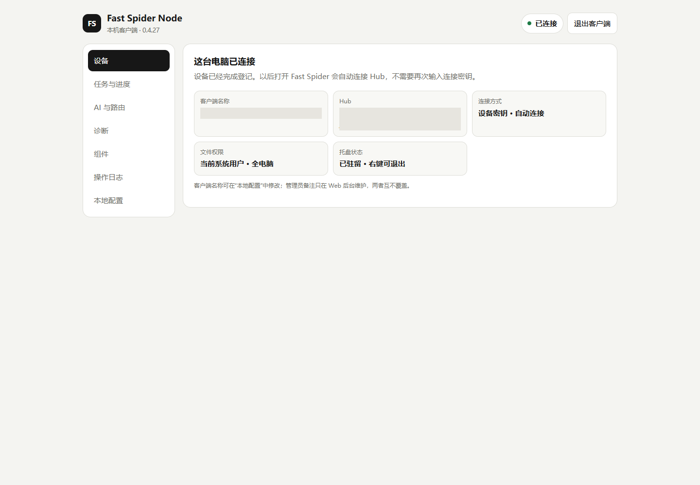
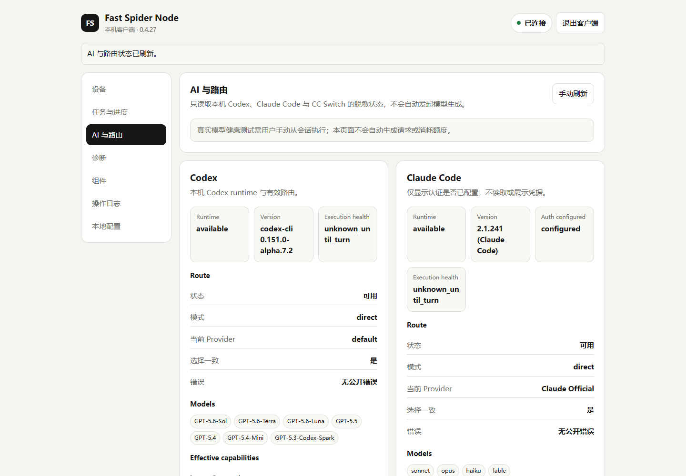
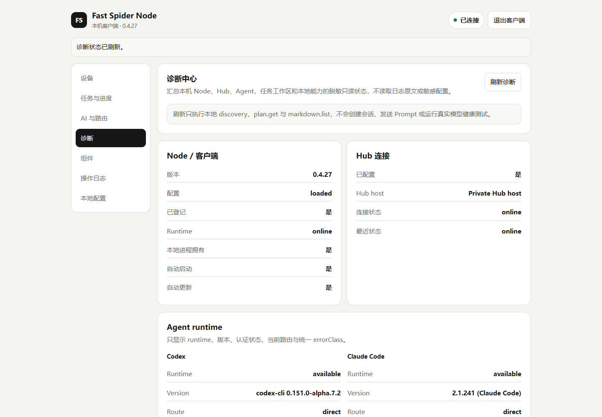
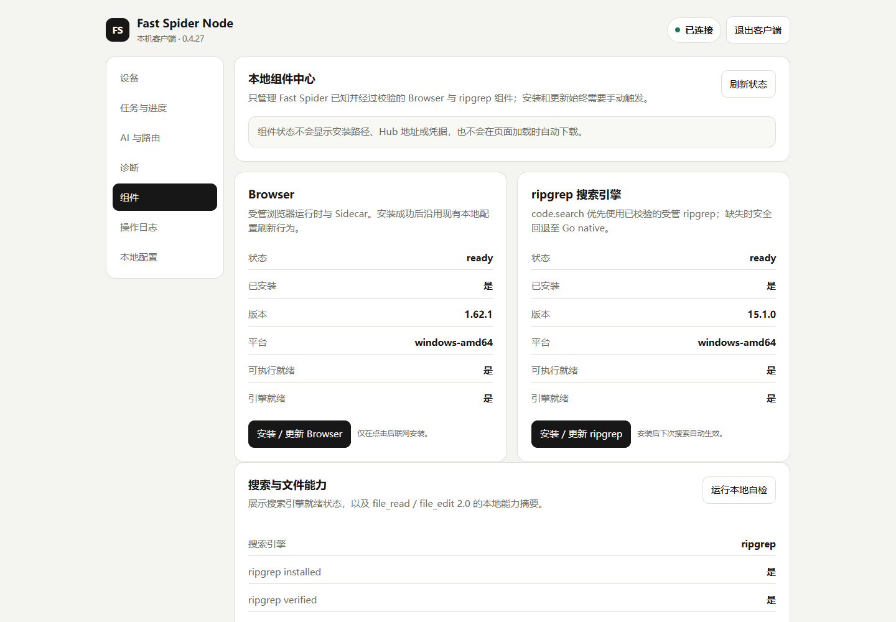

# Fast Spider

[English](README.md) | [简体中文](README.zh-CN.md)

**Use MCP or an AI coding agent to work safely across your own Windows, Linux
and macOS machines.**

Fast Spider is a self-hosted remote development and automation platform. It
turns user-owned machines into explicit, auditable capabilities for reading and
editing code, running builds, operating Git, controlling an isolated browser,
moving artifacts and managing local AI coding sessions.

The machine runs the work. Fast Spider provides the identity, routing, job
lifecycle, audit and control plane through MCP, Web Console, CLI and Local
Bridge.

> **Project status:** Fast Spider is an actively maintained, early-stage public
> project. The core platform is functional, but the external contributor and
> adopter community is still developing. Feedback, reproducible issues and
> focused contributions are welcome.

## Codex-native development

Fast Spider is developed with Codex as its primary engineering agent. The
maintainer provides product direction, architecture decisions, acceptance
criteria, security and privacy boundaries, and final release decisions. Codex
supports implementation, testing, documentation, code review, debugging and
iterative maintenance under maintainer supervision.

This collaboration is part of the project's normal engineering workflow:

- turn maintainer requirements into scoped implementation plans;
- implement and test cross-platform changes on Windows, Linux and macOS;
- review code, failure paths, permissions and privacy boundaries;
- maintain documentation, release gates and reproducible verification evidence.

## Three-part product structure

Fast Spider has three clear runtime parts:

| Part | Responsibility |
|---|---|
| Web Console | The browser-based management interface for owners and operators. It manages Nodes, credentials, jobs, routing and audit records through the Hub; it does not execute local machine actions itself. |
| Hub | The backend and control plane. It provides authentication, APIs, routing, job lifecycle, policy coordination and audit storage. |
| Node | The client installed on each Windows, Linux or macOS machine. It connects outbound to the Hub and performs the actual file, Shell, Git, browser and AI-session operations with the permissions of the local OS user. |

## What you can do with Fast Spider

| Area | Capabilities |
|---|---|
| Machines | Register, discover, inspect, disconnect and revoke multiple Windows, Linux and macOS Nodes |
| Code and files | Read text, search repositories, apply precise edits, preserve file integrity and return diffs |
| Commands and builds | Run shell commands, builds and tests as cancellable jobs with streamed logs and terminal results |
| Git | Inspect status, diffs and history; create commits; manage branches and worktrees; perform controlled fetch, pull and push operations |
| Browser | Launch an isolated Chromium profile, navigate, inspect pages, click, type, download and capture screenshots |
| AI coding sessions | Discover and control local Codex and Claude Code sessions through a provider-neutral API |
| Project coordination | Keep one compact revisioned plain-text context per project; optional role guidance stays caller-side |
| Artifacts and evidence | Transfer generated files, expose temporary presentation assets and retain operation/audit records |
| Access surfaces | Use the same capability model from MCP clients, the Web Console, `spiderctl` and the local bridge |

Fast Spider is useful when a coding agent or automation process needs to:

- inspect or change a repository on another machine you own;
- run a Windows-specific build from Linux or a cloud-based MCP client;
- start a test, follow its logs, cancel it and retrieve the final artifact;
- validate a local web application in an isolated browser;
- coordinate Codex or Claude Code sessions without copying their native history;
- keep machine access, job state and operator actions visible in one place.

## How a request runs

```text
MCP / Web / CLI / Local Bridge
              |
              v
        Fast Spider Hub
  identity | routing | jobs | audit
              |
        outbound HTTPS/WSS
              |
              v
       Fast Spider Node
 files | shell | Git | browser | AI
              |
              v
     your operating-system user
```

1. A client asks the Hub to perform a named capability on a selected Node.
2. The Hub authenticates the caller, records the job and routes it to the Node.
3. The Node validates the capability input and runs it with the permissions of
   the operating-system user that started the Node.
4. Progress, logs, results, errors and artifacts return through the same job
   lifecycle and remain available for audit.

## Screenshots

<table>
  <tr>
    <td width="50%">
      <a href="docs/images/fast-spider-node-overview.png"></a><br>
      <strong>Node overview</strong> — connection, local permission and runtime status. The private Hub URL is redacted.
    </td>
    <td width="50%">
      <a href="docs/images/fast-spider-ai-routing.png"></a><br>
      <strong>AI and routing</strong> — provider-neutral Codex and Claude Code discovery and effective capabilities.
    </td>
  </tr>
  <tr>
    <td width="50%">
      <a href="docs/images/fast-spider-diagnostics.png"></a><br>
      <strong>Diagnostics</strong> — redacted Node, Hub, agent and local capability readiness.
    </td>
    <td width="50%">
      <a href="docs/images/fast-spider-components.png"></a><br>
      <strong>Components</strong> — verified browser, search and file capability status.
    </td>
  </tr>
</table>

## What it does not provide

Fast Spider is not a hidden remote desktop, privilege escalation tool or generic tunnel.

It does not provide:

- arbitrary TCP forwarding;
- continuous desktop video streaming;
- automatic privilege escalation;
- unrestricted raw provider credential access;
- a second file-system permission model that overrides the operating system.

Node actions run with the permissions of the current OS user. Operators should treat a connected Node as a powerful local automation agent.

## Architecture and trust boundary

```text
+-------------------+        HTTPS/WSS 443        +----------------------+
|                   |  ------------------------->  |                      |
|  Fast Spider Node |                              |   Fast Spider Hub    |
|                   |  <-------------------------  |                      |
+-------------------+                              +----------------------+
        |                                                       |
        | local execution                                      | API / MCP / Web
        v                                                       v
+-------------------+                              +----------------------+
| Files / Shell /   |                              | Users / Machines /   |
| Git / Browser / AI|                              | Jobs / Audit / Relay  |
+-------------------+                              +----------------------+
```

The Hub never directly mounts a Node file system. All execution happens on the
Node and is routed through explicit capabilities. See the
[system architecture](docs/02-system-architecture.md),
[capability reference](docs/05-node-capabilities.md) and
[security model](docs/security-model.md) for the detailed contracts.

## Quick start

### Recommended: deploy with Codex

The recommended deployment path is to open this repository in Codex and ask it
to deploy the Web Console, Hub and Node for the target environment. Codex can
inspect the operating system, follow the documented security boundaries, run
the required checks and report the final service state.

Example deployment request:

```text
Deploy Fast Spider from this repository. First explain the Web Console, Hub and
Node topology you will use. Keep the Hub local unless I explicitly approve a
public tunnel. Generate credentials locally, do not commit them or expose them
in logs, run the documented checks, and report the final access URL and service
status.
```

Requirements:

- Go 1.26+
- Git
- Optional Node.js / Playwright dependencies for browser automation

### Three-minute safe trial

The public first-run path uses **Project mode**. It binds the Node capability
policy to the selected project directory instead of presenting the original
whole-machine Machine mode as the default.

From the Fast Spider source tree:

```bash
git clone https://github.com/isguang2024/fast-spider.git
cd fast-spider
go run ./cmd/spiderctl share --project . --tunnel none
```

`share` starts a temporary local Hub, creates the first owner and a short-lived
Node connection token, then prints the Node command and MCP URL. It does not
start Node for you: run the printed command in a second terminal. The MCP URL
uses OAuth; the printed Bearer credential is only for Node registration.

For a CLI installed outside the source tree, install the command and provide a
`fast-spider-hub` binary or set `FAST_SPIDER_SOURCE_ROOT`:

```bash
go install github.com/isguang2024/fast-spider/cmd/spiderctl@latest
spiderctl share --project .
```

The first safe request to use after connecting is:

```text
Inspect this repository and summarize its structure. Do not make changes.
```

Use `--tunnel cloudflare` or `--tunnel ngrok` only when a cloud client must
reach the local Hub. See [Security Model](docs/security-model.md) before
sharing a tunnel URL.

Start a local Hub:

```bash
FAST_SPIDER_ADMIN_PASSWORD='<replace-with-a-strong-password>' \
  go run ./cmd/hub --data-dir ./data
```

Initialize the Hub URL and owner bootstrap:

```bash
go run ./cmd/spiderctl setup-url \
  --public-url http://127.0.0.1:8787 \
  --allow-insecure \
  --bootstrap-token-file ./data/bootstrap-token
```

Start the local Node UI:

```bash
go run ./cmd/node ui
```

Or connect a headless Node after creating a connection token in the Hub:

```bash
go run ./cmd/node connect \
  --hub http://127.0.0.1:8787 \
  --allow-insecure \
  --token '<connection-token>' \
  --name dev-node
```

For no-server usage, run Hub locally and expose it with a free or free-tier tunnel only when cloud clients must reach it. See [Free Local Deployment](docs/free-local-deployment.md).

For more details, see [Getting Started](docs/getting-started.md), [Security Model](docs/security-model.md), [Configuration Reference](docs/configuration.md) and [Deployment and Operations](docs/14-deployment-and-operations.md).

## Project mode and Machine mode

Project mode is the recommended open-source onboarding profile. The Node
checks file, search, shell/build working directories, Git repositories and
artifact paths at the capability boundary and rejects paths outside the bound
project root. Native desktop/window screenshots are disabled in this mode.
Shells, Git remotes, browsers and AI providers can still have side effects, so
Project mode is a path-constraint profile, not an operating-system sandbox.

Machine mode remains available for private, advanced use and preserves the
original OS-user trust boundary. Do not expose a Machine-mode Node through a
public tunnel unless you understand and accept the whole-machine risk.

## MCP tools

The current public surface contains the following top-level MCP tools:

```text
machine_list
machine_get
capability_list
audit_log
operation_log
file_read
file_edit
code_search
shell_run
job_watch
job_cancel
git_control
build_control
artifact_get
browser_control
screenshot_take
thinking_team
ai_control
codex_cloud_collaboration
result_get
working_context
```

Tool inputs use explicit absolute paths for machine-local operations. Examples:

- `file_read`, `file_edit`, `code_search`: absolute `path`
- `shell_run`, `build_control`: absolute `cwd`
- `git_control`: absolute `repositoryPath`
- `ai_control.session.create`: absolute `workingDirectory`
- `codex_cloud_collaboration.dispatch`: `machineId`, local `callbackSessionId`, absolute `workingDirectory`, task `prompt` and stable `idempotencyKey`
- `working_context`: absolute `projectPath`; `set` stores one bounded plain-text note

Cloud collaboration has one transport path regardless of whether the caller is a single controller, a controller plus coordinator, or one AI. The CHAT calls `completion.notify`; the Hub persists that notification and actively pushes it into the Node callback queue; the Node wakes `callbackSessionId` immediately when idle or after its current turn finishes. Provider realtime events, startup reconciliation and timed status reads are fallback recovery only; future-created CHATs and tasks are not guaranteed to be covered by an external timer, so polling cannot replace the active callback.

The Windows Node UI asks for a Codex session mode on first launch and stores that choice in its local configuration. **Shared mode** is the default recommendation: Fast Spider does not claim loaded sessions through Codex Desktop IPC, so Desktop can open them without showing “already open in another application.” **FS managed mode** enables the owner/control bridge for FS-loaded local sessions. The Node UI setting is authoritative; `FAST_SPIDER_CODEX_DESKTOP_BRIDGE` remains a compatibility fallback for headless `run`/automation processes that do not use the Node UI. Public `ai_control` discovery and local session results include `desktopBridge` state. The bridge preserves Fast Spider's existing app-server execution path and does not yet promise native Desktop live-history rendering.

## Documentation

Start here:

- [Documentation Index](docs/README.md)
- [Getting Started](docs/getting-started.md)
- [Getting Started (简体中文)](docs/getting-started.zh-CN.md)
- [Free Local Deployment](docs/free-local-deployment.md)
- [Free Local Deployment (简体中文)](docs/free-local-deployment.zh-CN.md)
- [Security Model](docs/security-model.md)
- [安全模型（简体中文）](docs/security-model.zh-CN.md)
- [Configuration Reference](docs/configuration.md)
- [Product Vision](docs/00-product-vision.md)
- [Requirements and Scope](docs/01-requirements-and-scope.md)
- [System Architecture](docs/02-system-architecture.md)
- [Hub Design](docs/03-hub-design.md)
- [Node Design](docs/04-node-design.md)
- [Node Capabilities](docs/05-node-capabilities.md)
- [Public API and MCP](docs/10-public-api-and-mcp.md)
- [Deployment and Operations](docs/14-deployment-and-operations.md)
- [Security Threat Model](docs/09-security-threat-model.md)
- [Test Strategy](docs/17-test-strategy.md)
- [Public Release Guide](docs/public-release.md)

## Development

Run the standard checks:

```bash
go test ./... -count=1
go vet ./...
git diff --check
```

Run the public release hygiene check:

```bash
bash scripts/public-release-check.sh
```

Run the release gate:

```bash
bash scripts/release-gate.sh
```

Run the extended release gate where the required local runtimes are available:

```bash
bash scripts/release-gate.sh --full
```

Pull requests are also checked by the public GitHub Actions workflow. See the
[maintainer workflows](docs/maintainer-workflows.md) for issue triage, review,
release and responsible AI-assisted maintenance practices.

## Public source release

Do not publish private development history as the public repository history.

Use the public export flow to create a clean source snapshot with a new root commit:

```bash
bash scripts/public-export.sh \
  --output /absolute/path/fast-spider-public \
  --require-license
```

See [Public Release Guide](docs/public-release.md) for the full policy.

## Security

Read [SECURITY.md](SECURITY.md) before reporting a vulnerability or sharing logs.

Never publish:

- connection tokens;
- Direct Access Keys;
- private keys;
- environment files;
- production backup paths or backup archives;
- logs containing machine identifiers, credentials or local private paths.

## Contributing

Contributions should follow [CONTRIBUTING.md](CONTRIBUTING.md) and the [Code of Conduct](CODE_OF_CONDUCT.md).

Project decisions and maintainer access follow [GOVERNANCE.md](GOVERNANCE.md).
For usage questions and reproducible defects, see [SUPPORT.md](SUPPORT.md).
Notable public changes are recorded in [CHANGELOG.md](CHANGELOG.md).

## Community

Fast Spider recognizes and supports the developer community at
[LINUX DO](https://linux.do). Project discussions and contributions remain
open to everyone through this repository.

## License

Fast Spider is released under the Apache License 2.0. See [LICENSE](LICENSE).

Third-party dependency notice guidance is available in [THIRD_PARTY_NOTICES.md](THIRD_PARTY_NOTICES.md).
