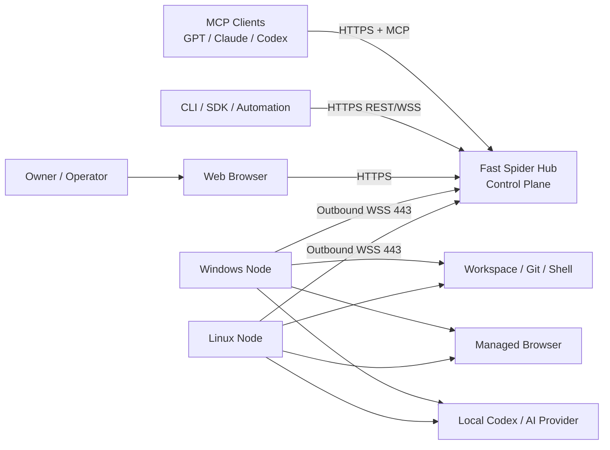
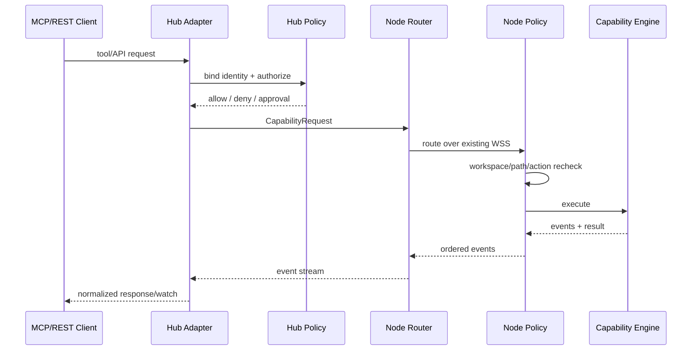
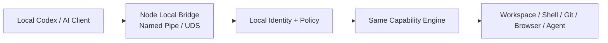
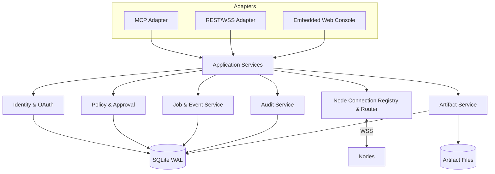
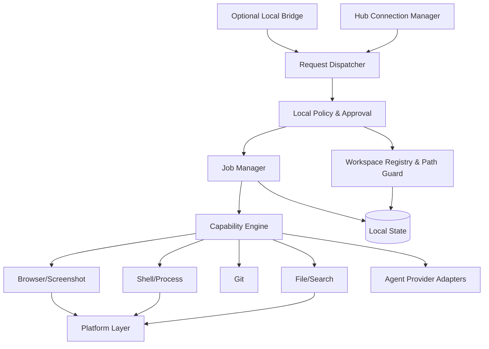
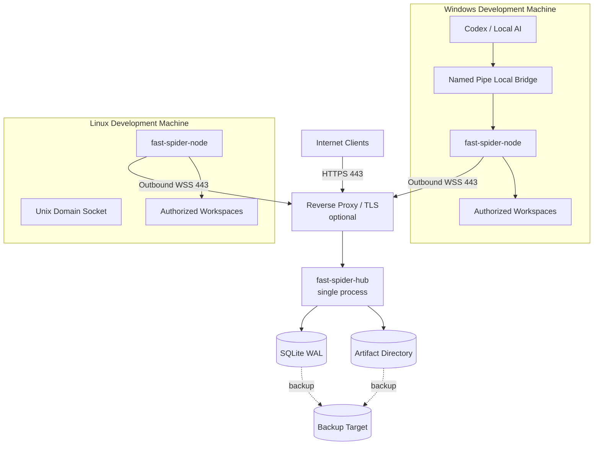

# 02 系统架构

## 1. 架构结论

Fast Spider MVP 采用 **Hub + Node + Adapter** 架构：

- **Hub**：一个 Go 模块化单体，负责公网入口、身份、策略、连接注册、路由、Job/Event、审批、审计、Artifact 元数据和 Web Console。
- **Node**：一个 Go 后台应用，负责 Workspace Registry、Capability Engine、Job Manager、平台适配和可选 Local Bridge。
- **Contracts**：与传输和 MCP 解耦的版本化契约，是 Request、Event、Error、Job、Approval、Artifact 和 Capability 的唯一模型来源。
- **Adapters**：MCP、REST、WebSocket、Web Console、CLI 和 Local Bridge 只做协议转换与身份绑定，不重复实现业务能力。

MVP 不拆微服务，不引入独立消息队列、Redis、对象存储或 Kubernetes。

## 2. 系统上下文图



## 3. 控制面与执行面

### 3.1 Hub 控制面

Hub 可以决定“请求是否有资格被路由”，但不能决定“本机资源是否最终允许执行”。它保存逻辑机器和 Workspace 信息，不保存 Node 真实路径作为远程授权字段。

Hub 的职责：

1. 验证用户、OAuth Client 和会话。
2. 解析 machineId/workspaceId。
3. 检查 Capability/Action 策略、短期授权和审批状态。
4. 创建或查询 Job，生成 requestId、traceId 和 deadline。
5. 将请求路由到当前拥有该 Node 连接的连接会话。
6. 接收事件并持久化必要索引和审计。
7. 管理 Artifact 上传授权和元数据。

### 3.2 Node 执行面

Node 对所有本地资源进行二次校验并拥有最终拒绝权：

1. 验证 Hub/设备会话和消息签名上下文。
2. 验证 machineId 与本设备一致。
3. 从本地 Workspace Registry 解析 workspaceId。
4. 重新计算路径并阻止符号链接、junction 和重解析点逃逸。
5. 检查本地策略、用户确认、并发和资源限额。
6. 调用 Capability Engine 执行。
7. 产生有序事件、结果、Diff 和 Artifact。

Hub 被攻破时，Node 仍不能被要求越过本机已授权边界。

## 4. 远程与本地调用链





Local Bridge 不经过 Hub，但必须使用独立本地身份、Workspace 权限、审计和限额。

## 5. Hub 内部模块图



Adapter 只能依赖应用服务接口，不能直接操作数据库或 Node 连接。

## 6. Node 内部模块图



Capability 模块不感知 MCP；文件和 Shell 模块不感知具体 AI Provider。

## 7. 部署拓扑



反向代理不是必须组件；Hub 可以直接终止 TLS。部署文档必须只给出一个生产推荐路径，避免脚本、安装包和临时启动方式并存造成运维混乱。

## 8. 仓库结构

MVP 采用单 Go Module，语言和边界清晰：

```text
fast-spider/
├─ cmd/
│  ├─ hub/
│  └─ node/
├─ internal/
│  ├─ hub/
│  │  ├─ app/
│  │  ├─ identity/
│  │  ├─ policy/
│  │  ├─ routing/
│  │  ├─ jobs/
│  │  ├─ artifacts/
│  │  ├─ audit/
│  │  └─ storage/
│  ├─ node/
│  │  ├─ connection/
│  │  ├─ workspace/
│  │  ├─ policy/
│  │  ├─ jobs/
│  │  ├─ localbridge/
│  │  └─ platform/
│  ├─ capabilities/
│  │  ├─ files/
│  │  ├─ search/
│  │  ├─ shell/
│  │  ├─ git/
│  │  ├─ browser/
│  │  ├─ screenshot/
│  │  └─ agent/
│  ├─ protocol/
│  └─ observability/
├─ contracts/
│  ├─ schema/
│  ├─ examples/
│  └─ generated/
├─ web/
├─ native/
│  └─ windows/
├─ packaging/
│  ├─ windows/
│  └─ linux/
├─ docs/
├─ tests/
└─ README.md
```

`native/` 只允许窄接口平台能力，不能承载策略、任务或协议逻辑。

## 9. 依赖方向

允许的依赖方向：

```text
Adapters -> Application Services -> Domain/Contracts -> Ports
Infrastructure/Platform -> Ports
```

禁止：

- Adapter 直接读写数据库。
- 文件能力调用 MCP 类型。
- Hub 业务层依赖 Node 平台代码。
- Node 文件模块直接调用具体 Codex Provider。
- 通过全局单例绕过策略、审计和 Job Manager。

## 10. MVP 与目标架构的区分

### MVP

- 单 Hub 实例。
- SQLite WAL。
- 单机 Artifact 目录。
- Hub 进程内连接注册表和事件扇出。
- WSS + JSON + 二进制块。
- Owner 单用户模式。

### 后续目标

只有达到以下触发条件才进入多实例设计：单 Hub 资源不足、需要无中断升级、多个地理入口或多用户隔离要求显著提高。届时才引入 PostgreSQL、连接归属租约、跨实例事件总线和 S3 兼容存储。该目标架构不进入 MVP 代码路径，不提前维护抽象过度的分布式一致性逻辑。
