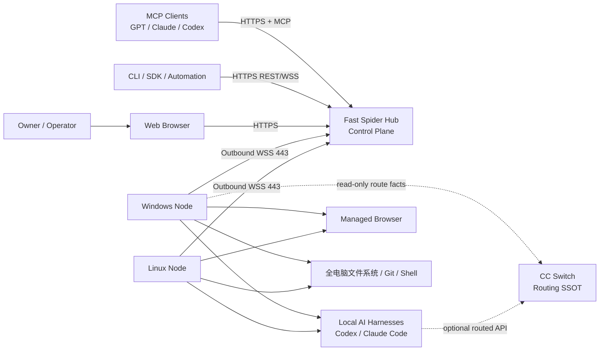
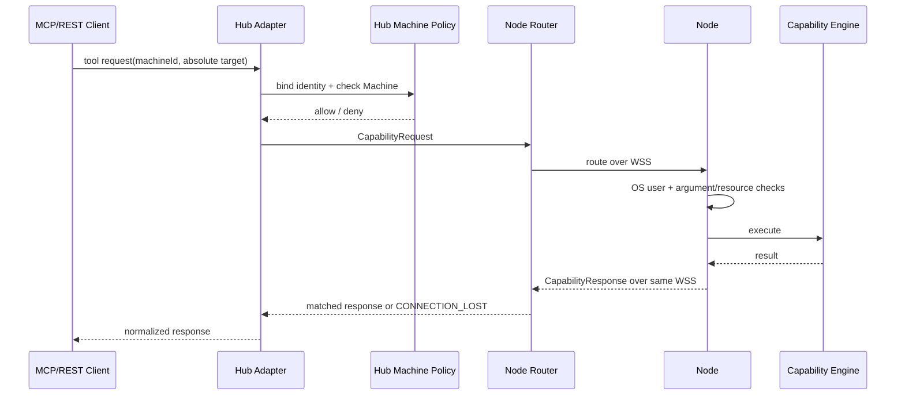
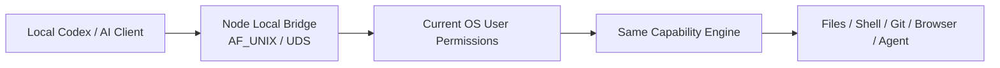
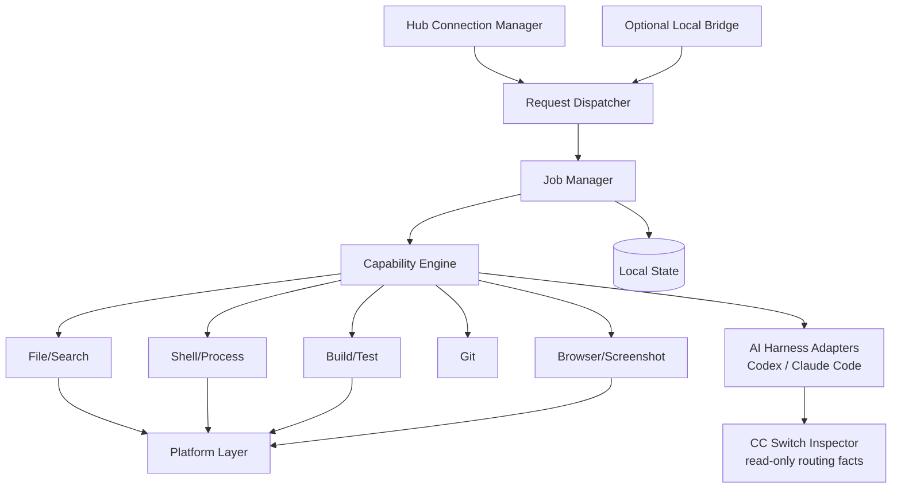
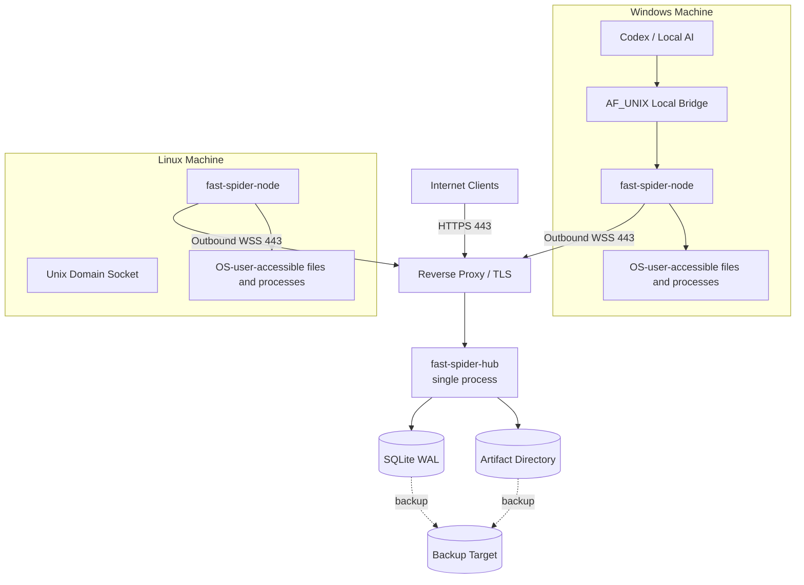

# 02 系统架构

## 1. 架构结论

Fast Spider 采用 **Hub + Node + Adapter** 架构：

- **Hub**：Go 模块化单体，负责公网入口、身份、Machine 归属、路由、Job/Event、审计、Artifact 元数据和 Web Console。
- **Node**：Go 后台应用，负责当前 OS 用户上下文中的 Capability Engine、Job Manager、平台适配和可选 Local Bridge。
- **Contracts**：与传输和 MCP 解耦的版本化契约，是 Request、Event、Error、Job、Artifact 和 Capability 的唯一模型来源。
- **Adapters**：MCP、REST、WebSocket、Web Console、CLI 和 Local Bridge 只做协议转换与身份绑定。

当前远程边界只有 Machine。Node 不维护目录注册表、目录授权、路径白名单或目录 ID 映射；0.3.0 是完成该边界迁移的历史版本。

## 2. 系统上下文图

## 3. 控制面与执行面

### 3.1 Hub 控制面

Hub 决定请求是否有资格路由到某个 Machine，但不代替 Node 判断 OS 是否允许实际操作。Hub 保存 Machine、Job、Event、审计和 Artifact 控制面事实，不保存目录授权映射。Hub↔Node 的 Capability Request/Response 全部直接走该 Machine 当前 generation 的同一条 WSS；`file.read` 文本结果和 `file.write/edit` 的 `oldText`/`newText` 也不绕行 HTTP。

Hub 的职责：

1. 验证用户、OAuth Client 和会话。
2. 解析 `machineId`，确认 Machine 属于当前 Owner 且在线。
3. 校验 Capability/Action、参数、大小、deadline 和幂等键。
4. 创建或查询 Job，生成 request/trace 标识并路由到 Node。
5. 接收事件并持久化必要索引、结果和审计。
6. 管理 Artifact 上传授权和元数据。

### 3.2 Node 执行面

Node 是 Machine 的唯一执行边界：

1. 验证 Hub/设备会话和消息上下文。
2. 验证 `machineId` 与本设备一致。
3. 按能力要求校验绝对 `path`、`cwd`、`repositoryPath` 或 `workingDirectory`。
4. 使用当前 OS 用户的文件系统、进程和网络权限执行，不自动提权。
5. 应用参数、网络、并发、大小、deadline、取消和资源限制。
6. 产生有序事件、结果、Diff 和 Artifact。

Hub 被攻破时，Node 仍不会获得超出自身设备身份和 OS 用户权限以外的能力；Node 被攻破时，Hub 仍应限制其对其他 Machine 的伪造和污染。

## 4. 远程与本地调用链

Local Bridge 不经过 Hub；它使用当前 OS 用户作为本机信任边界，与远程入口共用 Machine、Capability、Job、资源限制和审计语义。HTTPS 在 Hub↔Node 链路中只承担 Machine 登记、设备 Token 获取，以及 Artifact/Presentation 等大文件数据面；普通能力控制不建立第二条 HTTP 通道。

WSS 断开会立即终止 Hub 上等待响应的 in-flight 调用，并取消 Node 当前会话中仍执行的同步能力上下文；JobManager 已启动的 Job 继续按自身生命周期运行。系统不自动重放断线写操作。

## 5. Node 内部模块图

## 6. 部署拓扑

MVP 不拆微服务，不引入独立消息队列、Redis、对象存储或 Kubernetes。
