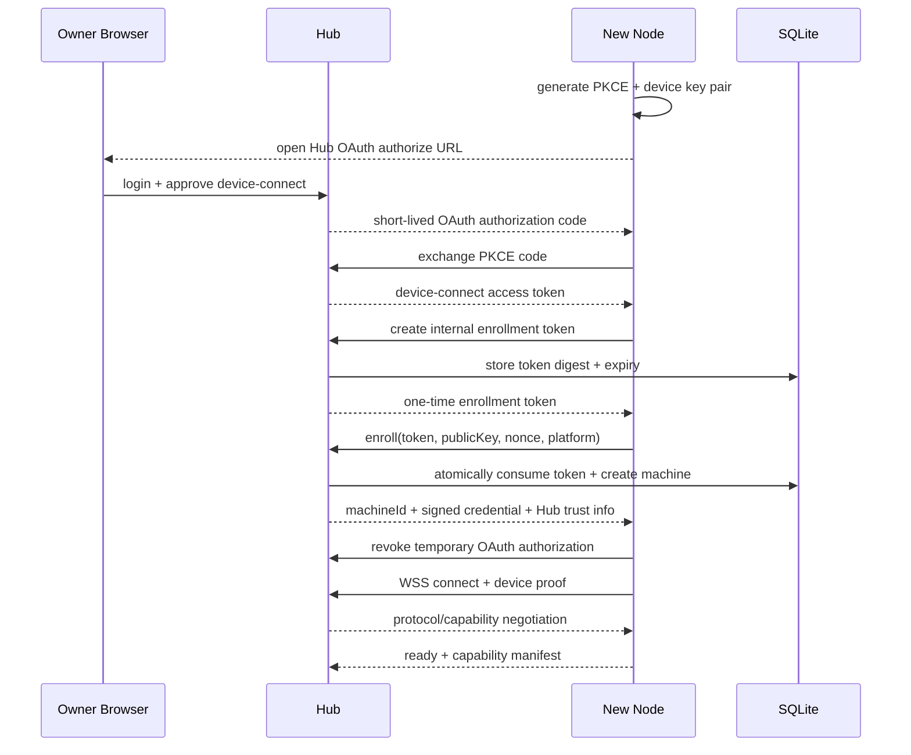

# 03 Hub 设计

## 1. 角色与边界

`fast-spider-hub` 是公网控制面、身份入口和消息路由层。它可以保存机器与 Workspace 的逻辑目录，但不能挂载、读取或执行 Node 的真实文件和命令。

Hub 负责：

- HTTPS/TLS、OAuth 2.1、MCP、REST/WSS 和 Web Console。
- 用户、客户端、机器、Workspace 逻辑目录和权限策略。
- Node 配对、设备身份、连接注册、心跳与吊销。
- Job、Event、Approval、Audit 和 Artifact 元数据。
- 将内部 Capability Request 路由到已连接 Node。
- 对公开响应做大小限制、脱敏和错误归一化。

Hub 不负责：

- 解析或信任 Node 的绝对路径。
- 代替 Node 进行本地权限判断。
- 直接执行 Shell、Git、浏览器或本地 AI Provider。
- 保存 Provider Token。
- 为离线 Node 静默重放不确定的写操作。

## 2. 进程与模块

MVP 只有一个 Hub 进程，模块边界通过 Go package 和接口体现，不拆服务。

| 模块 | 责任 | 主要持久化 |
|---|---|---|
| `identity` | 用户、OAuth Client、Token、Session | users, oauth_clients, auth_sessions |
| `enrollment` | 一次性配对码、设备证书登记 | enrollment_tokens, machines, device_credentials |
| `policy` | 授权、短期 Lease、审批 | grants, capability_leases, approvals |
| `routing` | Node 连接注册表、心跳、发送队列 | 内存为主，机器状态快照入库 |
| `jobs` | Job 状态机、事件游标、取消 | jobs, job_events |
| `artifacts` | 上传会话、哈希、元数据、清理 | artifacts, artifact_uploads + 文件系统 |
| `audit` | 不可省略的安全审计 | audit_entries |
| `mcp` | MCP 工具到应用命令的转换 | 无独立业务状态 |
| `api` | REST/WSS、错误和分页 | 无独立业务状态 |
| `console` | 静态资源和管理 API | 无独立业务状态 |
| `operations` | 备份、清理、轮换、升级状态 | operation_runs |

Adapter 不得直接访问 `routing` 内部连接或数据库表，必须经过应用服务。

## 3. Node 注册与配对

### 3.1 浏览器登录与内部 Enrollment Token

日常配对入口是 `fast-spider-node login --hub <hub>`。Node 本机生成 PKCE 和 loopback callback，浏览器跳转 Hub 登录/授权页；Owner 登录并允许“设备连接”后，Node 获得仅限 `fast-spider:device-connect` 的短期 OAuth Access Token。

Hub 随后为该受限 OAuth 身份签发内部一次性 enrollment token：

- 随机强度至少 128 bit。
- 默认有效期 10 分钟且只允许使用一次。
- 绑定 Owner、可选节点显示名和预期平台。
- 数据库仅保存不可逆摘要。
- token 只在 Node 与 Hub 内部交换，不进入日常用户界面、复制粘贴流程或普通日志。

Node 使用该 token 连同本机设备公钥、Node 版本、OS、架构和随机 nonce 完成 enrollment；成功后立即撤销临时 device-connect OAuth Authorization。后续持续连接只使用设备私钥和短期设备凭据，不依赖 OAuth/PAT。

### 3.2 注册时序图



任何重试都必须使用配对请求 idempotencyKey；Token 消费和机器创建在一个事务内完成。

## 4. Node 长连接管理

### 4.1 连接键

连接注册表以 `machineId` 为主键，一个设备默认只允许一个 active connection。新连接完成身份验证和协议协商后，通过 generation CAS 替换旧连接；旧连接收到 `connection_replaced` 后关闭。

每个连接保存：

- machineId、credentialId、connectionId、generation。
- protocolVersion 和 capability versions。
- connectedAt、lastHeartbeatAt、lastEventSequence。
- 受限发送队列、当前 inflight 数和 Node 报告容量。
- 远端 IP 只用于风控和审计，不参与设备身份。

### 4.2 心跳

- 默认 30 秒一个应用层 heartbeat；随机抖动，避免同步风暴。
- 连续 3 个周期无有效消息标记 `suspect`，再超时标记 `offline`。
- 任何有效协议消息都可刷新存活时间。
- 不为每个 Workspace、Job 或 Capability 单独探活。
- 心跳只携带轻量状态和容量摘要，不重复发送完整能力清单。

### 4.3 发送与背压

每个 Node 连接只有有界队列：

- 控制消息优先于日志事件。
- 达到队列上限时拒绝新 Job，返回 `NODE_BACKPRESSURE`。
- stdout/stderr 由 Node 分块，Hub 可根据客户端消费速度暂停转发或降级为 Artifact。
- Hub 不在内存中无限保存事件；持久化后按游标读取。

## 5. 请求处理

```text
Adapter Authentication
→ Input Schema Validation
→ Application Identity Context
→ Hub Policy Evaluation
→ Approval/Lease Check
→ Job Create or Idempotent Lookup
→ Node Route Selection
→ Dispatch
→ Event Ingestion
→ Client Watch/Result
```

关键规则：

1. machineId/workspaceId 必须来自明确参数或已签名的安全会话上下文。
2. 客户端绝对路径永远不作为 Workspace 授权依据。
3. Hub 只验证逻辑 Workspace 与授权关系；Node 必须再次解析本地真实路径。
4. 高风险操作没有有效 Approval/Lease 时进入 `waiting_for_approval`，不得先发送再补授权。
5. deadline 在 Hub 创建时固定，转发和重试不能延长。
6. 同一主体、Action 和 idempotencyKey 返回原 Job，不创建第二个执行。

## 6. Job 与 Event 服务

Hub 保存 Job 的权威控制面状态；Node 保存本地执行事实。两者通过 generation 和 sequence 协调。

- Job 终态不可逆。
- Event 使用 `(jobId, sequence)` 唯一键去重。
- Hub 只接受当前 machine connection generation 的事件。
- Node 断线后，运行中的 Job 标记为 `reconciling` 内部态；超过窗口转为公开 `lost`。
- Node 重连必须报告 active/completed Job 摘要，Hub 做状态对账。
- Hub 不自动重新执行 `accepted` 或 `running` 的写任务。

完整规则见 [07-job-and-event-model.md](07-job-and-event-model.md)。

## 7. Approval 与短期授权

Approval 是一次用户决策；Capability Lease 是在特定边界内的短期授权。

建议维度：

- subject/userId/clientId。
- machineId、workspaceId。
- capability、action。
- 参数摘要或风险指纹。
- allowedCount、expiresAt。
- origin（remote MCP、Web Console、Local Bridge）。

Node 可以要求本机确认，即使 Hub 策略允许。Node 本地拒绝应原样映射为 `NODE_POLICY_DENIED`，Hub 不能覆盖。

## 8. Artifact 服务

### 8.1 存储

MVP 使用本地内容寻址目录：

```text
data/artifacts/sha256/ab/cd/<full-hash>
```

数据库保存 owner、jobId、machineId、workspaceId、Content-Type、size、hash、createdAt、expiresAt、scanStatus 和 logicalName。逻辑名称不得直接成为磁盘路径。

### 8.2 上传

1. Node 请求创建上传会话并声明大小、类型和 SHA-256。
2. Hub 检查 Job、权限、配额和类型。
3. 分块上传到临时文件，按 offset/idempotencyKey 去重。
4. 完成后校验长度和哈希，再原子移动到内容寻址路径。
5. 只有完成校验后才产生 `artifact` 事件。

压缩包、HTML 报告等下载默认使用附件响应和严格 Content-Type；Hub 不直接以内联方式执行不可信内容。

## 9. 数据库与事务

MVP 选择 SQLite WAL：

- 单实例 Hub 与单 Owner 负载下部署最简单。
- 写事务短小，不在事务内进行 WSS、文件 I/O 或外部调用。
- 使用外键、唯一索引和 `busy_timeout`。
- 关键状态更新使用版本号/CAS 防止并发覆盖。
- 数据库迁移采用单向、版本化 migration，启动时先备份并验证。

当需要多个 Hub 实例或持续高写入时迁移 PostgreSQL。存储接口只围绕真实聚合设计，不创建“通用 Repository”或预实现分布式事务。

## 10. Web Control Center

首版页面：

- Overview：Hub 版本、健康、在线 Node、运行 Job、容量告警。
- Machines：配对、状态、版本、能力、吊销、紧急断开。
- Workspaces：逻辑目录、Node、权限、最后访问。
- Jobs：状态、事件、日志、Diff、Artifact、取消。
- Approvals：待确认和历史决定。
- Audit：按主体、机器、Workspace、Action、结果查询。
- Settings：Hub 地址、保留策略、更新渠道、OAuth Client。

危险按钮必须显示目标机器、Workspace、Action 和影响，不提供“一键永久允许所有操作”。

## 11. 后台运维任务

只使用 Hub 内置、单实例调度器，不引入消息队列。任务包括：

- 过期 enrollment token、auth session 和 lease 清理。
- Job event、审计和 Artifact 保留策略执行。
- 临时上传和孤儿文件清理。
- 设备凭据轮换提醒。
- 数据库 checkpoint、备份验证和容量检查。

调度器必须有唯一任务名、互斥锁、最长运行时间、上次/下次时间和运行摘要。失败使用受限退避，不高频刷日志。

## 12. 健康与降级

- `/livez`：进程可响应，不检查 Node 或外部服务。
- `/readyz`：数据库可读写、迁移完成、关键目录可用、监听就绪。
- `/health/details`：仅管理员查看容量、连接数、清理滞后等，不暴露秘密。

数据库不可写时 Hub 进入只读降级：可以读取历史和健康信息，但不创建 Job、配对、审批或更新权限。Artifact 磁盘不足时拒绝新上传，不影响纯文本小结果。

## 13. 安全响应头与公网边界

- TLS 1.2+，优先 TLS 1.3。
- 严格 Host allowlist、HSTS、CSP、`X-Content-Type-Options: nosniff`。
- Cookie 使用 Secure、HttpOnly、SameSite。
- OAuth Redirect URI 精确匹配。
- WSS Origin 按客户端类型校验；设备连接使用专用认证，不复用浏览器 Cookie。
- 管理 API、Node WSS 和公开 MCP 在路由及限流上分组，避免一个入口耗尽全部资源。
