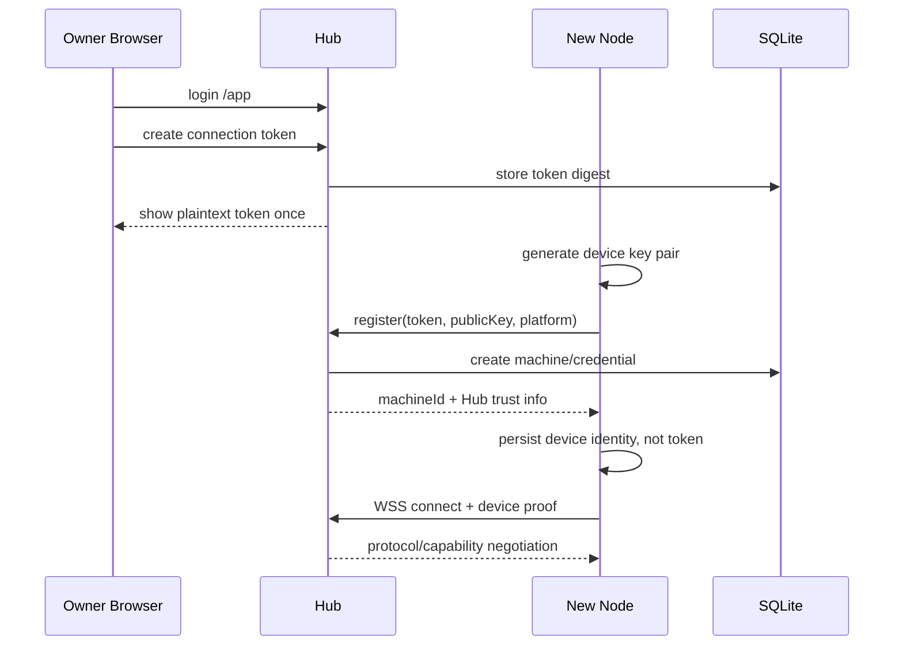

# 03 Hub 设计

## 1. 角色与边界

`fast-spider-hub` 是公网控制面、身份入口和消息路由层。它保存 Owner、Client、Machine、Job、Event、Audit 和 Artifact 控制面事实，但不能挂载、读取或执行 Node 的真实文件和命令。

Hub 负责：

- HTTPS/TLS、OAuth 2.1、MCP、Direct API、Web Console 和必要的管理 API。
- Owner、MCP Client、Machine、设备凭据、连接和吊销。
- Job、Event、Audit 和 Artifact 元数据。
- 将内部 Capability Request 路由到已连接 Machine。
- 对公开响应做大小限制、脱敏和错误归一化。

Hub 不负责：

- 代替 Node 解释或授权本机绝对路径。
- 直接执行 Shell、Git、Build、浏览器或本地 AI Provider。
- 保存 Provider Token。
- 为离线 Node 静默重放不确定的副作用操作。
- 维护已移除的目录授权、来源列表或目录 ID 逻辑。

## 2. 进程与模块

MVP 只有一个 Hub 进程，模块边界通过 Go package 和接口体现，不拆服务。

| 模块 | 责任 | 主要持久化 |
|---|---|---|
| `identity` | 单 Owner Web 登录、MCP OAuth、连接令牌、临时直连密钥 | owners, web_sessions, oauth_*, connection_tokens, direct_access_keys |
| `devices` | Node 登记、设备公钥、撤销 | machines, device_credentials, device_access_tokens |
| `routing` | Node WSS 连接注册表与在线状态 | 内存为主，Machine 快照入库 |
| `jobs` | Job/Event、幂等、游标和结果 | jobs, job_events |
| `artifacts` | 上传会话、哈希、元数据、清理 | artifacts, artifact_uploads + 文件系统 |
| `audit` | 必要的安全审计 | audit_entries |
| `tools` | MCP 提供 18 个固定工具；Direct API 保持 17 工具子集。两种 transport 对共有工具复用同一 `toolExecutor`；`audit_log` 仅在 MCP 注册，避免扩大 Direct Access Key 审计可见性 | 无独立业务状态 |
| `console` | Web 后台、设备/令牌/OAuth 管理 | 复用上述表 |

Adapter 不得直接访问路由内部连接或数据库表，必须经过应用服务。

## 3. Machine 注册

Owner 先登录 `/app` 创建连接令牌，Node 本地控制界面或 CLI 提交 Hub、令牌、设备公钥、版本、OS、架构和显示名。Hub 返回 `machineId` 与信任材料；Node 登记成功后只保存设备身份和 Hub 指纹，后续 WSS 使用设备私钥。

连接令牌只允许 `POST /api/v1/machines/register`，数据库保存哈希，明文只在创建页展示一次，可过期或撤销，并可在有效期内登记多台 Node。它不能调用 MCP、机器管理或 Artifact 下载。



## 4. Direct API 与临时直连密钥

不支持 MCP / OAuth、但能够发送 HTTPS 请求的 AI、Agent 或程序可使用独立 Direct API。后台生成 `fsp_tmp_` 临时直连密钥，数据库只保存哈希和短提示；明文只显示一次。Direct Key 不可用于 MCP、Node 注册或后台登录，Connection Token 和 OAuth Token 也不可反向调用 Direct API。

Direct API 固定提供 `GET /direct/v1/tools` 与 `POST /direct/v1/call`。生产部署在公共 BasePath `/fast-spider` 下时，对外路径分别为 `/fast-spider/direct/v1/tools` 和 `/fast-spider/direct/v1/call`。默认无高危 Scope，即只允许只读动作；文件写入、Shell/Build、Job cancel、Git mutation/network、Browser/Screenshot、AI mutation、Working Context mutation、Artifact upload/publish 分别要求独立 Scope。高权限密钥最长 24 小时，只读密钥最长 7 天，并支持绑定单一 `machineId` 和每分钟限速。

MCP 与 Direct API **不得复制工具实现**。二者都进入同一个 `toolExecutor`，统一完成输入到 Capability Request 的映射和结果适配；MCP 只增加 OAuth/原生 MCP 内容回显，Direct 只增加 Direct Key Scope、Machine binding、HTTP JSON 和限速。这样新增参数或调整能力时只修改一处执行逻辑。

## 5. 长连接管理

连接注册表以 `machineId` 为主键，一个设备默认只允许一个 active connection。新连接完成身份验证和协议协商后，通过 generation CAS 替换旧连接。

每个连接保存：`machineId`、`credentialId`、`connectionId`、generation、协议/能力版本、心跳时间、事件序号、发送队列、inflight 数和容量摘要。心跳按连接粒度运行，不为目录、路径或单个路由建立探活。

达到发送队列上限时拒绝新 Job，返回 `NODE_BACKPRESSURE`；stdout/stderr 由 Node 分块，过大内容转 Artifact。

## 6. 请求处理

```text
Adapter Authentication
→ Input Schema Validation
→ Owner/Client Identity Context
→ Machine Ownership Check
→ Capability/Action and Resource Limits
→ Job Create or Idempotent Lookup
→ Node Route Selection
→ Dispatch
→ Event Ingestion
→ Client Watch/Result
```

关键规则：

1. `machineId` 必须来自明确参数或已签名会话上下文。
2. `path`、`cwd`、`repositoryPath` 和 `workingDirectory` 是目标字段，不是授权凭据；Node 按当前 OS 用户权限和能力规则校验它们。
3. Hub 不维护目录资源或路径白名单。
4. deadline 在 Hub 创建时固定，转发和重试不能延长。
5. 同一主体、Action 和 `idempotencyKey` 返回原 Job，不创建第二个执行。

## 7. Job、Artifact 与 Web Console

Hub 保存 Job 的权威控制面状态，Node 保存本地执行事实；通过 generation 和 sequence 对账。终态不可逆，事件使用 `(jobId, sequence)` 去重，Hub 不自动重新执行已经 accepted/running 的副作用 Job。

Artifact 使用内容寻址存储，元数据绑定 Owner、Machine、Job、类型、大小、哈希、保留期和来源。下载再次进行主体和 Artifact 权限复核，不把逻辑名称直接拼成磁盘路径。

Web Console 提供 Overview、Machines、Jobs、Artifacts、Audit、OAuth/连接令牌、Settings 和健康信息页面。所有危险操作显示目标 Machine、Action 和影响，不提供“一键永久允许所有操作”。

## 8. 健康与降级

- `/livez`：进程可响应。
- `/readyz`：数据库可读写、迁移完成、关键目录可用、监听就绪。
- `/health/details`：仅管理员查看容量、连接数和清理滞后。

数据库不可写时 Hub 进入只读降级；Artifact 磁盘不足时拒绝新上传，不影响小型结构化结果。MVP 使用 SQLite WAL，不引入 Redis、队列或多实例状态。
