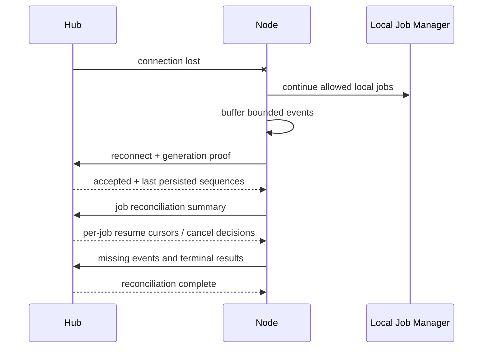

# 04 Node 设计

## 1. Node 的角色

`fast-spider-node` 是真实机器执行面，也是本机权限的最终裁决者。Hub、MCP Client 或本机 Local Bridge 调用都不能要求 Node 越过本机已授权的 Workspace、Capability、Action 和风险策略。

Node 默认：

- 作为普通用户后台应用运行。
- 只建立到 Hub 的 HTTPS/WSS 443 出站连接。
- 不监听公网或局域网端口。
- Local Bridge 默认随 Node 启用；明确不需要时可用本机开关关闭。
- 不自动提权，不隐蔽运行。
- 显示连接状态、授权目录和正在执行的高风险操作。

## 2. 进程模型

MVP 使用单 Node 进程。当前不提供 Windows 托盘 UI 或第二个后台进程；如未来确有 UI 需求，也只能复用同一 Node 状态与权限逻辑。

### Windows

- 当前只维护普通用户启动的单 Node 进程，不提供第二套 Windows Service/SYSTEM 模式。
- 当前状态通过 CLI/Hub 查看；不为个人 MVP 维护托盘状态同步层。
- 需要开机启动时使用当前用户启动项或任务计划运行同一个 `fast-spider-node run`，不改变权限语义。

### Linux

- 默认普通用户进程。
- 可选 user-level systemd unit；服务器场景可显式安装 system-level unit 并指定非 root 用户。
- Wayland、X11、无桌面会话和容器环境能力需要分别发现并上报。

## 3. 模块

| 模块 | 责任 |
|---|---|
| Connection Manager | Hub 信任、认证、WSS、重连、心跳、协议协商 |
| Workspace Registry | 本地路径、opaque workspaceId、权限与生命周期 |
| Path Guard | 规范化、打开时校验、symlink/junction/reparse point 防护 |
| Local Policy | Workspace、危险本机权限、参数/路径/网络与资源边界 |
| Dispatcher | 校验请求封装、deadline、idempotency 和路由 |
| Job Manager | 并发、状态、事件、取消、恢复和孤儿进程回收 |
| Capability Engine | 统一能力注册和执行接口 |
| Platform Layer | Windows/Linux 路径、进程、截图、凭据和通知差异 |
| Local Bridge | 当前用户 AF_UNIX/UDS Adapter，默认随 Node 启用，可显式关闭 |
| Agent Adapters | Codex 等本地 Provider 的独立适配器 |
| Local Audit | Hub 不可用时仍保留必要的本机安全记录 |

## 4. 本地状态

建议目录：

### Windows

```text
%LOCALAPPDATA%\FastSpider\
├─ config.json
├─ state.db
├─ credentials/
├─ logs/
├─ jobs/
├─ recovery-bin/
└─ run/
```

### Linux

```text
~/.local/share/fast-spider/
~/.config/fast-spider/
~/.cache/fast-spider/
```

当前没有第二套服务模式状态目录；Node 使用当前用户数据目录运行。未来若真正增加系统服务模式，再单独定义其目录与权限边界。

本地状态存储：

- machineId、设备凭据引用、Hub 信任材料。
- Workspace Registry 和本地权限。
- Job 执行摘要、idempotency 去重窗口和事件缓冲。
- 更新和恢复状态；当前个人 MVP 不持久化通用逐次 Approval 状态。
- 不保存 Hub 用户密码或远程 Provider Token。

敏感私钥使用 Windows DPAPI/Credential Manager 或 Linux Secret Service；不可用时使用权限严格的加密文件，并向用户显示降级状态。

## 5. Workspace Registry

### 5.1 注册

Workspace 必须由本机用户在 Node 管理界面或本机 CLI 中选择。注册过程：

1. 解析为绝对路径。
2. 获取真实路径、卷/设备标识、文件 ID 能力和大小写行为。
3. 检测 Git 根，但不强制 Workspace 必须是 Git 仓库。
4. 生成随机 opaque workspaceId。
5. 选择只读/读写、允许 Capability、子目录规则和排除项。
6. 本地保存；只把逻辑信息与能力摘要上报 Hub。

Hub 不下发绝对路径创建 Workspace。

### 5.2 Path Guard

每次文件操作都执行“输入验证 + 安全解析 + 打开后复核”，不能只做字符串前缀判断。

基本步骤：

```text
workspaceId -> local registry root
relativePath validation
-> reject absolute/drive/UNC/NUL/invalid segments
-> lexical clean
-> join below root
-> resolve parent components without following unsafe links
-> open with platform-safe flags
-> compare final object identity/path against root boundary
```

规则：

- 拒绝 `..` 逃逸、Windows 驱动器相对路径、UNC、设备路径和 Alternate Data Streams，除非明确支持。
- 符号链接、junction 和 reparse point 默认不能跨出 Workspace。
- 大小写不敏感平台使用规范化比较，但保留原始显示名。
- 操作期间路径被替换时，通过文件句柄/文件 ID 复核并返回 `PATH_RACE_DETECTED`。
- Git worktree 的 `.git` 文件可读取必要元数据，但不能借此授权外部主仓库任意路径。

### 5.3 权限变化

Workspace 禁用、删除或权限收紧时：

- registry revision 增加。
- 取消尚未开始的相关 Job。
- 运行中写 Job默认请求取消；无法立即终止的标记并警告。
- 后续请求和 Session 再次使用 Workspace 时必须看到最新 revision/启用状态。
- 新请求返回 `WORKSPACE_REVOKED`。

## 6. Capability Engine

统一接口概念：

```go
// 仅为设计示意，不是当前业务代码。
type Capability interface {
    Descriptor() Descriptor
    Authorize(ctx Context, req Request) Decision
    Execute(ctx Context, req Request, sink EventSink) (Result, error)
}
```

要求：

- Descriptor 声明 capabilityId、版本、actions、输入上限、输出模式、平台条件和风险等级。
- Dispatcher 先校验协议和本地策略，再调用能力。
- Capability 不能自行绕过 Job Manager 建后台 goroutine。
- 所有长输出走 EventSink；大结果转 Artifact。
- 相同能力供远程 Hub 和 Local Bridge 复用。
- 能力发现只报告可真实执行且当前可用的能力，不伪造平台支持。

## 7. Job Manager

### 7.1 并发分组

默认并发不是一个全局数字，而是少量固定资源组：

- `read`: 文件读取/搜索，默认 4。
- `write`: 文件编辑/移动/删除，默认 1。
- `exec`: Shell/build/test，默认 2。
- `browser`: 受管浏览器，默认 1。
- `capture`: 截图，默认 1。
- `agent`: 本地 AI run，默认 1。

这些是配置上限，不建立通用复杂调度器。单个 Job 只能占用一个主资源组，避免死锁。

### 7.2 生命周期

Node 接收请求后先持久化最小 Job 记录和 idempotencyKey，再返回 `accepted`。开始执行时记录进程/资源句柄。每个事件在本地先分配递增 sequence；Hub 断线时保留有界缓冲，超限日志转本地 Artifact 摘要。

### 7.3 超时与取消

- deadline 来自 Hub，但不能超过 Node 本地 action 上限。
- cancel 是幂等请求。
- Shell 先发送温和终止，再在 grace period 后杀完整进程树。
- Windows 使用 Job Object 管理子进程；Linux 使用 process group/session，必要时 cgroup v2 作为后续增强。
- 取消完成不等于操作回滚；结果必须说明副作用是否已发生。
- 无法终止时进入 `cancel_pending` 内部态，并产生警告；最终可为 `failed` 或 `lost`，不能虚报 canceled。

## 8. 文件写入与恢复

### 原子写入

1. 在同目录创建权限受限临时文件。
2. 写入、flush，按策略保留权限/换行/BOM。
3. 验证 expected revision/hash。
4. 原子替换目标。
5. 必要时同步父目录。
6. 生成前后 hash、摘要和 Diff。

### 小范围编辑

- `oldText` 必须唯一匹配，或使用明确 range + expected hash。
- 不模糊猜测多个候选位置。
- 默认拒绝二进制和超大文件。
- UTF-8 无效内容返回结构化错误；不静默重新编码。

### 删除

默认移动到 Node 管理的 recovery-bin，并保存原路径、Workspace、hash、时间和过期时间。永久删除是独立 Action，并可要求本机确认。恢复区有容量和定期清理策略。

## 9. Shell 与进程

### 命令模型

初期支持 `executable + args` 和明确的 shell profile 两种形式：

- 结构化形式优先，减少拼接注入。
- 只有调用方显式选择 `powershell`、`cmd`、`bash` 等 profile 时才解释 shell command string。
- cwd 必须是 Workspace 内相对路径。
- 环境变量为白名单继承 + 显式覆盖；敏感值不回显。

### 编码

- 协议事件统一 UTF-8。
- Windows 优先使用支持 Unicode 的进程和管道；必要时检测/配置代码页并记录转换警告。
- 原始字节无法可靠转换时，可以作为受限二进制 Artifact，而不是产生乱码写回文件。

### 输出

- stdout/stderr 独立序列，事件带 streamOffset。
- 每个事件大小受限，按换行或字节阈值刷新。
- 总输出超过阈值后，在线流保留头尾摘要，完整内容写 Artifact。
- 客户端慢不能阻塞子进程直至死锁；Node 必须持续排空管道。

## 10. Git

MVP 默认调用本机 `git`：

- 与用户现有 Git 配置、凭据、LFS、签名和 hooks 兼容。
- 版本和可执行路径在能力发现中报告。
- 为每次调用设置非交互环境，禁用 pager/editor，避免 Job 卡死。
- Git cwd 固定为 Workspace/Git 根内。
- 读操作与写操作分开权限。

风险控制：

- `safe.directory` 不自动全局放宽。
- 不自动修改全局 Git config。
- commit/pull/push 可能触发 hooks；`git-hooks` 开关关闭时拒绝，需要时在日志/结果中明确提示 hooks 风险。
- 远程 URL 中的凭据脱敏。
- 删除 worktree 前验证它是 Fast Spider 创建的受管 worktree，且无未提交变更，除非用户明确强制。

## 11. 截图与平台能力

截图、窗口枚举等优先用成熟的 Go/系统 API；只有 Go 无法可靠覆盖时才添加窄接口原生辅助模块。原生模块必须：

- 版本化 ABI。
- 无网络和策略逻辑。
- 输入输出长度明确。
- 独立测试和签名。
- 崩溃不拖垮主 Node，必要时改为短生命周期 helper process，而不是 DLL 内堆业务。

## 12. Local Bridge

当前 Phase 6 使用一条简单本机链路：

- Windows/Linux 都使用 Go 原生 AF_UNIX/UDS，endpoint 位于当前用户 Node data-dir。
- Node 运行时默认启动 Local Bridge，可通过本机 `--disable-local-bridge` 关闭。
- 当前 OS 用户与 data-dir 文件系统权限即本机信任边界；不注册 localClientId、公钥、Token 或独立 Grant。
- 不监听 TCP/loopback HTTP，不存在 Host/Origin/CORS 配置负担。
- 所有请求仍携带 workspaceId 和 action，并进入同一 Capability Dispatcher；危险操作继续复用现有 write/shell/git/build 权限和路径/资源检查。

## 13. 断线重连



规则：

- 断线不自动取消所有任务；由 Action 策略决定是否允许离线继续。
- 新的远程写任务在离线时不入 Node。
- 重连后先对账，后接收新任务。
- 已完成 Job 只补传事件/结果，不重新执行。
- idempotency 去重记录至少覆盖 Job 最大寿命和重连窗口。

## 14. 本机可见性与紧急控制

当前个人版只保留已经存在的简单控制面：

- `status` 查看 Node 状态，`version` 查看版本。
- `workspace-list/enable/disable/remove` 查看或收紧本机 Workspace 授权。
- 运行中的 Job 通过现有 Hub/MCP `job_watch/job_cancel` 查看和取消。
- 需要立即停止接收任务时，停止当前 Node 进程；重新启动后仍按本机 Workspace 权限工作。

当前没有 Local Client 注册/吊销、Update Manager、更新签名状态、托盘或隐藏持久化进程；Node 只以用户明确启动的当前用户进程运行。
