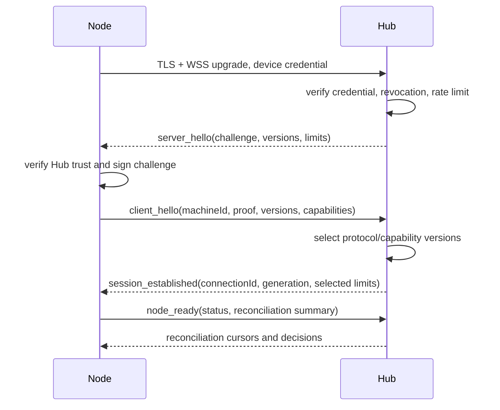

# 06 线路协议

## 1. 目标

Fast Spider Wire Protocol（FSWP）是 Hub 与 Node 之间的版本化应用层协议。它独立于 MCP、REST 和 Web Console：外部 Adapter 先把请求转换为内部 Capability Request，再由 FSWP 传输。

协议目标：

- 通过常见 443 反向代理。
- 支持双向请求、事件流、取消、审批和心跳。
- 支持至少一次传输、幂等去重和断线续传。
- 控制消息易于调试；大二进制不做 base64 膨胀。
- 明确版本、限额和 Capability 协商。
- 不把 transport connection 等同于用户或设备身份。

## 2. 传输选择

| 方案 | 优点 | 缺点 | MVP 结论 |
|---|---|---|---|
| WSS + JSON/二进制 | 443 兼容好、双向、生态成熟、易调试 | 应用层自行处理流控、恢复和多路复用 | **选择** |
| HTTP/2 长流 | 原生多路复用和流控 | 双向会话和代理行为更复杂，调试门槛高 | 保留 REST/下载使用 |
| gRPC | 契约和流式强 | 浏览器/MCP Adapter、代理、生成链路更重 | MVP 不选 |
| QUIC/HTTP/3 | 弱网、多路复用好 | UDP 可达性、运维和实现复杂度高 | 后续评估 |

MVP 使用：

- TLS 上的 WebSocket。
- JSON 文本帧承载控制消息。
- WebSocket 二进制帧承载 Artifact chunk 等大数据。
- 压缩默认关闭于敏感控制消息；可对允许类型协商 permessage-deflate，防止压缩侧信道和 CPU 滥用。

## 3. 协议版本

版本格式：`major.minor`，例如 `1.0`。

- major 不兼容；双方没有共同 major 时拒绝连接。
- minor 向后兼容；接收方忽略允许忽略的未知可选字段。
- 新增必需字段、改变语义或删除枚举值必须提升 major。
- Capability 自身有独立版本，不随线路协议强绑定。

握手双方发送支持范围：

```json
{
  "protocolVersions": ["1.1", "1.0"],
  "capabilities": {
    "file.system": ["1.1", "1.0"],
    "shell.process": ["1.0"]
  },
  "limits": {
    "maxControlMessageBytes": 1048576,
    "maxBinaryChunkBytes": 1048576,
    "maxInflightRequests": 16
  }
}
```

Hub 选择最高共同兼容版本；Node 可以拒绝不满足本地安全下限的版本。

## 4. 连接握手



TLS 验证失败、设备吊销、时钟偏差超限或协议不兼容时，连接在进入消息循环前关闭。

## 5. 控制消息信封

所有 JSON 控制消息使用统一信封：

```json
{
  "protocolVersion": "1.0",
  "messageType": "request.dispatch",
  "requestId": "req_opaque",
  "traceId": "trace_opaque",
  "userId": "usr_opaque",
  "clientId": "cli_opaque",
  "machineId": "mach_opaque",
  "workspaceId": "ws_opaque",
  "jobId": "job_opaque",
  "capability": "file.system",
  "capabilityVersion": "1.0",
  "action": "read",
  "params": {},
  "deadline": "2026-08-08T10:00:00Z",
  "idempotencyKey": "idem_opaque",
  "approvalContext": {
    "leaseId": "lease_opaque",
    "approvalId": null,
    "riskDigest": "sha256:..."
  },
  "sequence": 0,
  "timestamp": "2026-08-08T09:59:30Z",
  "extensions": {}
}
```

### 必需性

- 每种 `messageType` 定义自己的必需字段。
- `userId` 和 `clientId` 是 Hub 绑定后的身份，不接受 Node/外部客户端自报覆盖。
- `machineId` 必须与当前设备连接一致。
- `workspaceId` 对 Workspace 能力必需；不能传绝对路径替代。
- `deadline` 使用 UTC RFC 3339，过期请求不得执行。
- `sequence` 对 Job Event 和 chunk 必需，其他消息可为 0。

## 6. Message Types

### 6.1 连接与发现

- `server.hello`
- `client.hello`
- `session.established`
- `node.ready`
- `heartbeat`
- `heartbeat.ack`
- `capabilities.changed`
- `connection.close`

### 6.2 请求与响应

- `request.dispatch`
- `request.accepted`
- `request.rejected`
- `request.cancel`
- `request.cancel_ack`
- `request.reconcile`

### 6.3 Job 事件

- `job.event`
- `job.event_ack`
- `job.snapshot`
- `job.result`

### 6.4 审批

- `approval.required`
- `approval.decision`
- `approval.expired`

### 6.5 Artifact

- `artifact.create`
- `artifact.created`
- `artifact.chunk_ack`
- `artifact.complete`
- `artifact.abort`

控制信封里的 event `type` 使用 [07-job-and-event-model.md](07-job-and-event-model.md) 的事件枚举。

## 7. 请求幂等

### 7.1 Key 作用域

有效键为：

```text
(subjectId, machineId, workspaceId, capability, action, idempotencyKey)
```

同键不同参数摘要返回 `IDEMPOTENCY_CONFLICT`，不能当作同一次请求。

### 7.2 Node 规则

Node 在返回 `request.accepted` 前持久化：

- idempotency key。
- canonical params digest。
- jobId。
- 接收时间和状态。

收到重复请求时：

- 原 Job 运行中：返回相同 jobId 和当前状态。
- 原 Job 已完成：返回相同结果引用，不重新执行。
- 原记录过期：只有超过去重保留窗口且 Hub 明确创建新 key 才可执行。

### 7.3 读与写

读操作也使用 requestId，但可根据策略允许透明重试。所有写入、Shell、Git 写操作、浏览器副作用和 AI run 必须使用 idempotencyKey。

## 8. 至少一次传输与重复消息

FSWP 假设控制消息可能重复、延迟或在断线边界丢失确认：

- Sender 在收到应用层 ack 前可重发。
- Receiver 通过 requestId、idempotencyKey、event sequence、chunk offset 去重。
- ack 只证明接收/持久化到对应级别，不等于执行成功。
- 不提供“恰好一次执行”的虚假承诺；通过持久化幂等和状态对账达到业务效果。

## 9. 顺序

### 9.1 请求

不同 Job 之间不保证全局顺序。需要顺序的调用方必须等待前一个 Job 终态，或使用同一资源的 Node 写锁。

### 9.2 事件

每个 Job 的 `sequence` 从 1 严格递增：

- Hub 可以乱序接收但只能按序发布已连续区间。
- 缺口触发 `request.reconcile`，不永久等待。
- 重复 sequence 且 payload hash 相同：忽略。
- 重复 sequence 但 payload 不同：`EVENT_SEQUENCE_CONFLICT`，记录安全告警。

### 9.3 Stream Offset

stdout/stderr 额外带各自的 `streamOffset`，用于检测日志字节缺口；事件 sequence 仍是总顺序。

## 10. 断线重连与对账

Node 重连后发送：

```json
{
  "messageType": "node.ready",
  "reconciliation": {
    "jobs": [
      {
        "jobId": "job_opaque",
        "localState": "completed",
        "lastEventSequence": 42,
        "resultDigest": "sha256:..."
      }
    ]
  }
}
```

Hub 返回每个 Job：

- `resumeFromSequence`
- `knownTerminalState`
- `cancelRequested`
- `discardAfter`（仅对确认无用的临时缓冲）

禁止：

- 因为 Hub 未收到 completed 就重新 dispatch 同一写 Job。
- Node 在未完成对账前接收同 key 新执行。
- 旧 connection generation 继续发送事件。

## 11. 超时

- Hub 创建 deadline；Node 取 `min(remote deadline, local action maximum)`。
- 网络传输时间不自动延长 deadline。
- 接收时已过期：拒绝 `REQUEST_EXPIRED`。
- 执行中到期：触发取消流程，最终状态通常为 `expired`；若副作用已发生，结果必须说明。
- 客户端 watch 超时不取消 Job，除非明确发送 cancel。

## 12. 取消

`request.cancel` 包含 jobId、reason 和 cancelRequestId。

- 可重复发送，结果幂等。
- Node 立即 ack“已收到取消”，随后产生最终事件。
- `cancel_ack.accepted=true` 不代表进程已退出。
- 完整进程树终止后才可进入 `canceled`。
- 已终态 Job 返回当前终态。
- 取消不承诺回滚文件、Git 或外部网络副作用。

## 13. 背压与限流

### 13.1 协商限额

- max control message bytes。
- max binary chunk bytes。
- max inflight requests。
- max pending event bytes。
- per-capability concurrency。

### 13.2 行为

- Node 容量满：`NODE_BUSY`，带 retryAfterMs。
- Hub 消费慢：发送 `flow.pause`/`flow.resume` 或减少 ack window。
- 日志缓冲接近上限：产生 warning，完整日志切换 Artifact。
- 超出硬限额：终止对应流或 Job，不拖垮连接。

不允许无限 channel、无限 goroutine 或每个 Event 一个独立持久化事务。

## 14. 大消息与二进制帧

### 14.1 二进制帧头

二进制帧采用固定长度前缀 + payload，概念字段：

```text
magic | headerVersion | frameType | uploadId | sequence | offset | payloadLength | crc32c | payload
```

完整文件最终使用 SHA-256；CRC32C 用于快速检测单块传输损坏。

### 14.2 分块

- 默认块 1 MiB，可协商 64 KiB–4 MiB。
- offset 必须对齐已确认边界。
- 每块独立 ack；断线后从最后确认 offset 恢复。
- 控制 JSON 不携带 base64 大数据。

## 15. 压缩

- Artifact 已压缩格式（zip/png/jpeg/webp）不再压缩。
- JSON 控制消息默认不压缩；后续只有在明确无秘密混合和有长度限制时启用。
- 解压后大小必须预先限制，防止压缩炸弹。
- 压缩算法和阈值属于连接协商，不改变业务 payload hash 语义。

## 16. Capability 版本协商

Descriptor 关键字段：

```json
{
  "capabilityId": "file.system",
  "versions": ["1.1", "1.0"],
  "actions": ["list", "stat", "read", "write", "edit"],
  "platform": {"os": "windows", "arch": "amd64"},
  "limits": {},
  "features": ["atomic_replace", "recovery_bin"]
}
```

Hub 只能调用双方共同版本和 Node 当前声明的 Action。能力临时不可用使用状态字段，不通过删除/新增大量 MCP 工具改变公共 Schema。

## 17. 向前兼容

- 未知可选字段保存在 `extensions` 或忽略。
- 未知 `messageType`：若标记 optional 可忽略，否则返回 `MESSAGE_TYPE_UNSUPPORTED`。
- 未知枚举值不映射成已有值；返回结构化版本错误。
- 公共错误码保持稳定，新增 details 字段不能改变 retry 语义。
- 接收方必须限制 JSON 深度、对象字段数、字符串长度和数组长度。

## 18. 错误信封

```json
{
  "messageType": "request.rejected",
  "requestId": "req_opaque",
  "timestamp": "2026-08-08T10:00:00Z",
  "error": {
    "code": "WORKSPACE_REVOKED",
    "message": "workspace authorization is no longer active",
    "retryable": false,
    "origin": "node",
    "details": {
      "requiredRevision": 8
    }
  }
}
```

错误类别：

- `AUTH_*`
- `PROTOCOL_*`
- `NODE_*`
- `WORKSPACE_*`
- `PATH_*`
- `FILE_*`
- `PROCESS_*`
- `GIT_*`
- `BROWSER_*`
- `AGENT_*`
- `ARTIFACT_*`
- `INTERNAL_*`

`INTERNAL_*` 不公开堆栈或秘密，traceId 用于管理员诊断。

## 19. 时钟与重放防护

- TLS 连接握手含 server nonce 和 client nonce。
- 每个连接有不可复用 connectionId/generation。
- 消息 timestamp 只用于审计和粗略过期检查，权威 deadline 结合接收方单调时钟计算。
- requestId 和 idempotencyKey 去重。
- 设备凭据、连接上下文和 machineId 绑定。
- 超出允许时间窗口的未见过控制请求仍需依据 deadline 和 Token 状态拒绝。

## 20. 协议测试资产

`contracts/examples/` 后续必须包含：

- 每种 messageType 的有效样例。
- 缺字段、超限、未知字段和未来 minor 版本样例。
- 重复 request/event/chunk 样例。
- 断线重连和 sequence gap 样例。
- Golden JSON 与跨版本兼容测试。
- Fuzz corpus，重点覆盖 JSON、二进制帧头、长度和状态转换。
