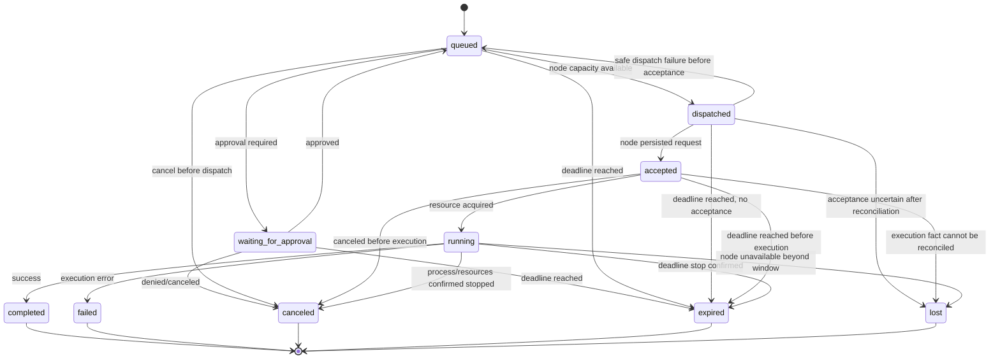
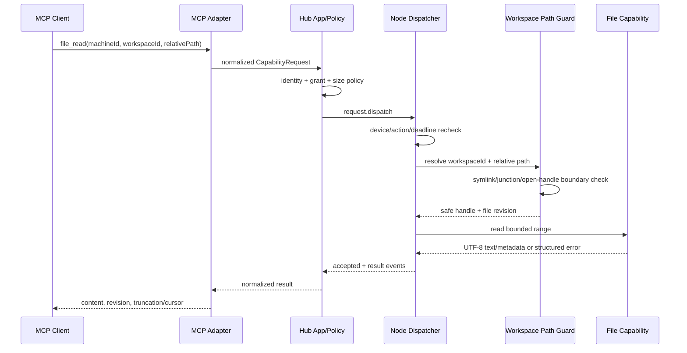
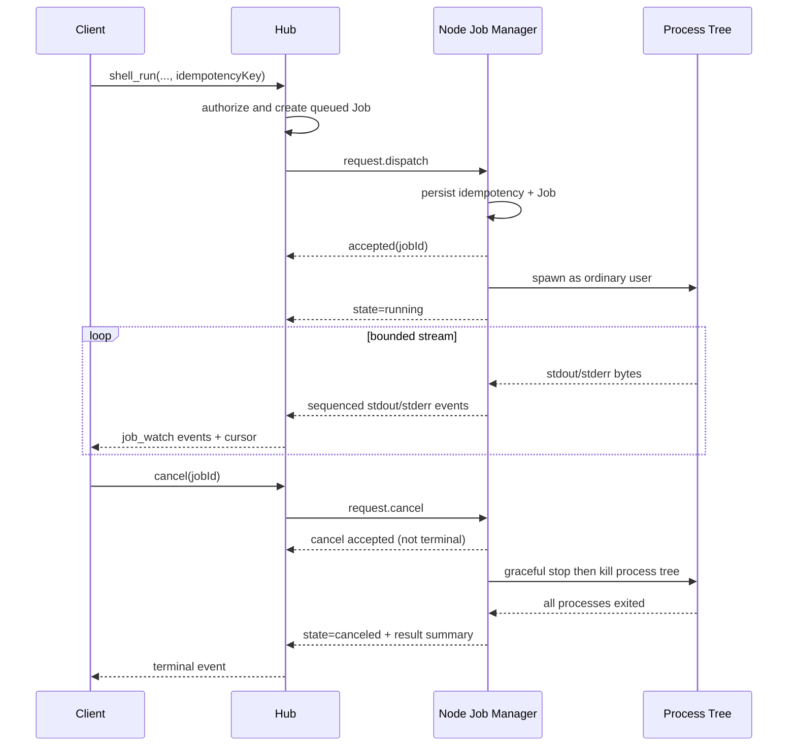

# 07 Job 与 Event 模型

## 1. 设计目标

Fast Spider 将任何可能超过一次短请求、产生持续输出、需要取消或可能产生副作用的操作建模为 Job。Job 是协议和产品层概念，不等同于 goroutine、进程、MCP tool call 或某个 Provider 的 Turn。

目标：

- 状态语义稳定，可被 MCP、Web Console、CLI 和 Local Bridge 共同使用。
- 支持至少一次传输、幂等去重、断线重连和事件续读。
- 清楚区分“请求已接收”“本机已开始执行”“正在等待确认”和“已终止进程”。
- 不把界面已打开、任务已分发或取消请求已收到误报为执行中/已取消。
- Job、Event、日志和结果均有保留上限，不无限增长。

## 2. 标识与所有权

| 字段 | 含义 |
|---|---|
| `jobId` | Hub 创建的 opaque Job 标识 |
| `requestId` | 一次协议请求标识，可重试但不代表业务幂等 |
| `idempotencyKey` | 业务幂等键，防止重复执行 |
| `traceId` | 跨 Hub、Node、Adapter 的诊断关联 |
| `sessionId` | 可选上层会话标识，不决定本机授权 |
| `correlationId` | AI/多步骤调用链关联 |
| `owner` | 当前执行所有权，如 `node_process`、`local_agent`、`none` |
| `generation` | Node 连接或执行租约代次，阻止旧连接回写 |

Job 创建后，machineId、workspaceId、capability、action 与规范化参数摘要不可修改。需要换机器、Workspace 或 Action 时必须创建新 Job。

## 3. 公开状态

Canonical 状态：

```text
queued
waiting_for_approval
dispatched
accepted
running
completed
failed
canceled
expired
lost
```

### 3.1 状态含义

| 状态 | 权威事实 | 是否终态 |
|---|---|---:|
| `queued` | Hub 已持久化，尚未获得调度/容量 | 否 |
| `waiting_for_approval` | 缺少有效审批或本机确认，未执行副作用 | 否 |
| `dispatched` | Hub 已发送给当前 Node 连接，尚未收到持久化接收确认 | 否 |
| `accepted` | Node 已持久化幂等记录并接受执行，但可能尚未占用资源 | 否 |
| `running` | Node 已取得资源并真正开始能力执行 | 否 |
| `completed` | 执行成功，Result 已固定 | 是 |
| `failed` | 执行结束且失败；含结构化错误 | 是 |
| `canceled` | 取消完成，执行资源/进程树已确认停止 | 是 |
| `expired` | deadline 到期并完成停止或确认未开始 | 是 |
| `lost` | 无法确定执行事实且对账窗口已耗尽 | 是 |

`lost` 不是可自动重试信号。对有副作用的 Job，调用方必须先调查或使用新的显式操作，不能复用旧 idempotencyKey 静默重跑。

### 3.2 内部瞬态

实现可以使用但不得作为稳定公共状态的内部态：

- `dispatch_pending`
- `cancel_requested`
- `cancel_pending`
- `reconciling`
- `result_persisting`

Adapter 只向外映射 canonical 状态，并可通过 `phase` 展示内部进度。

## 4. 状态转换



规则：

1. 终态不可逆。
2. `dispatched → queued` 只允许 Hub 确认 Node 未接受时发生。
3. `accepted/running` 之后断线不能退回 queued。
4. Job 只有收到 Node 的真实开始证据才进入 running。
5. 取消请求已收到不等于 canceled。
6. `completed` 必须在结果摘要和所有必要 Artifact 引用持久化后发布。

## 5. 事件模型

### 5.1 Canonical 事件类型

```text
accepted
progress
stdout
stderr
diff
artifact
approval_required
warning
result
error
heartbeat
```

另有状态类事件 `state_changed`，用于 Web/CLI 快速更新；状态本身仍以 Job 记录为权威。

### 5.2 通用事件结构

```json
{
  "jobId": "job_opaque",
  "sequence": 17,
  "type": "stdout",
  "timestamp": "2026-08-08T10:05:00Z",
  "source": "node",
  "payload": {
    "streamOffset": 4096,
    "text": "...",
    "truncated": false
  },
  "payloadHash": "sha256:..."
}
```

- `sequence` 在单个 Job 内从 1 严格递增。
- Event 不允许修改；纠正信息通过新事件表达。
- `payloadHash` 用于重复/冲突检测。
- stdout/stderr 另外维护独立 `streamOffset`。
- Event payload 默认最大 64 KiB；大内容转 Artifact。

### 5.3 事件语义

| 类型 | 必要字段 | 说明 |
|---|---|---|
| `accepted` | nodeAcceptedAt, executionPolicy | Node 已持久化并接受 |
| `progress` | current/total 或 phase/message | 不承诺百分比一定存在 |
| `stdout`/`stderr` | streamOffset, text/bytesRef | 统一 UTF-8，无法转换则 Artifact |
| `diff` | format, summary, artifactId/inline | 文件或 Git 变更 |
| `artifact` | artifactId, name, type, size, hash | 已完成校验的 Artifact |
| `approval_required` | approvalId, risk, expiresAt | 未执行高风险步骤 |
| `warning` | code, message, recoverability | 非终止问题 |
| `result` | outcome, summary, data/artifacts | 唯一终态成功结果 |
| `error` | structured error | 终态失败或非终止错误需标记 scope |
| `heartbeat` | phase, localLiveness | 长时间无输出任务的轻量存活信号 |

## 6. 文件读取时序

小文件读取可以快速完成，但仍遵循相同授权和结果模型。



任何阶段拒绝都不返回 Node 绝对路径。

## 7. Shell 长任务时序



若进程树无法确认退出，不得发布 canceled；应产生 `CANCEL_INCOMPLETE` 并进入 failed 或 lost。

## 8. Event Cursor

公开 cursor 是签名/不可猜测的 opaque 值，内部至少编码：

- jobId。
- last acknowledged sequence。
- event stream generation。
- expiresAt。

API：

```text
job_watch(jobId, afterCursor?, maxEvents?, waitMs?)
```

行为：

- 首次不传 cursor，返回 Job 快照与当前可用事件。
- 后续使用 `nextCursor`。
- cursor 落后于保留窗口时返回 `CURSOR_EXPIRED`，同时给出 Job 最新快照和可用的日志/Artifact 位置。
- 客户端重复使用 cursor 可安全得到相同或重叠事件。
- watch 连接断开不取消 Job。

## 9. Node 本地事件缓冲

Node 对每个 Job 保存：

- 状态转换和关键事件：必须持久化至对账完成。
- stdout/stderr：有界环形缓冲 + 可选本地完整日志文件。
- Artifact 上传状态。
- 最后被 Hub 确认的 sequence。

默认策略建议：

- 单 Job 内存缓冲不超过 1 MiB。
- 本地事件/日志磁盘默认每 Job 50 MiB、全局 1 GiB，可配置。
- 超限时在线保留头尾摘要，完整日志转 Artifact；仍超限则截断并发 warning。
- 终态与 Hub 确认后，按本地保留期清理。

## 10. Hub 事件持久化

避免每个短 stdout chunk 一次事务：

- Hub 在有界时间/数量窗口内批量持久化。
- 终态、审批、Diff、Artifact 和 error 事件立即或优先持久化。
- 唯一键 `(job_id, sequence)`。
- Job 行保留 `last_event_sequence`、`terminal_sequence` 和 revision。
- 事件清理不删除 Job 结果摘要；大日志先确认 Artifact 可用。

## 11. 断线与恢复

### 11.1 Node 断线

- queued 未分发：保持 queued，可等待 Node 回来或过期。
- dispatched 未确认：进入内部 `reconciling`，不立即重发有副作用请求。
- accepted/running：保留公开状态与 `connection_lost` warning；等待对账窗口。
- 超过对账窗口且无法证明结果：lost。

### 11.2 Node 重连

Node 报告本地 Job 摘要和最后 sequence。Hub 返回每个 Job 的已知状态和续传位置。冲突处理：

- Hub 终态 + Node 相同终态：补事件后完成。
- Hub 非终态 + Node 终态：校验 generation/摘要后采纳。
- Hub 终态 + Node 不同终态：安全告警，人工调查；不得覆盖。
- Node 无记录但 Hub 显示 accepted/running：lost。

## 12. 幂等与重试

| 场景 | 行为 |
|---|---|
| dispatch ack 丢失 | 重发同 requestId/idempotencyKey，Node 返回原 jobId |
| result 丢失 | 通过 watch/get 补取，不重执行 |
| 同 key 同参数 | 返回原 Job |
| 同 key 不同参数 | `IDEMPOTENCY_CONFLICT` |
| lost 写 Job | 不自动重试；新 key + 用户显式决定 |
| 纯读 Job 网络失败 | Adapter 可按策略用同 key重试 |

## 13. Approval 与 Job

审批发生在副作用之前：

1. Hub 或 Node 判断需要确认。
2. Job 进入 waiting_for_approval。
3. 发布 `approval_required`。
4. 用户允许、拒绝或超时。
5. 允许后重新校验身份、Workspace revision、参数风险摘要和 deadline。
6. 任一变化使旧 Approval 失效，不能直接执行。

Approval 不可用于“先执行后补审计”。

## 14. Result

Result 是稳定摘要，不直接塞入无限日志：

```json
{
  "outcome": "completed",
  "summary": "12 tests passed",
  "data": {
    "exitCode": 0,
    "durationMs": 4217
  },
  "artifacts": ["artifact_opaque"],
  "sideEffects": {
    "occurred": false,
    "fullyKnown": true
  }
}
```

失败、取消、过期也应有结果摘要，说明退出码、已知副作用、截断、取消完整性和诊断 Artifact。

## 15. 清理与保留

建议默认值（最终由运维配置与容量测试确定）：

- Job 元数据：90 天。
- 普通事件：14 天。
- 审计相关事件：按审计策略，不因普通事件清理而丢失。
- stdout/stderr 在线事件：7 天或先转 Artifact。
- 临时/失败上传：24 小时。
- Node 本地已确认终态缓存：7 天。

清理任务必须分批、有游标、有运行上限，记录删除数量和容量变化，不逐条刷日志。

## 16. Adapter 映射

不同 Provider/平台可能使用 `cancelled`、`timeout`、`dispatching`、`native_attached` 等术语。Adapter 必须保留 Provider 原始阶段作为 `providerPhase`，但映射到本模型：

- `dispatching` → dispatched。
- `native_attached` 只有真实执行已开始时才 → running；否则 accepted/phase。
- `cancelled` → canceled。
- `timeout` → expired。
- UI 打开/会话可见不是 Job running 证据。
