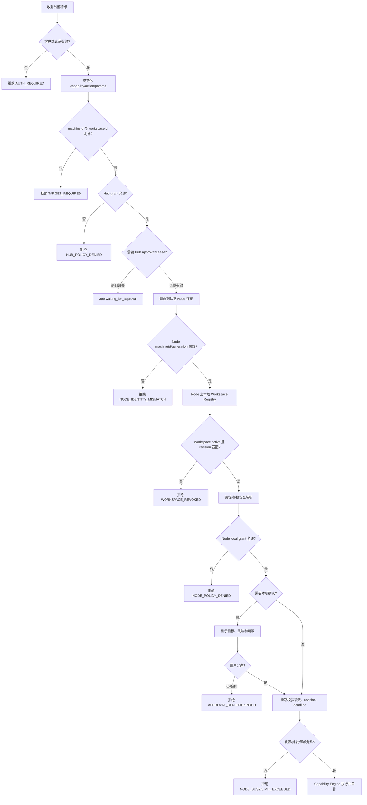

# 08 身份与权限

## 1. 安全目标

Fast Spider 的授权不能退化为“拿到 Hub Token 就能控制所有 Node”。每次操作都必须绑定并验证：

```text
User / Client
→ Machine
→ Workspace
→ Capability
→ Action
→ 可选参数风险与短期 Approval
```

Hub 进行第一层资格判断；Node 使用本地事实进行第二层判断并拥有最终拒绝权。任何外部协议都不能以绝对路径、Node 名称或 UI 选择状态替代 Workspace 授权。

## 2. 身份实体

| 实体 | 标识 | 认证方式 | 说明 |
|---|---|---|---|
| User | `userId` | Web 登录/OAuth Session | MVP 主要为 Owner |
| Organization | `organizationId` | 归属于 User | MVP 可只有一个隐式组织 |
| OAuth Client / MCP Client | `clientId` | OAuth 2.1 Client/Token | 每个外部客户端独立身份 |
| Machine | `machineId` | 设备密钥/凭据 | 逻辑设备，不等于连接 |
| Device Credential | `credentialId` | 私钥证明，可选 mTLS | 每台设备可轮换多个凭据 |
| Node Connection | `connectionId` | 认证后的短期连接上下文 | 带 generation，不持久充当设备身份 |
| Workspace | `workspaceId` | Node 本地 Registry 解析 | 对外 opaque，不暴露路径 |
| Local Client | `localClientId` | Named Pipe/UDS OS 身份 + Token/密钥 | 不复用 Hub OAuth Token |
| Session | `sessionId` | 继承创建者与边界 | 只是会话，不扩大权限 |
| Approval | `approvalId` | 用户/本机明确决定 | 针对风险摘要的一次决定 |
| Capability Lease | `leaseId` | 由策略和 Approval 签发 | 短时、窄边界授权 |

## 3. Owner 模式与未来多用户

### MVP Owner 模式

- 一个实例至少有一个 Owner。
- Owner 可以配对/吊销机器、查看审计和配置策略。
- Owner 不是“自动允许所有 Action”；高风险操作仍受 Node 本地策略与确认约束。
- 外部 MCP Client 只获得被授予的 scope 和资源边界，不继承 Owner 的 Web Session 权限。

### 未来多用户

预留 `organizationId` 和 role，但不在 MVP 实现复杂 RBAC。未来角色可为 Owner、Admin、Operator、Viewer；实际授权仍落到资源和 Action grant，不只依赖角色名。

## 4. 认证域

### 4.1 人类用户

- Web Console 使用安全登录 Session。
- 支持外部 OIDC/OAuth Provider 是后续选项；MVP 可提供 Owner 初始化和受保护的本地账户。
- 密码若存在，使用现代自适应哈希并支持恢复流程；不在日志、配置或 URL 中出现。
- 高风险管理操作可要求近期重新认证。

### 4.2 MCP 与 API Client

- 使用 OAuth 2.1 授权码 + PKCE，具体流程遵循编码时选定的官方 MCP 规范版本。
- Redirect URI 精确匹配。
- Access Token 短时，Refresh Token 轮换并可吊销。
- Token 绑定 clientId、subject、audience、scope、issuedAt、expiresAt；不把 Workspace 路径写入 Token。
- 公网 MCP 与普通管理 API 使用独立 audience/scope。

### 4.3 Node

- enrollment token 只用于首次配对，不能作为长期认证。
- Node 本机生成设备私钥；Hub 仅保存公钥/证书信息。
- 每次连接进行设备证明，绑定 challenge、Hub 身份、machineId 和连接 generation。
- 凭据支持轮换、短 overlap、立即吊销和最后使用时间。
- 设备私钥不能经 Hub、MCP 或普通日志传输。

### 4.4 Local Client

- Windows Named Pipe 限制当前用户 SID；Linux UDS 使用所有者权限。
- OS 身份只是第一层，客户端仍应有独立注册凭据和 `localClientId`。
- loopback HTTP 默认关闭；开启时必须使用短期 Token、Host/Origin 校验和 127.0.0.1/::1 绑定。
- Local Client 不因为在本机就自动获得所有 Workspace。

## 5. Grant 模型

Grant 是长期或中期策略记录：

```json
{
  "subjectType": "client",
  "subjectId": "cli_opaque",
  "machineId": "mach_opaque",
  "workspaceId": "ws_opaque",
  "capability": "file.system",
  "actions": ["list", "stat", "read"],
  "effect": "allow",
  "conditions": {
    "workspaceRevisionAtLeast": 8,
    "maxRisk": "R1",
    "source": ["remote_mcp"],
    "timeWindow": null
  },
  "expiresAt": null
}
```

### 5.1 默认拒绝

没有匹配 allow 即拒绝。显式 deny 优先于 allow，用于紧急封锁或局部排除。

### 5.2 匹配维度

- organization/user/client/localClient。
- machineId。
- workspaceId。
- capabilityId + version range。
- action。
- origin（remote MCP、Web Console、CLI、Local Bridge）。
- 风险等级、时间、并发、参数约束。

MVP 不支持通用策略脚本或可执行表达式，避免策略引擎本身成为复杂攻击面。条件使用固定、可审计字段。

## 6. Capability Lease

Lease 用于把一次审批或近期授权限定在窄范围：

| 字段 | 规则 |
|---|---|
| subject | 精确到 user/client |
| machine/workspace | 必须固定，不允许 wildcard 扩大 |
| capability/action | 精确或小集合 |
| riskDigest | 绑定规范化参数/副作用摘要 |
| allowedCount | 默认 1，可设置少量次数 |
| expiresAt | 默认分钟级 |
| workspaceRevision | 必须匹配当前 revision |
| issuer | Hub Approval 或 Node local approval |
| nonce | 防止重放 |

Lease 不是 Bearer 超级 Token。Hub 转发时携带引用和签名上下文；Node 仍要查本地策略和 revision。

## 7. 权限校验流程



任何 Approval 返回后必须重新校验，而不是从中断点无条件继续。

## 8. 安全会话上下文

MCP/Web 可以创建“当前机器/Workspace”上下文以减少重复参数，但它必须：

- 由 Hub 生成并签名。
- 绑定 userId、clientId、machineId、workspaceId、Workspace revision 和 expiresAt。
- 只减少目标选择，不扩大 grant。
- 不包含绝对路径。
- Workspace 禁用、权限变化、Client 吊销或 Session 结束时失效。
- 工具仍可显式覆盖目标，但覆盖值必须重新授权。

UI 中的“已打开 Workspace”不是权限本身。

## 9. Action 权限建议

### 文件

- `file.read`、`code.search`：只读 grant。
- `file.write`、`file.edit`、`file.applyPatch`：独立写 grant。
- `file.deleteRecoverable`：独立 grant。
- `file.purge`：MVP 默认拒绝或本机逐次确认。

### Shell

- `shell.run.argv` 与 `shell.run.profile` 分开。
- Profile 白名单可以允许常规 test/build。
- 任意 shell string、后台任务、网络工具和系统目录访问提升风险。
- 提权永远不能仅由 Hub grant 自动允许。

### Git

- read、stage、commit、network、worktree-delete 分开。
- push/pull/commit 可按 Workspace 设置短期 Lease。

### 浏览器/截图

- 隔离浏览器与用户现有浏览器分开。
- 页面截图与桌面/窗口截图分开。
- 访问真实登录态、本地网络或下载执行文件是高风险 Action。

### Agent

- provider/model 发现与 run 分开。
- session share/handoff 单独授权。
- Agent 调用其他 Agent 受 hopLimit、correlationId 和发起者权限约束。

## 10. Approval 展示

确认界面至少显示：

- 发起用户和客户端。
- 来源（远程 MCP、本地 Client、Web Console）。
- 机器与 Workspace 显示名。
- capability/action。
- 结构化影响摘要，如文件数量、命令、Git remote、浏览器 URL。
- 风险等级和为什么需要确认。
- 允许一次、允许短时间或拒绝；不得默认“永久允许所有”。
- deadline 和 Lease 期限。

敏感参数可以部分脱敏，但不能脱敏到用户无法判断风险。

## 11. 撤销与失效

| 事件 | 立即影响 |
|---|---|
| 用户/Client 吊销 | Token 和新请求失效；运行 Job 按策略取消 |
| Machine 吊销 | 关闭连接，拒绝重连和新事件 |
| Device Credential 吊销 | 对应凭据失效；machine 可用新凭据重连 |
| Workspace 禁用/删除 | revision 增加，旧 Session/Lease 失效 |
| Grant 收紧 | 新请求立即生效；相关 queued/waiting Job 重新评估 |
| Lease 过期/使用完 | 不可再次使用 |
| Hub 紧急锁定 | 停止新执行，只保留管理员恢复路径 |
| Node 本地暂停 | Hub allow 也不能绕过 |

## 12. Token 与凭据存储

- Hub 数据库中 Refresh Token、设备长期秘密只保存摘要或加密形式。
- 加密主密钥不与数据库备份放在同一文件中。
- Node 私钥优先 OS 凭据库。
- Access Token 不写普通日志、审计 details、URL query 或 Artifact。
- Web Console 不在 localStorage 长期保存高权限 Token。
- 配置导出默认排除所有秘密。

## 13. 审计身份链

每个危险操作的审计条目包含：

```text
userId / clientId / localClientId
organizationId
machineId / credentialId / connectionId
workspaceId / workspaceRevision
capability / action / risk
approvalId / leaseId
requestId / jobId / traceId / correlationId
policy decision at Hub and Node
result / side-effect knowledge / timestamps
```

不记录完整 Token、私钥、未脱敏环境变量或不必要的文件内容。

## 14. 防止 Confused Deputy

- Hub 不接受 Client 声称的 userId/clientId；由认证层注入。
- Node 不接受 Hub 任意指定本机绝对路径；只解析 workspaceId。
- Local Agent Adapter 不把 Provider 身份当作 Fast Spider 用户身份。
- Artifact 下载再次检查当前主体权限，不因知道 artifactId 即允许。
- Job cancel、watch、result 都检查 Job 所属资源和主体权限。
- 跨 Session handoff 需要明确共享授权，不能只凭 sessionId。

## 15. MVP 策略实现

MVP 使用关系表 + 固定决策函数，不引入 OPA、通用 DSL 或远程策略服务。等出现真实复杂组织策略需求后，再通过 ADR 评估外部策略引擎；即使引入，Node 本地最终裁决和固定安全底线不可外包。
