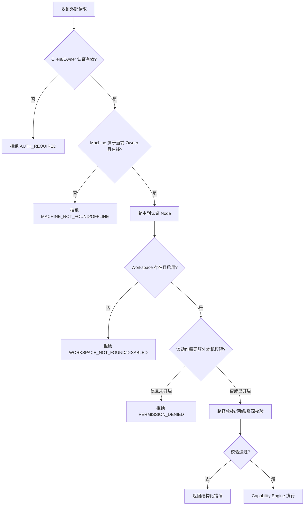

# 08 身份与权限

## 1. 安全目标

Fast Spider 的授权不能退化为“拿到 Hub Token 就能控制所有 Node”，但个人自托管 MVP 也不需要把每个 Action 都做成企业级审批系统。当前实际边界是：

```text
Owner / Client 身份
→ Machine
→ Workspace
→ 少量真正危险的本机权限（write / shell / git-* / build）
→ 固定参数、路径、网络与资源安全检查
```

Hub 进行身份与资源归属判断；Node 使用本地 Workspace 和运行时事实进行最终裁决。浏览器、截图、读取等常用能力不再额外叠一层独立 grant。任何外部协议仍不能以绝对路径、Node 名称或 UI 选择状态替代 Workspace 授权。

## 2. 身份实体

| 实体 | 标识 | 认证方式 | 说明 |
|---|---|---|---|
| User | `userId` | Web 登录/OAuth Session | MVP 主要为 Owner |
| Organization | `organizationId` | 归属于 User | MVP 可只有一个隐式组织 |
| OAuth Client / MCP Client | `clientId` | OAuth 2.1 Client/Token | 每个外部客户端独立身份 |
| Machine | `machineId` | 设备密钥/凭据 | 逻辑设备，不等于连接 |
| Device Credential | `credentialId` | 私钥证明，可选 mTLS | 每台设备可轮换多个凭据 |
| Node Connection | `connectionId` | 认证后的短期连接上下文 | 带 generation，不持久充当设备身份 |
| Workspace | `workspaceId` | Node 本地 Registry 解析 | 对外 opaque，不暴露路径 |
| Local Client | `localClientId` | Named Pipe/UDS OS 身份 + Token/密钥 | 不复用 Hub OAuth Token |
| Session | `sessionId` | 继承创建者与边界 | 只是会话，不扩大权限 |
| Approval | `approvalId` | 未来多人/高风险模式可选 | 当前个人 MVP 不进入正常执行链路 |
| Capability Lease | `leaseId` | 未来多人模式可选 | 当前个人 MVP 不实现通用 Lease 状态机 |

## 3. Owner 模式与未来多用户

### MVP Owner 模式

- 一个实例至少有一个 Owner。
- Owner 可以配对/吊销机器、查看审计和配置策略。
- Owner 对已配对 Machine 和已启用 Workspace 拥有正常使用权；写入、Shell、Git 网络/副作用和 Build 仍受 Node 本地开关约束。
- 外部 MCP Client 仍受认证 scope、Machine/Workspace 归属和 Node 本地边界限制，不继承 Owner 的 Web Session 凭据。

### 未来多用户

预留 `organizationId` 和 role，但不在 MVP 实现复杂 RBAC。未来如果真的进入多人共享场景，再根据实际需求决定是否需要 Owner、Admin、Operator、Viewer 和细粒度资源授权；当前代码不为这些角色提前设计执行分支。

## 4. 认证域

### 4.1 人类用户

- Web Console 使用安全登录 Session。
- 支持外部 OIDC/OAuth Provider 是后续选项；MVP 可提供 Owner 初始化和受保护的本地账户。
- 密码若存在，使用现代自适应哈希并支持恢复流程；不在日志、配置或 URL 中出现。
- 高风险管理操作可要求近期重新认证。

### 4.2 MCP 与 API Client

- 使用 OAuth 2.1 授权码 + PKCE，具体流程遵循编码时选定的官方 MCP 规范版本。
- Redirect URI 精确匹配。
- Access Token 短时，Refresh Token 轮换并可吊销。
- Token 绑定 clientId、subject、audience、scope、issuedAt、expiresAt；不把 Workspace 路径写入 Token。
- 公网 MCP 与普通管理 API 使用独立 audience/scope。

### 4.3 Node

- enrollment token 只用于首次配对，不能作为长期认证。
- Node 本机生成设备私钥；Hub 仅保存公钥/证书信息。
- 每次连接进行设备证明，绑定 challenge、Hub 身份、machineId 和连接 generation。
- 凭据支持轮换、短 overlap、立即吊销和最后使用时间。
- 设备私钥不能经 Hub、MCP 或普通日志传输。

### 4.4 Local Client

- Windows Named Pipe 限制当前用户 SID；Linux UDS 使用所有者权限。
- OS 身份只是第一层，客户端仍应有独立注册凭据和 `localClientId`。
- loopback HTTP 默认关闭；开启时必须使用短期 Token、Host/Origin 校验和 127.0.0.1/::1 绑定。
- Local Client 不因为在本机就自动获得所有 Workspace。

## 5. 当前个人模式权限模型

MVP 不实现通用 Grant 表、策略 DSL、Capability Lease 或逐 Action Approval。实际判断只保留几层：

- Owner/Client 身份有效，Machine 属于该 Owner 且在线。
- 请求必须使用 opaque `machineId + workspaceId`；Workspace 在 Node 本机存在且启用。
- 读取、搜索、隔离浏览器和一次性截图直接使用 Workspace 基础授权。
- `write`、`shell`、`git-write`、`git-network`、`git-hooks`、`build` 是当前少量额外本机权限。
- 每个 Capability 仍执行自己的参数白名单、路径限制、URL/SSRF、并发、大小、deadline 和幂等检查。
- Node 永远可以拒绝请求；Hub 不能绕过 Node 本地边界。

这套模型的目标是让个人机器“配置一次就正常用”，而不是每次操作都弹确认或维护短期授权。

## 6. 未来多人模式

只有出现以下真实需求时，再通过 ADR 引入 Grant/Lease/Approval：

- 多个互不信任用户或团队共享同一 Hub/Node。
- 需要按 Client、角色、时间窗口精细授权。
- 需要合规审批、双人确认或临时第三方访问。

未来扩展不得改变两个基础原则：Workspace 路径仍只由 Node 本机解析；Node 仍拥有最终拒绝权。当前代码不为未来模式预埋长期双路径执行逻辑。

## 7. 权限校验流程



## 8. 会话上下文

MCP/Web 后续可以保存“当前 Machine/Workspace”以减少重复参数，但它只是易用性上下文：

- 不包含绝对路径。
- 不扩大 Workspace 或额外本机权限。
- Workspace 禁用/删除、Machine 吊销或 Session 结束后失效。
- 显式覆盖目标时仍重新检查 Machine/Workspace 归属。

UI 中的“已打开 Workspace”不是新的权限对象。

## 9. Action 权限建议

### 文件

- `file.read`、`code.search`：Workspace 启用即可。
- `file.write`、`file.edit`、`file.applyPatch`：统一使用 `write` 本机权限。
- 删除能力若后续加入，优先可恢复删除；永久删除再单独评估，不提前做审批系统。

### Shell

- `shell.run.argv` 与 `shell.run.profile` 分开。
- Profile 白名单可以允许常规 test/build。
- 任意 shell string、后台任务、网络工具和系统目录访问提升风险。
- 提权不进入普通远程执行链路；Hub 不能把普通 Shell 升级成管理员/root。

### Git

- 读操作使用 Workspace 基础授权。
- 写操作统一 `git-write`，联网操作统一 `git-network`，可能执行 hooks/filter/driver 的操作使用 `git-hooks`。
- 不再为 commit/pull/push/worktree-delete 各建独立权限或短期 Lease。

### 浏览器/截图

- 当前隔离浏览器和一次性截图使用 Workspace 基础授权，不再要求额外 `browser`/`screenshot` 权限。
- 公网浏览默认可用；localhost/私网 Origin 只需本机加入一次持久白名单。
- 接管用户现有浏览器 Profile、持续录屏或远控仍不进入 MVP；如果未来加入，再作为独立高风险能力设计。

### Agent

- provider/model 发现与 run 分开。
- session share/handoff 单独授权。
- Agent 调用其他 Agent 受 hopLimit、correlationId 和发起者权限约束。

## 10. 本机可见性

当前个人 MVP 不做逐次 Approval 弹窗，但本机仍应让用户看得懂正在发生什么：

- 能查看已授权 Workspace、实际 Root 和额外本机权限。
- 能看到当前运行中的 Shell/Build/Git 网络/Browser 等长任务。
- 错误和日志不隐藏真实目标，但敏感 Token/凭据必须脱敏。
- 紧急情况下可以禁用 Workspace、停止 Node 或吊销 Machine。

未来多人模式如引入 Approval，再单独定义确认界面与期限，不把这套交互提前塞进个人模式。

## 11. 撤销与失效

| 事件 | 立即影响 |
|---|---|
| 用户/Client 吊销 | Token 和新请求失效；运行 Job 按策略取消 |
| Machine 吊销 | 关闭连接，拒绝重连和新事件 |
| Device Credential 吊销 | 对应凭据失效；machine 可用新凭据重连 |
| Workspace 禁用/删除 | 新请求立即拒绝；运行中的相关能力按各自取消/清理规则结束 |
| 本机额外权限收紧 | 新请求立即生效；长 Job 按现有周期 guard 重新检查 |
| Hub 紧急锁定 | 停止新执行，只保留管理员恢复路径 |
| Node 本地暂停 | Hub allow 也不能绕过 |

## 12. Token 与凭据存储

- Hub 数据库中 Refresh Token、设备长期秘密只保存摘要或加密形式。
- 加密主密钥不与数据库备份放在同一文件中。
- Node 私钥优先 OS 凭据库。
- Access Token 不写普通日志、审计 details、URL query 或 Artifact。
- Web Console 不在 localStorage 长期保存高权限 Token。
- 配置导出默认排除所有秘密。

## 13. 审计身份链

每个危险操作的审计条目包含：

```text
userId / clientId / localClientId
organizationId
machineId / credentialId / connectionId
workspaceId / workspaceRevision
capability / action
requestId / jobId / traceId / correlationId
Hub identity/resource decision + Node local decision
result / side-effect knowledge / timestamps
```

不记录完整 Token、私钥、未脱敏环境变量或不必要的文件内容。

## 14. 防止 Confused Deputy

- Hub 不接受 Client 声称的 userId/clientId；由认证层注入。
- Node 不接受 Hub 任意指定本机绝对路径；只解析 workspaceId。
- Local Agent Adapter 不把 Provider 身份当作 Fast Spider 用户身份。
- Artifact 下载再次检查当前主体权限，不因知道 artifactId 即允许。
- Job cancel、watch、result 都检查 Job 所属资源和主体权限。
- 跨 Session handoff 需要明确共享授权，不能只凭 sessionId。

## 15. MVP 策略实现

MVP 只使用 Owner/Machine 归属、Node Workspace Registry、少量额外本机权限和固定决策函数。不创建通用 Grant/Lease/Approval 数据表，也不引入 OPA、通用 DSL 或远程策略服务。等真正出现多人共享和细粒度授权需求后再通过 ADR 评估；即使未来扩展，Node 本地最终裁决和固定安全底线不可外包。
