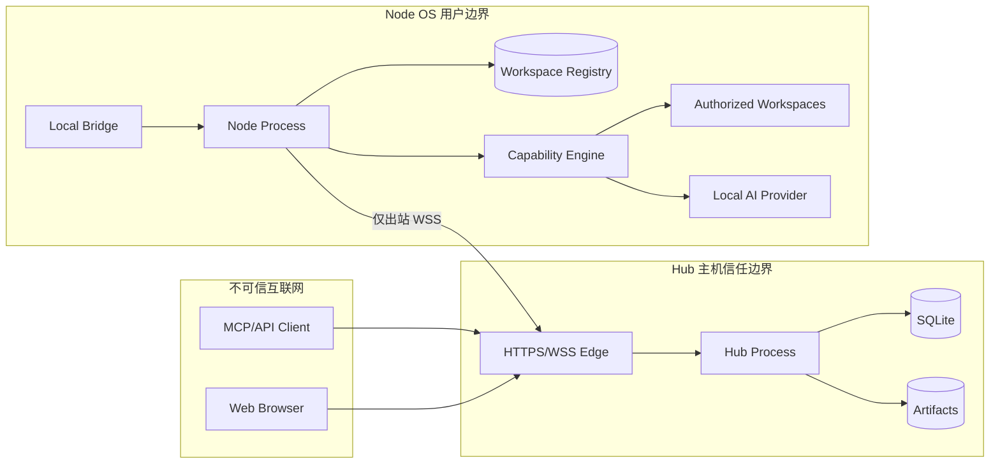

# 09 安全威胁模型

## 1. 文档目的

Fast Spider 能在真实开发机上读取和修改代码、执行命令、控制浏览器并调用本地 AI，因此其风险接近“受控远程代码执行平台”。安全不能只依赖 TLS 或 Hub 登录。本威胁模型单独定义资产、攻击者、信任边界、主要威胁、控制措施、剩余风险和验证要求。

本模型覆盖 MVP 和已规划能力。任何新增 Capability、传输、安装模式或自动更新机制都必须更新本文件和对应测试。

## 2. 安全目标

1. 未授权主体不能访问其他用户、机器或 Workspace。
2. Hub 即使被攻破，也不能无条件突破 Node 本地授权边界。
3. Node 即使被攻破，也不能伪造其他机器身份或无限污染 Hub。
4. 外部 MCP Client 被攻破时，损害被限制在其明确 grant 内。
5. 写操作、Shell、Git、浏览器和 AI run 不因网络重试重复执行。
6. 所有高风险操作可见、可审计、可取消、可超时并受资源限制。
7. Token、设备私钥、Provider Token、环境变量和用户内容不会通过日志或错误泄露。
8. 更新与恢复链路不能成为供应链后门。
9. 不提供隐蔽控制、权限绕过、任意端口转发或自动提权。

## 3. 资产

### 3.1 高价值资产

- Node 设备私钥和 Hub 签名/加密密钥。
- OAuth Access/Refresh Token、Web Session；Local Bridge 当前不维护独立凭据。
- 本机 Workspace 源码、配置、密钥文件和 Git 凭据。
- Shell 执行权限、进程环境和系统资源。
- 浏览器 Profile、Cookie、下载内容和内网可达性。
- 本地 AI Provider Token、Session 历史和模型权限。
- Artifact、截图、Diff、测试报告和日志。
- Workspace/危险本机权限、Audit 和设备吊销状态。
- Hub 备份包、恢复数据和人工升级使用的二进制。

### 3.2 完整性资产

- Job 状态、事件序号、Result 和幂等记录。
- Workspace Registry、revision 和路径边界。
- Capability Descriptor 与协议版本。
- Hub 数据库、备份和迁移历史。

### 3.3 可用性资产

- Hub 公网入口和 Node 长连接。
- Node 的 CPU、内存、磁盘、进程、浏览器和文件句柄。
- Job/Event/Artifact 存储容量。

## 4. 攻击者与假设

| 攻击者 | 能力假设 |
|---|---|
| 互联网攻击者 | 可扫描 Hub、发送恶意 HTTP/WSS/MCP、重放已捕获数据但不能破解现代 TLS |
| 被盗账号攻击者 | 拥有某用户 Token/Session，可能操作 Web/MCP |
| 恶意/被攻破 MCP Client | 能构造任意合法或畸形工具参数，尝试扩大权限 |
| 被攻破 Hub | 可控制 Hub 应用和数据库，但不自动拥有 Node OS 权限或私钥 |
| 被攻破 Node | 可访问该 Node 用户权限内资源，并尝试伪造协议/事件 |
| 恶意本地进程 | 与 Node 同机，尝试连接 Local Bridge、读取状态或竞争路径 |
| 供应链攻击者 | 控制依赖、更新源、CI 凭据或发布包 |
| 恶意 Workspace | 仓库内包含 hooks、构建脚本、symlink、压缩炸弹和诱导 AI 的内容 |
| 内部误操作 | Owner 误授权、误删除、误执行命令或忽略风险提示 |

基本假设：操作系统内核和用户账户未完全失守；一旦攻击者取得与 Node 相同或更高 OS 权限，Node 无法保证该机器上的秘密不被读取，但仍应限制向其他机器和 Hub 扩散。

## 5. 信任边界

关键边界：

1. Client ↔ Hub 公网边界。
2. Hub ↔ Node 设备边界。
3. Node ↔ Workspace 文件系统边界。
4. Node ↔ Shell/子进程边界。
5. Node ↔ 浏览器/桌面边界。
6. Node ↔ Local Bridge/本地进程边界。
7. Node ↔ Agent Provider 边界。
8. Owner ↔ 备份介质/人工升级文件边界。

## 6. 安全基线

- Node 只出站连接；默认无公网/局域网监听。
- TLS 必需，每台设备独立身份；首次登记使用后台创建、可过期/可撤销的连接令牌。
- 可轮换、可吊销设备密钥；可选 mTLS。
- 当前个人 MVP 以 Owner/Client 身份、Machine、Workspace 为主要边界；写入、Shell、Git 网络/副作用、Build 等危险能力额外由 Node 本机开关控制。
- Hub 与 Node 双重校验，Node 最终裁决；不依赖通用 Grant/Lease/Approval 引擎才能安全运行。
- 高风险操作必须可在 Node 本机整体关闭/收紧，并保持可见、可取消和可审计。
- 服务默认普通用户运行；不自动提权。
- 升级前可验证备份，失败时人工回退二进制或恢复备份。
- Token、日志、环境变量和错误脱敏。
- Local Bridge 使用当前 OS 用户/data-dir ACL，并继续复用 Workspace 与危险本机权限。
- 任务、命令和关键策略决策审计。
- 审计、Event、日志和 Artifact 有保留/容量策略。
- 紧急断开、机器吊销、Workspace 禁用和 Client 吊销。
- 禁止隐蔽模式、任意 TCP 转发和绕过用户知情。

## 7. 威胁登记

风险等级综合影响与可利用性：Critical、High、Medium、Low。状态为 MVP 必须控制或后续增强。

### T01 Hub 被攻破

- **场景**：攻击者控制 Hub 进程/数据库，向 Node 发送任意请求、窃取 Artifact 或篡改审批。
- **风险**：Critical。
- **控制**：Node 本地 Workspace Registry 和额外危险权限开关；Hub 不持有绝对路径/Provider Token；设备会话认证；固定 Action/参数白名单；路径、URL、资源与并发底线；Node 本机可看到授权目录和运行任务；紧急暂停/吊销；最小 OS 权限；备份和审计。
- **剩余风险**：Hub 能在已启用 Workspace 和本机允许能力范围内滥用合法请求，也可读取 Hub 已保存 Artifact。高度敏感目录应直接不注册为 Workspace，或临时禁用 Workspace。
- **验证**：伪造 Hub 请求不能越过 Workspace、路径、参数、网络和并发限制，也不能把未开启的 write/shell/git/build 能力变成已开启。

### T02 Node 被攻破

- **场景**：恶意代码控制某 Node，窃取该用户文件、伪造能力/事件、攻击 Hub 或其他 Node。
- **风险**：Critical。
- **控制**：每设备独立密钥和 machineId；Hub 将连接严格绑定设备；单 Node 不能选择其他 machineId；事件和 Artifact 绑定 Job/连接 generation；输入/速率/配额限制；Hub 不信任 Node 上报的权限；机器吊销；Artifact 安全下载；不允许 Node 直接路由到其他 Node。
- **剩余风险**：攻击者可访问该 OS 用户本来可访问的资源。Fast Spider 不能替代终端安全。
- **验证**：被吊销 Node 无法重连；伪造其他 machineId、JobId、sequence 被拒绝。

### T03 MCP Client 被攻破

- **场景**：Client Token 被恶意插件/提示注入滥用，批量读取、写入或执行命令。
- **风险**：High/Critical。
- **控制**：每 Client 独立 OAuth 身份和 scope；短时 Token；Machine/Workspace 资源归属；Node 本机危险权限；速率/并发限制；安全会话上下文不扩大权限；审计和即时吊销。
- **剩余风险**：Client 可滥用其合法 Workspace 和已开启能力。个人模式应只注册真正愿意让 AI 使用的 Workspace，并只开启实际需要的 write/shell/git/build 权限。

### T04 用户账号被盗

- **场景**：攻击者控制 Owner Web Session，配对新 Node、扩大权限或读取 Artifact。
- **风险**：Critical。
- **控制**：安全 Cookie、CSRF 防护、近期重新认证、可选 MFA、登录告警、会话/Token 列表、设备配对可见、敏感变更审计、恢复码保护、异常限流。
- **验证**：旧 Session/Refresh Token 在吊销后不可继续使用。

### T05 连接令牌泄露

- **场景**：后台创建的连接令牌被截屏、Shell 历史、进程参数或旁观者窃取。
- **风险**：High。
- **控制**：随机高熵、数据库仅保存哈希、明文只展示一次、可设置有效期、可立即撤销；令牌只允许机器登记接口，不能访问 MCP/管理 REST；Node 登记后不持久化令牌。
- **剩余风险**：泄露者在令牌撤销/过期前可能登记一台新设备，因此后台必须让新增设备清晰可见并支持立即撤销。对敏感环境可使用短有效期并在登记完成后主动撤销令牌。

### T06 设备私钥泄露

- **场景**：恶意本地进程复制设备密钥，伪装 Node。
- **风险**：Critical。
- **控制**：OS Credential Store、不可导出能力优先、密钥轮换、最近连接/环境异常展示、challenge proof、连接替换告警、吊销、可选硬件密钥/TPM 后续。
- **验证**：旧凭据在 overlap 后失效；吊销即时关闭连接。

### T07 重放攻击

- **场景**：重放 enroll、dispatch、Approval、cancel、Artifact chunk 或旧连接消息。
- **风险**：High。
- **控制**：TLS；握手 nonce；connectionId/generation；deadline；requestId/idempotencyKey；event sequence；chunk offset/hash；连接令牌最小权限、可过期、可撤销。
- **验证**：重复同 key 返回原 Job；不同参数同 key冲突；旧 generation 事件拒绝。

### T08 中间人攻击

- **场景**：伪造 Hub、降级 TLS/协议或替换更新。
- **风险**：Critical。
- **控制**：严格 TLS 验证、Hub 信任材料/可选 pin、HSTS、协议版本下限、设备 challenge、更新独立签名、不可忽略证书错误的默认 UI。
- **剩余风险**：用户手动信任恶意根证书/Hub。需要显示 Hub 指纹和变更告警。

### T09 越权访问其他机器

- **场景**：替换 machineId、利用缓存/路由混淆访问另一 Node。
- **风险**：Critical。
- **控制**：Hub grant 绑定 machineId；连接注册表绑定 machineId/credential；Node 校验请求 machineId 与本机一致；Job/Artifact 再次绑定资源；数据库外键和组织边界。
- **验证**：跨组织、跨 Client、跨 machine IDOR 测试。

### T10 Workspace 路径穿越

- **场景**：`../`、绝对路径、Windows drive-relative/UNC/device path、编码或分隔符绕过。
- **风险**：Critical。
- **控制**：只接受相对路径；平台化解析；拒绝危险形式；以本地 Registry 根为起点；打开后对象身份复核；不使用字符串前缀作为唯一判断。
- **验证**：跨平台恶意路径 corpus 和 fuzz。

### T11 Symlink/Junction/Reparse Point 逃逸与 TOCTOU

- **场景**：Workspace 内链接指向外部；检查后替换路径；mount/junction 变化。
- **风险**：Critical。
- **控制**：逐组件安全打开；默认不跟随跨界链接；文件句柄/ID 复核；expected revision；写入同目录临时文件；检测路径竞态；Workspace 文件系统特征记录。
- **剩余风险**：部分平台 API 很难完全消除竞态，需平台专项测试和保守拒绝。

### T12 命令注入

- **场景**：把未可信参数拼入 shell string；文件名、分支名或测试参数形成命令。
- **风险**：Critical。
- **控制**：优先 executable+argv；Shell Profile 明确选择；结构化参数白名单；不自动拼接；cwd 限 Workspace；普通用户；审批展示规范化命令。
- **验证**：引号、换行、环境变量、PowerShell/cmd/bash 特殊字符测试。

### T13 参数注入

- **场景**：把以 `-` 开头文件名、Git ref、ripgrep pattern 等误作工具选项。
- **风险**：High。
- **控制**：结构化映射；使用 `--` 终止选项；固定允许 flags；不把客户端任意参数直接透传给系统工具。

### T14 Git 配置、凭据与 Hooks 风险

- **场景**：恶意仓库 hooks、filter、credential helper、submodule URL、配置 include 执行或泄密。
- **风险**：High/Critical。
- **控制**：只在授权 Workspace；写/网络 Action 分权；检测 hooks 并在 commit 等操作提示；非交互；URL/凭据脱敏；不自动放宽 safe.directory；不修改全局 config；构建/checkout 外部代码视为执行风险。
- **剩余风险**：为兼容用户 Git 行为，系统 Git 可能执行合法 hooks。用户可禁用该 Workspace 的 Git 写操作。

### T15 浏览器 SSRF 与内网访问

- **场景**：导航云元数据、路由器、本机服务、file URL 或 DNS rebinding 域名。
- **风险**：Critical。
- **控制**：URL scheme allowlist；解析并校验目标 IP；重定向每跳复核；阻止云元数据和保留地址；本地开发地址需明确策略；隔离 Profile；下载限制；网络日志脱敏。
- **剩余风险**：合法公网域名可返回内网 DNS；需要连接前后地址检查和可选网络沙箱。

### T16 浏览器真实登录态泄露

- **场景**：控制用户日常浏览器，读取已登录页面、Cookie 或敏感数据。
- **风险**：Critical。
- **控制**：默认隔离 Profile；连接现有浏览器是独立高风险能力；本机显式授权；限制 Session/域名/期限；不返回 Cookie 原文；可随时断开。

### T17 截图泄露

- **场景**：截图包含密码、聊天、个人数据或其他显示器内容。
- **风险**：High。
- **控制**：截图单独权限、本机提示、精确显示器/窗口选择、默认一次性、尺寸限制、Artifact 权限与短保留、审计，不做持续录屏。
- **剩余风险**：用户选择窗口本身可能包含敏感内容；UI 必须说明范围。

### T18 日志和环境变量泄露

- **场景**：命令输出、错误堆栈、Git URL、HTTP Header 或 env 含秘密。
- **风险**：High。
- **控制**：env 白名单、敏感字段匹配和结构化脱敏、Token 不入 URL、错误不含堆栈/绝对路径、日志访问权限、短保留、Artifact 显式标记敏感。
- **剩余风险**：任意命令可主动打印秘密；高风险 Shell 权限需谨慎授予。

### T19 恶意 Artifact

- **场景**：HTML/压缩包/可执行文件攻击浏览器或管理员终端；路径穿越；压缩炸弹。
- **风险**：High。
- **控制**：内容寻址存储；logicalName 不作路径；大小/hash/type 校验；下载附件、nosniff、隔离域名可选；不自动执行/解压；恶意扫描接口；过期清理。

### T20 节点伪造能力

- **场景**：恶意 Node 宣称不真实或错误版本的能力，诱导 Hub/Client。
- **风险**：Medium/High。
- **控制**：Descriptor 签在认证连接上下文；Hub 只把它当设备声明；调用仍受策略；结果校验；协议 conformance；异常能力变更审计。
- **剩余风险**：Hub 无法完全证明 Node 的本地实现正确，只能限制影响和识别异常。

### T21 被篡改的备份或人工升级文件

- **场景**：备份介质损坏、备份被替换，或人工取得的新二进制来自错误/受污染来源。
- **风险**：High/Critical。
- **控制**：备份包逐文件 SHA-256、恢复前强制 `backup-verify`、恢复到空目录、升级前保留可验证备份；程序升级不自动下载或静默安装，来源由 Owner 明确选择。
- **剩余风险**：当前备份 manifest 没有外部签名，能可靠发现随机损坏和未同步篡改，但不能抵抗同时重写内容与 manifest 的攻击者；因此备份文件本身仍需操作系统权限/离线副本保护。若未来开放自动更新，再单独引入签名信任链。
- **验证**：篡改 ZIP 内容、缺失/额外 entry、恢复覆盖、错误二进制版本和升级失败回退演练。

### T22 Local Bridge 本机越权调用

- **场景**：同机其他用户或错误权限的进程尝试连接 Local Bridge。
- **风险**：High。
- **控制**：Windows/Linux 统一使用当前用户 data-dir 下的 AF_UNIX/UDS；依赖 OS 用户目录/Socket 权限作为本机信任边界；不监听 TCP/loopback HTTP；请求仍必须通过 Workspace 与 Capability 的既有边界。

### T23 多个 AI 递归调用

- **场景**：未来若加入 AI→AI workflow，可能形成费用、任务或写操作循环。
- **风险**：High。
- **控制**：当前 MVP 不开放通用 AI→AI 调用；同一 Session 只允许一个 active Turn。只有真实引入跨 Provider workflow 时再增加 correlationId/hopLimit 等专门策略。

### T24 Node 离线后任务重复执行

- **场景**：Hub 未收到 ack/result，重发写命令；Node 已完成但再次执行。
- **风险**：Critical。
- **控制**：Node 在 accepted 前持久化 idempotency；相同 key 返回原 Job；状态对账；终态缓存；lost 写 Job 不自动重试；参数 digest 冲突拒绝。

### T25 取消失败留下孤儿进程

- **场景**：只杀父进程、子进程继续运行；UI 虚报 canceled。
- **风险**：High。
- **控制**：Windows Job Object、Linux process group/session；graceful + force；进程句柄持久摘要；回收器；只有确认树退出才 canceled；否则 `CANCEL_INCOMPLETE`、failed/lost 和告警。

### T26 资源耗尽与 DoS

- **场景**：海量连接、深目录、正则、巨大日志、Artifact、浏览器或进程耗尽资源。
- **风险**：High。
- **控制**：公网限流、连接/Client/Node/Capability 并发；输入深度/长度限制；有界队列；搜索/输出/文件大小/运行时间限制；磁盘配额和清理；心跳抖动；不为每路由创建独立探活。

### T27 审计篡改或清理逃避

- **场景**：攻击者删除操作痕迹、用日志洪泛赶走重要记录。
- **风险**：High。
- **控制**：安全事件与普通日志分层；append-oriented 审计；hash chain/签名作为后续增强；权限分离；重要条目独立保留；容量告警；备份。

### T28 数据库/备份泄露

- **场景**：SQLite、备份或 Artifact 目录被复制。
- **风险**：High。
- **控制**：文件权限、磁盘加密建议、秘密摘要/字段加密、备份加密、密钥分离、最小 Artifact 保留、恢复环境访问控制。

### T29 协议解析与供应链漏洞

- **场景**：畸形 JSON/二进制帧、依赖漏洞、WebSocket/OAuth/MCP SDK 缺陷。
- **风险**：High。
- **控制**：长度/深度/数组限制；fuzz；依赖锁定、SBOM、漏洞扫描、最小依赖；官方 SDK 优先；升级窗口和回归测试；高风险解析在边界层完成。

### T30 UI 欺骗与同意疲劳

- **场景**：确认框目标模糊、连续弹窗导致用户无脑允许。
- **风险**：Medium/High。
- **控制**：个人 MVP 尽量不使用逐次确认；高风险能力通过少量持久本机开关整体启用/关闭，并在执行结果中显示真实 Client、机器、Workspace、Action 和影响，避免连续弹窗造成同意疲劳。

## 8. STRIDE 汇总

| 类别 | 典型威胁 | 主要控制 |
|---|---|---|
| Spoofing | 设备/用户/Client 冒充 | OAuth、设备证明、OS 用户边界、吊销 |
| Tampering | 消息、Event、备份、Artifact 篡改 | TLS、sequence/hash、备份 SHA-256、内容寻址 |
| Repudiation | 否认执行 | 结构化审计、身份链、时间与 Job 关联 |
| Information Disclosure | 文件、Token、截图、日志泄露 | 最小权限、脱敏、隔离 Profile、保留策略 |
| Denial of Service | 连接、搜索、日志、Artifact 洪泛 | 有界队列、限流、配额、超时、清理 |
| Elevation of Privilege | 路径逃逸、Shell/Local Bridge 提权 | Node 最终裁决、Path Guard、普通用户、无自动提权 |

## 9. 安全测试要求

### 必须自动化

- 路径穿越、symlink/junction、TOCTOU 和 Windows 特殊路径 corpus。
- 协议 JSON/二进制 fuzz、长度和状态机 property test。
- OAuth scope、IDOR、跨机器/Workspace/Client 授权矩阵。
- 重放、idempotency、sequence 冲突和旧 generation。
- Shell argv/profile 注入与进程树取消。
- Artifact 路径、hash、offset、压缩炸弹和 Content-Type。
- Local Bridge Host/Origin/OS ACL。
- 更新签名、回滚、防降级。

### 必须人工/演练

- Hub 被攻破假设下 Node 本地拒绝演练。
- Node 吊销、Workspace 收紧、Token 泄露和紧急锁定。
- Hub/Node 断电、数据库损坏、磁盘满、时间偏差。
- 浏览器 SSRF、真实 Profile 授权和截图隐私。
- 发布密钥丢失与更新回滚。

## 10. 安全日志与告警

高优先级事件：

- 多次配对失败、设备凭据冲突和旧 generation 回写。
- 跨 machine/workspace 越权尝试。
- Path Guard 逃逸/竞态检测。
- Approval 参数摘要变化。
- 同 sequence 不同 payload。
- 取消不完整、孤儿进程。
- 更新签名/版本异常。
- Local Bridge 非法 Origin/Host。
- Artifact hash 冲突或类型异常。

告警必须聚合和限频，不能被攻击者制造成磁盘写入洪水。

## 11. 事件响应

### Hub 疑似被攻破

1. 启用紧急锁定，停止新 Job、配对和权限变更。
2. 通知/指导 Node 本地暂停并断开。
3. 轮换 Hub TLS、签名/加密密钥和 OAuth secrets。
4. 吊销所有 Access/Refresh Token 与设备连接 Session。
5. 从可信备份恢复，核对审计和发布产物。
6. Node 重新核验 Hub 指纹后恢复连接。

### Node 疑似被攻破

1. Hub 吊销 machine/credential 并断开。
2. 撤销其 Artifact/Job 可见入口和短期 Lease。
3. 本机停止 Node、隔离机器、轮换 Git/Provider/系统凭据。
4. 检查该 Node 上传的 Artifact 与异常事件。
5. 清理重装后使用新 machine 身份重新配对，不复用旧私钥。

### Client Token 泄露

吊销 Client/Session/Refresh Token、检查 grant 和审计、轮换相关秘密、缩小权限后重新授权。

## 12. 发布门禁

任何正式版本不得在以下条件下发布：

- 存在可越过 Workspace 的已知 Critical/High 缺陷。
- 取消会虚报成功或幂等无法防重复写。
- 更新包无签名验证/回滚。
- Local Bridge 可被普通网页无认证调用。
- 日志默认记录 Token、私钥或完整环境变量。
- Hub 能通过未授权绝对路径直接命令 Node。
- 安全测试和威胁模型未随新 Capability 更新。
