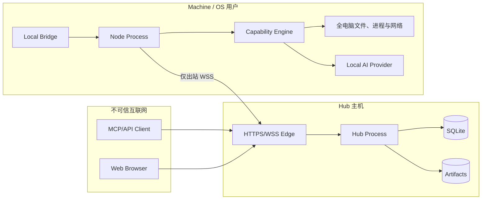

# 09 安全威胁模型（0.3.0）

## 1. 文档目的

Fast Spider 能在真实开发机上读取和修改代码、执行命令、控制浏览器并调用本地 AI，因此风险接近“受控远程代码执行平台”。安全边界不是目录名单，而是 Owner/Client → Machine → Node 当前 OS 用户权限，再叠加能力参数、资源、Job 和审计规则。

## 2. 安全目标

1. 未授权主体不能访问其他 Owner 或 Machine。
2. Hub 即使被攻破，也不能伪造其他 Machine 的设备身份或直接取得 Node OS 权限。
3. Node 以当前 OS 用户执行，不自动提权；OS 权限不足时明确失败。
4. MCP Client 被攻破时，损害被限制在其 Owner 已连接的 Machine 及其当前 OS 用户权限内。
5. 写操作、Shell、Git、Browser 和 AI Run 不因网络重试重复执行。
6. 高风险操作可见、可审计、可取消、可超时并受资源限制。
7. Token、设备私钥、Provider Token、环境变量和用户内容不会通过日志或错误泄露。
8. 更新与恢复链路不能成为供应链后门。
9. 不提供隐蔽控制、任意端口转发或自动提权。

## 3. 资产

### 高价值资产

- Node 设备私钥、Hub 签名/加密密钥、OAuth Token 和 Web Session。
- Node 当前 OS 用户可访问的源码、配置、密钥文件、Git 凭据和进程环境。
- 浏览器 Profile、Cookie、下载内容和 Node 可达网络。
- 本地 AI Provider Token、Session 历史和模型权限。
- Job、Artifact、截图、Diff、报告、日志、备份和设备吊销状态。

### 完整性与可用性资产

- Job 状态、事件序号、Result 和幂等记录。
- Capability Descriptor、协议版本、Hub 数据库和迁移历史。
- Hub 公网入口、Node 长连接、CPU、内存、磁盘、进程、浏览器和文件句柄。

## 4. 攻击者与假设

| 攻击者 | 能力假设 |
|---|---|
| 互联网攻击者 | 扫描 Hub，发送恶意 HTTP/WSS/MCP，不能破解现代 TLS |
| 被盗账号攻击者 | 拥有某个 Owner 的 Web/MCP Token |
| 恶意或被攻破 MCP Client | 构造任意合法或畸形工具参数，尝试切换 Machine 或扩大副作用 |
| 被攻破 Hub | 控制 Hub 应用和数据库，但没有 Node 私钥或 Node OS 权限 |
| 被攻破 Node | 拥有该 Node 当前 OS 用户权限，并尝试伪造协议/事件 |
| 恶意本地进程 | 与 Node 同机，尝试读取状态或连接 Local Bridge |
| 供应链攻击者 | 控制依赖、更新源、CI 凭据或发布包 |
| 恶意项目内容 | 包含 hooks、构建脚本、symlink、压缩炸弹和诱导 AI 的内容 |

基本假设是 OS 内核和当前账户未完全失守。取得与 Node 相同或更高 OS 权限后，Node 无法保护该用户可访问的全部秘密，但仍应限制对其他 Machine 和 Hub 的扩散。

## 5. 信任边界

关键边界：

1. Client ↔ Hub 公网认证边界。
2. Hub ↔ Node Machine 设备边界。
3. Node ↔ 当前 OS 用户可访问的文件、进程和网络边界。
4. Node ↔ Shell/Git/Build 子进程边界。
5. Node ↔ Browser/桌面边界。
6. Node ↔ Local Bridge/本地进程边界。
7. Node ↔ Agent Provider 边界。
8. Owner ↔ 备份介质/人工升级文件边界。

## 6. 安全基线

- Node 只出站连接；默认无公网/局域网监听。
- TLS 必需，每台设备独立身份；连接令牌只用于登记且不落盘。
- Machine 是唯一远程边界；Node 以当前 OS 用户执行整台电脑上的请求，不维护目录授权、路径白名单或额外本机权限开关。
- 绝对 `path`、`cwd`、`repositoryPath` 和 `workingDirectory` 经过 Schema、平台格式、大小、竞态、资源和秘密处理检查。
- 浏览器允许 Node 可访问的公网、localhost 和私网 HTTP/HTTPS/WS/WSS；不使用 Fast Spider Origin 白名单。危险 scheme、任意 CDP/JavaScript 和通用远控仍拒绝。
- 高风险操作可取消、可超时、可审计、可限制并发/输出/磁盘。
- 服务默认普通用户运行；不自动提权。
- 更新前验证备份，发布物校验签名、哈希和大小。
- Token、日志、环境变量、错误和 Artifact 脱敏。
- Local Bridge 依赖当前 OS 用户/data-dir ACL，不监听 TCP。

## 7. 主要威胁

### T01 账号或 OAuth Token 被盗

攻击者可调用 Owner 有权访问的 Machine。控制措施：PKCE、短期 Access Token、Refresh 轮换、Web Session/Authorization 撤销、速率限制、审计和 Machine 紧急断开。剩余风险是合法账号本身拥有 Machine 当前 OS 用户权限，必须由 Owner 管好账号和 Node。

### T02 Hub 被攻破

Hub 可伪造合法请求，但不能直接执行 Node 文件或进程。Node 仍校验设备会话、`machineId`、绝对目标的参数安全、资源上限和当前 OS 执行条件；其他 Machine 由各自设备凭据隔离。Hub 已保存的 Artifact 和审计数据仍可能泄露，备份必须按秘密保存。

### T03 MCP Client 被攻破

Client 可尝试枚举 Machine、切换绝对路径、注入命令、重复提交 Job 或打开 Node 网络。控制措施：Machine 归属校验、固定工具 Schema、结构化 argv、绝对目标字段、idempotency、Job 状态机、输出/并发上限、审计和 Node 最终拒绝。客户端不能伪造 `machineId` 或设备身份。

### T04 绝对路径与文件操作风险

绝对路径不是授权机制，因此安全重点是拒绝 NUL、非法设备路径、意外特殊文件、TOCTOU、超大文件、二进制误编辑和危险删除。写入使用 expected hash/revision、临时文件和原子替换；删除默认进入 recovery-bin；错误不得静默改写目标。

### T05 Shell、Build 与 Git 副作用

控制措施：优先结构化 `argv`，`cwd`/`repositoryPath` 必须绝对，关闭隐式字符串拼接和不受控环境覆盖；系统 Git 保留用户配置但脱敏凭据与 remote；hooks/filter、commit/pull/push、构建和网络动作进入 Job、审计、超时和取消流程。Node 不自动提权。

### T06 Browser 网络访问

Browser 允许 Node 可达的公网、localhost 和私网，意味着它确实具备该 Node 网络视角下的访问能力。控制措施：只开放固定动作和隔离 Profile，不暴露原始 CDP/任意脚本；拒绝危险 scheme，限制页面、下载、输出、并发和生命周期；结果通过结构化数据和 Artifact 返回。私网访问不通过 Fast Spider 白名单授权。

### T07 Provider 与 Session 泄露

Provider Token、Codex 本地认证和原始环境不进入 Hub。`session.create` 使用绝对 `workingDirectory`，但日志只记录脱敏摘要；Session/Turn 使用单 active Run、幂等和真实终态，Provider 崩溃只影响 Agent Adapter。

### T08 Local Bridge 与本地进程

Local Bridge 使用当前用户 AF_UNIX/UDS、0700/0600 或等价 Windows ACL，不监听 TCP，不注册第二套 Client 身份。连接只产生临时日志字段；请求复用远程 Capability、Job、资源和审计链路。

### T09 重放、断线与取消

控制措施：设备 generation、requestId、idempotencyKey、Job sequence、deadline、有限事件缓冲和重连对账。ack 只表示收到或持久化，不代表副作用完成；完整进程树退出前不报告 canceled。

### T10 日志、Artifact 与备份泄露

日志、错误、MCP 返回和 Artifact 元数据不得包含 Token、私钥、Cookie、环境秘密或不必要的命令凭据。Hub 备份包含敏感密钥，必须验证哈希、限制访问并在恢复前确认目标目录为空。

### T11 供应链与更新

发布 manifest、组件和 Node EXE 验证签名、SHA-256、大小和版本；升级前 backup/verify，失败时回退到旧二进制或恢复新 data-dir。Node 更新不自动提权，不安装独立常驻 updater。

## 8. 验证要求

- OAuth、IDOR、跨 Machine、设备吊销和旧 generation 测试。
- 绝对路径格式、NUL、设备路径、symlink/TOCTOU、并发替换和大文件测试。
- argv、shell profile、环境变量、Git remote/hooks、Build、超时、取消和幂等测试。
- Browser 的公网、localhost、RFC1918/ULA/CGNAT 访问，以及危险 scheme、任意脚本和隔离 Profile 测试。
- Local Bridge ACL、断线重连、Job/Event sequence、Artifact hash、备份恢复和更新签名测试。
- Hub 被攻破假设下 Node 仍只代表自身 Machine，不能代表其他设备。

## 9. 发布阻断条件

- 存在可绕过 Machine 或 OS 用户边界的 High/Critical 缺陷。
- 绝对路径被静默改写、可借相对路径逃逸、或输入会执行隐式命令。
- 取消会虚报成功，或幂等无法防止重复写/执行。
- Browser/Local Bridge 暴露任意端口、CDP、脚本或秘密。
- 发布物、备份、日志或 Artifact 会泄露凭据。
