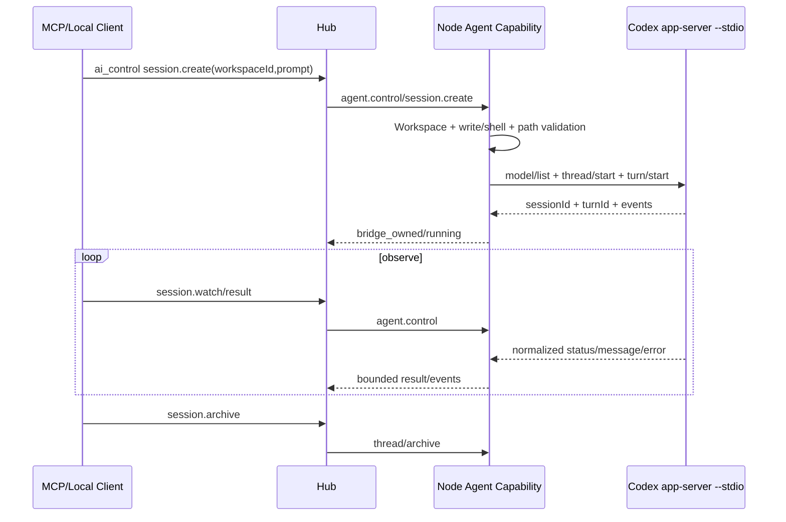

# 11 Local Bridge 与 AI 控制

## 1. 目标与边界

Node 可选择性提供只面向本机的 Local Bridge，供 Codex、其他 AI 编程软件、CLI 或编辑器访问 Fast Spider 能力。Local Bridge 与远程 Hub 入口复用同一个 Capability Engine、Workspace Registry、Policy、Job、Event 和 Audit 实现。

Local Bridge 不是：

- localhost/TCP 后门或局域网 MCP Server。
- 绕过 Workspace、路径和现有危险操作开关的“本机全权模式”。
- 为单人电脑再维护一套 Client 注册、Grant、Lease、Approval 的权限系统。
- 让多个 AI 自动无限互相调用的代理网络。
- 把本地 Provider Token 上传到 Hub 的通道。

## 2. 默认状态

- Node 正常运行时默认启用本机 IPC；它不占 TCP 端口，因此不要求用户每次手工打开。
- Windows/Linux 使用当前用户 data-dir 下的 AF_UNIX socket；macOS 后续沿用 Unix Domain Socket。
- 提供 `--disable-local-bridge` 作为明确关闭入口。
- loopback HTTP/MCP Capability Adapter 默认不实现；只有出现真实兼容需求时再单独评估。Node 的 `127.0.0.1` 本地控制 UI 是独立管理面，不承载 MCP/Capability 调用。
- 本机状态只需显示 Local Bridge 是否启用、endpoint 类型和最近活动，不维护“已注册客户端列表”。

## 3. 传输选择

| 传输 | 优点 | 风险/限制 | 推荐 |
|---|---|---|---|
| AF_UNIX / Unix Domain Socket | Windows 10/11 与 Linux 共用 Go `net.Unix*`，无 TCP 端口、协议一致 | Windows 依赖当前用户 data-dir ACL；Unix 还需处理 stale socket | Phase 6 默认 |
| stdio | 生命周期与父进程绑定、边界简单 | 不适合多个长期客户端或发现 | 单客户端 Adapter 可用 |
| loopback HTTP/MCP | 兼容生态、易调试 | DNS rebinding、Origin、Token 泄露、端口冲突 | 默认关闭的兼容项 |

详细决策见 [adr/0006-local-bridge.md](adr/0006-local-bridge.md)。

## 4. 本地信任边界

个人模式把 **当前 OS 用户** 作为 Local Bridge 的信任边界：

- Socket 固定放在 Node 当前用户 data-dir 的私有 `local/` 子目录，不依赖名称保密。
- Unix 目录/Socket 使用 `0700/0600`；Windows 继承当前用户 data-dir 的 Windows ACL，不再维护第二套 SID/SDDL 代码。
- 不做 Local Client 注册、一次性配对 Token、公钥、Capability Grant 或逐请求 nonce。
- 连接可生成临时 `connectionId` 仅用于日志和排错，它不是权限对象。
- 本地请求仍必须使用 opaque `workspaceId`，并继续经过 Workspace enabled、相对路径、URL、资源限制，以及现有 `write/shell/git-*/build` 本机权限。

如果未来出现“同一机器多个互不信任 OS 用户共享一个 Node”的真实需求，再单独设计多人本地身份；当前不预埋双路径。

## 5. 为什么首版不做 Loopback HTTP

AF_UNIX/UDS 已覆盖本机 AI/CLI Client 的核心需求，因此不实现 loopback HTTP/MCP Capability Adapter。桌面客户端现在有一个单独的 loopback 本地管理 UI，只负责连接、每机配置和 Workspace/权限；它不接受 MCP 工具调用，也不替代 Local Bridge。这样满足日常可视化操作，同时不把远程执行协议搬到 TCP。

## 6. Local Bridge 调用链

```text
Local Client（当前 OS 用户）
→ 当前用户 data-dir 下的 AF_UNIX / UDS 文件边界
→ request schema and size validation
→ Workspace enabled + 现有危险权限/路径/网络/资源检查
→ same Dispatcher / Job Manager
→ same Capability Engine
→ local Event/Result
```

如果该操作同时需要 Hub 同步，Node 只同步允许的 Job 摘要/审计，不把 Local Client 的 Provider Token 或私有 Session 内容默认上传。

## 7. Provider-neutral Agent Bridge

AI Provider 适配器与文件、Shell、传输模块分离。核心模型：

### 7.1 Provider

```text
providerId
name
adapterVersion
availability
supportedOperations
credentialLocation=local_only
```

### 7.2 Model

```text
modelId
providerId
displayName
capabilities
policyAllowed
thinking/effort options if provider exposes them
source and authoritative flag
```

模型列表是运行时发现结果，不由 Hub 猜测。Node Policy 可以过滤 Provider 可用模型。

### 7.3 Project

Provider 的项目边界必须映射到已授权 workspaceId。Provider 返回的绝对项目路径只在 Node 本机用于匹配；对外返回 opaque projectId、workspaceId 和显示名。

### 7.4 Session

Session 是 Provider 持久会话，不等于一次 Job：

```text
sessionId
providerId
projectId/workspaceId
createdByClientId
sessionMode
executionMode
owner
lifecycle
providerSessionRef (local only)
createdAt/updatedAt
```

创建后不能静默更换 Provider、Workspace 边界或 sessionMode。

### 7.5 Run / Turn

Run 是 Session 内的一次用户请求与 Provider 响应：

```text
runId / turnId
sessionId
jobId
inputDigest
owner
phase
startedAt/completedAt
result/artifacts
```

一个 Session 可有多个 Run，但默认同一 Session 只允许一个 active Run，除非 Provider 明确支持且策略允许并行。

## 8. Agent 能力面

固定 actions：

```text
providers.list
models.list
projects.list
session.list
session.get
session.create
session.send
session.watch
session.cancel
session.rename
session.archive
session.result
```

### 8.1 `session.create`

必需：workspaceId。可选：prompt、workingDirectory、model、thinking；providerId 省略时默认为 `codex`。Workspace 必须已有 `write + shell` 权限。未指定 model 时先读取本机 Codex 当前 `model/list` 并自动选择可用模型。

只创建 Session 时可不带 prompt，返回 phase=`ready`；带 prompt 时同时启动 Turn，返回 sessionId、turnId、model、executionMode=`bridge_owned`、phase=`running`。

### 8.2 `session.list/get/result`

- `session.list`：只列当前 Workspace 内 Codex Session，不返回本机 cwd/root。
- `session.get`：返回有限 Session/最新 Turn 摘要。
- `session.result`：返回最新 Turn 的真实 status 与 finalAgentMessage（存在时）。

### 8.3 `session.send`

Session 空闲时启动下一 Turn；active Turn 存在时返回 `AGENT_SESSION_BUSY`，不做隐式 steering。可选 workingDirectory 仍必须位于当前 Workspace 内。

### 8.4 `session.watch`

按本机有界 event cursor 读取 assistant/status/warning/error 等归一化事件；waitSeconds 最多 15 秒。它只观察，不创建第二条 Provider 执行链。

### 8.5 `session.cancel`

对当前 active Turn 调用 Codex `turn/interrupt`。返回 cancelRequested 后，真实终态继续由 `session.watch/result` 获取。

### 8.6 `session.rename/archive`

直接映射 Codex `thread/name/set` 与 `thread/archive`。当前不实现 recover、handoff、share、desktop-owned 或通用 AI→AI workflow。

## 9. 当前执行模式

Phase 6 只有 `bridge_owned`：Node 启动本机 `codex app-server --stdio` 并管理 Session/Turn。一个 Session 同时只允许一个 active Turn。没有 `desktop_owned`/Hook/handoff 的第二套状态机。

## 10. Codex Adapter

当前实际实现：

1. 运行时探测本机 `codex --version`。
2. 直接启动 `codex app-server --stdio` 并完成 `initialize/initialized`。
3. 使用 `model/list`、`thread/list/read/start/name/set/archive`、`turn/start/interrupt`。
4. stdio JSON-line 写入使用独立写锁，避免并发 RPC 交叉破坏协议。
5. Provider 凭据、ChatGPT/Codex 本地认证状态、环境变量和 Workspace 绝对路径不返回 Hub。
6. App Server 崩溃只影响 Agent Adapter，不拖垮 Node 主进程；下次调用可重新启动。

当前 Windows 实机使用 Codex CLI 0.141.0 已验证：自动选择 `model/list` 当前可用模型后，`session.create → result/watch → archive` 可以完整返回最终 `OK`。

## 11. 调用链



## 12. 本机与远程共用 Session

- 本机 Local Bridge 与远程 MCP 都调用同一个 `agent.control`，看到同一 Codex Session 事实。
- Local Bridge connectionId 只是日志字段，不形成 Session 分享权限。
- Client 断开不自动取消 Provider Turn；显式 `session.cancel` 才中断。
- 当前不实现“AI 自动调用另一个 AI”的通用递归网络。

## 13. Provider Token 与秘密

- Token 只保存在 Provider/Node 本机安全存储。
- Hub 只知道 providerId、可用性和经过策略过滤的模型摘要。
- 请求不接受“把 API Key 临时传给 Hub 再转发”的模式。
- Provider 原始事件中的 Header、环境变量、账户名和路径必须脱敏。
- 配置导出和 Artifact 不包含 Token。

## 14. Artifact 与变更

Phase 6 不复制完整 Codex 会话历史、Trace 或 Token usage 到 Hub，也不额外建立 Agent Artifact 流。Codex 在授权 Workspace 中产生的文件变更仍由现有 file/Git/Build/Artifact 工具查看和导出；截图仍走 Phase 5 的既有 Artifact 链路。

## 15. 审计与日志

当前 Hub 对 `session.create/send/cancel/rename/archive` 记录 capability 审计；Node/Adapter 日志只记录必要的 request/session/provider 状态和有界错误，不默认永久保存完整 prompt、Provider 原始事件、环境变量或凭据。本机 Local Bridge connectionId 只用于排错，不形成长期身份记录。

## 16. 当前 Phase 6 范围

已实现：

1. 默认启用的当前用户 AF_UNIX/UDS Local Bridge，可用 `--disable-local-bridge` 关闭。
2. Local Bridge 复用同一个 Capability Engine，不建立 Local Client 注册/Grant/Approval。
3. Codex provider/model/project 发现。
4. bridge_owned `session.list/get/create/send/watch/cancel/result/rename/archive`。
5. Session 与 Workspace 真实路径边界绑定。
6. 本机 `codex app-server --stdio` Adapter 与实际模型自动选择。

当前明确不实现 desktop-owned、Hook、handoff/recover、Agent 专属 Artifact 流或通用 AI→AI workflow。
