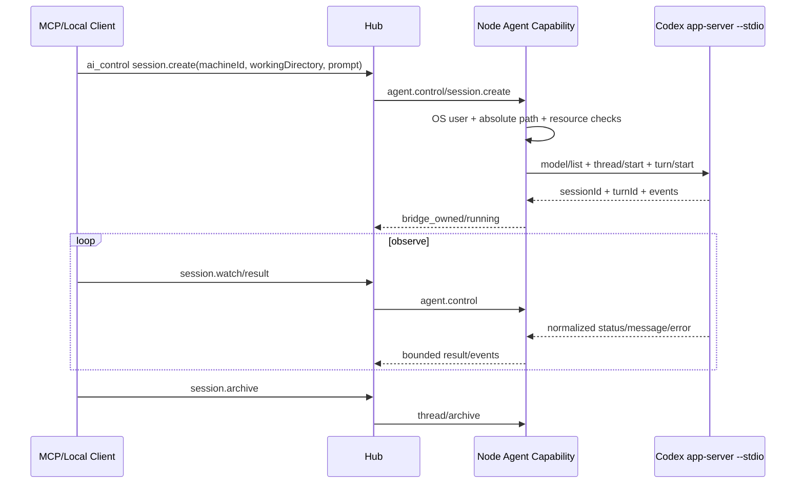

# 11 Local Bridge 与 AI 控制（0.3.0）

## 1. 目标与边界

Node 可提供只面向本机的 Local Bridge，供 Codex、其他 AI 编程软件、CLI 或编辑器访问 Fast Spider 能力。Local Bridge 与远程 Hub 入口复用同一个 Capability Engine、Machine、Policy、Job、Event 和 Audit 实现。

Local Bridge 不是：

- localhost/TCP 后门或局域网 MCP Server。
- 绕过 Node 当前 OS 用户权限、参数安全和资源限制的特殊通道。
- 为单人电脑维护一套 Local Client 注册、Grant、Lease 或 Approval 系统。
- 让多个 AI 无限互相调用的代理网络。
- 把 Provider Token 上传到 Hub 的通道。

## 2. 默认状态与传输

- Node 正常运行时默认启用本机 IPC；可使用 `--disable-local-bridge` 关闭。
- Windows/Linux 使用当前用户 data-dir 下的 AF_UNIX/UDS；不占 TCP 端口。
- loopback HTTP/MCP Capability Adapter 默认不实现；Node 的 `127.0.0.1` 管理 UI 只负责连接、本机设置和状态。
- 本机状态只显示 Bridge 是否启用、endpoint 类型、最近活动和运行 Job，不维护客户端注册列表。

## 3. 本地信任边界

当前 OS 用户和 data-dir 文件系统 ACL 是 Local Bridge 的信任边界：

- Unix 目录/Socket 使用 `0700/0600`；Windows 继承当前用户 data-dir ACL。
- 不做 Local Client 注册、配对 Token、公钥、Capability Grant 或逐请求 nonce。
- 临时 `connectionId` 只用于日志和排错，不是权限对象。
- Local 请求直接进入相同的 Machine、Capability、Job、绝对路径、网络、并发和资源校验。

调用链：

```text
Local Client（当前 OS 用户）
→ 当前用户 data-dir 下的 AF_UNIX / UDS
→ request schema and size validation
→ Machine / absolute target / OS permission / resource checks
→ same Dispatcher / Job Manager
→ same Capability Engine
→ local Event/Result
```

## 4. Provider-neutral Agent Bridge

### Provider

```text
providerId
name
adapterVersion
availability
supportedOperations
credentialLocation=local_only
```

### Model

```text
modelId
providerId
displayName
capabilities
policyAllowed
source and authoritative flag
```

模型列表是运行时发现结果，不由 Hub 猜测。Node 只返回必要的模型摘要。

### Project、Session、Run

Provider 的项目由绝对路径定位。对外只返回 opaque `projectId`、显示名和必要摘要，不把 Provider Token、环境变量或完整本机目录清单上传 Hub。

Session 是 Provider 持久会话，不等于一次 Job：

```text
sessionId
providerId
projectId
createdByClientId
sessionMode
executionMode
owner
lifecycle
providerSessionRef (local only)
createdAt/updatedAt
```

`Run/Turn` 属于 Session，包含 `runId/turnId`、`jobId`、输入摘要、phase、时间和结果引用。一个 Session 默认只允许一个 active Run。

## 5. Agent 能力面

固定 actions：

```text
providers.list
models.list
projects.list
session.list
session.get
session.create
session.send
session.watch
session.cancel
session.rename
session.archive
session.result
```

### `session.create`

必需：`machineId` 和绝对 `workingDirectory`。可选：`prompt`、`model`、`thinking`；`providerId` 省略时默认为 `codex`。Git 子目录/linked worktree 会自动解析到主工作树项目，响应额外返回 `projectDirectory` 和 `projectId`；实际 Turn 仍在传入的 `workingDirectory` 执行。

只创建 Session 时可不带 prompt，返回 `phase=ready`；带 prompt 时同时启动 Turn，返回 sessionId、turnId、model、`executionMode=bridge_owned`、`phase=running`。Node 直接以当前 OS 用户权限启动 Provider，不检查或创建额外目录授权对象。项目归并只写 Codex Desktop 的项目/会话展示元数据，不创建第二份仓库或项目目录；非 Git 目录保持普通聊天目录语义。

未指定 model 时先读取本机 Codex 当前 `model/list` 并自动选择可用模型；显式不可用模型在启动 Turn 前拒绝。

### `session.list/get/result`

- `session.list`：列出当前 Machine 上当前 Client 可见的 Session，不返回不必要的本机绝对路径。
- `session.get`：返回有限 Session/最新 Turn 摘要。
- `session.result`：返回最新 Turn 的真实 status 与 finalAgentMessage（存在时）。

### `session.send`

Session 空闲时启动下一 Turn；active Turn 存在时返回 `AGENT_SESSION_BUSY`，不做隐式 steering。可选 `workingDirectory` 也必须是绝对路径，并按当前 OS 用户权限处理；同一 Session 只允许切换到同一主 Git 项目内的子目录或 worktree，跨项目时必须新建 Session。

### `session.watch/cancel/rename/archive`

`session.watch` 使用有界 event cursor；`session.cancel` 映射 Codex `turn/interrupt`，ack 不等于最终 canceled；rename/archive 直接映射 Codex `thread/name/set` 与 `thread/archive`。当前不实现 recover、handoff、share、desktop-owned 或通用 AI→AI workflow。

## 6. Codex Adapter

当前实现：

1. 运行时探测本机 `codex --version`。
2. 直接启动 `codex app-server --stdio` 并完成 initialize/initialized。
3. 使用 `model/list`、`thread/list/read/start/name/set/archive`、`turn/start/interrupt`。
4. stdio JSON-line 写入使用独立写锁，避免并发 RPC 交叉破坏协议。
5. Provider 凭据、ChatGPT/Codex 本地认证状态、环境变量和不必要的绝对路径不返回 Hub。
6. App Server 崩溃只影响 Agent Adapter，不拖垮 Node 主进程；下次调用可重新启动。

## 7. 调用链



本机 Local Bridge 与远程 MCP 看到同一 Session 事实；Client 断开不自动取消 Provider Turn，显式 `session.cancel` 才中断。Provider Token 只保存在 Node/Provider 本机。

## 8. 审计与当前范围

Hub 对 `session.create/send/cancel/rename/archive` 记录 capability 审计；日志只记录必要的 request/session/provider 状态和有界错误，不永久保存完整 prompt、Provider 原始事件、环境变量或凭据。

当前范围：默认启用的 AF_UNIX/UDS Local Bridge、Provider/model/project 发现、bridge_owned Session 全生命周期、绝对 `workingDirectory` 和本机 `codex app-server --stdio` Adapter。明确不实现 desktop-owned、Hook、handoff/recover、Agent 专属 Artifact 流或通用 AI→AI workflow。
