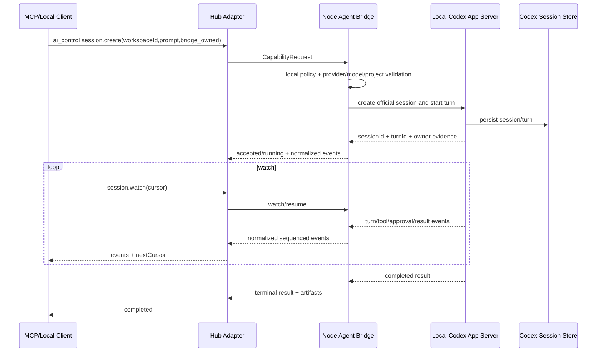
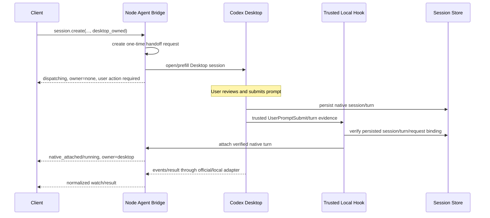

# 11 Local Bridge 与 AI 控制

## 1. 目标与边界

Node 可选择性提供只面向本机的 Local Bridge，供 Codex、其他 AI 编程软件、CLI 或编辑器访问 Fast Spider 能力。Local Bridge 与远程 Hub 入口复用同一个 Capability Engine、Workspace Registry、Policy、Job、Event 和 Audit 实现。

Local Bridge 不是：

- 无认证的 localhost 后门。
- 向局域网开放的通用 MCP Server。
- 绕过 Workspace/Action 权限的“本机全权模式”。
- 让多个 AI 自动无限互相调用的代理网络。
- 把本地 Provider Token 上传到 Hub 的通道。

## 2. 默认状态

- 默认关闭。
- Windows 优先 Named Pipe；Linux 优先 Unix Domain Socket。
- 只有兼容需求明确时才启用 loopback HTTP/MCP。
- loopback 只能绑定 `127.0.0.1` 和可选 `::1`，不得默认监听 `0.0.0.0`。
- UI 明确显示已启用接口、客户端、权限和最近活动。

## 3. 传输选择

| 传输 | 优点 | 风险/限制 | 推荐 |
|---|---|---|---|
| Windows Named Pipe | OS ACL、无 TCP 端口、当前用户隔离好 | 跨语言库和异步取消需验证 | Windows 默认 |
| Unix Domain Socket | 文件权限清晰、无 TCP 暴露 | 容器/挂载和 stale socket 处理 | Linux/macOS 默认 |
| stdio | 生命周期与父进程绑定、边界简单 | 不适合多个长期客户端或发现 | 单客户端 Adapter 可用 |
| loopback HTTP/MCP | 兼容生态、易调试 | DNS rebinding、Origin、Token 泄露、端口冲突 | 默认关闭的兼容项 |

详细决策见 [adr/0006-local-bridge.md](adr/0006-local-bridge.md)。

## 4. Local Client 身份

每个本地客户端独立登记：

```json
{
  "localClientId": "lcli_opaque",
  "displayName": "Codex Desktop",
  "executableIdentity": "optional platform evidence",
  "publicKey": "optional",
  "allowedWorkspaces": ["ws_opaque"],
  "allowedCapabilities": {
    "file.system": ["list", "stat", "read", "edit"],
    "shell.process": ["run", "status", "logs", "cancel"]
  },
  "expiresAt": null
}
```

身份来源组合：

- OS 用户/SID、socket ACL。
- 首次本机配对产生的独立 Token 或公钥。
- 可选进程路径/签名信息只作为风险信号，不能作为唯一认证，因为进程路径可被替换。
- 每次连接使用 challenge/nonce，防止简单 Token 重放。

Client 可单独暂停、吊销和查看审计。

## 5. Loopback HTTP 安全

启用兼容 HTTP 时必须：

- 随机高位端口或用户指定端口，只绑定 loopback。
- `Host` 只允许明确的 `127.0.0.1:<port>`、`[::1]:<port>` 或固定本地域名。
- 浏览器来源请求严格校验 Origin；默认不允许网页跨域。
- 不设置 `Access-Control-Allow-Origin: *`。
- 使用独立短期 Token，不能复用 Hub 高权限 Token。
- 敏感写操作使用每请求 nonce/CSRF 保护。
- 禁止通过 GET 产生副作用。
- 启动时检测端口被占用和代理劫持，失败即不启用。
- 管理页面与 API 若共用端口，使用强 CSP、frame-ancestors 和内容隔离。

## 6. Local Bridge 调用链

```text
Local Client
→ transport authentication
→ localClientId binding
→ request schema and size validation
→ Workspace/Capability/Action grant
→ optional local approval
→ same Dispatcher / Job Manager
→ same Capability Engine
→ local Event/Result
→ local audit
```

如果该操作同时需要 Hub 同步，Node 只同步允许的 Job 摘要/审计，不把 Local Client 的 Provider Token 或私有 Session 内容默认上传。

## 7. Provider-neutral Agent Bridge

AI Provider 适配器与文件、Shell、传输模块分离。核心模型：

### 7.1 Provider

```text
providerId
name
adapterVersion
availability
supportedOperations
credentialLocation=local_only
```

### 7.2 Model

```text
modelId
providerId
displayName
capabilities
policyAllowed
thinking/effort options if provider exposes them
source and authoritative flag
```

模型列表是运行时发现结果，不由 Hub 猜测。Node Policy 可以过滤 Provider 可用模型。

### 7.3 Project

Provider 的项目边界必须映射到已授权 workspaceId。Provider 返回的绝对项目路径只在 Node 本机用于匹配；对外返回 opaque projectId、workspaceId 和显示名。

### 7.4 Session

Session 是 Provider 持久会话，不等于一次 Job：

```text
sessionId
providerId
projectId/workspaceId
createdByClientId
sessionMode
executionMode
owner
lifecycle
providerSessionRef (local only)
createdAt/updatedAt
```

创建后不能静默更换 Provider、Workspace 边界或 sessionMode。

### 7.5 Run / Turn

Run 是 Session 内的一次用户请求与 Provider 响应：

```text
runId / turnId
sessionId
jobId
inputDigest
owner
phase
startedAt/completedAt
result/artifacts
```

一个 Session 可有多个 Run，但默认同一 Session 只允许一个 active Run，除非 Provider 明确支持且策略允许并行。

## 8. Agent 能力面

固定 actions：

```text
providers.list
models.list
projects.list
session.list
session.get
session.create
session.send
session.watch
session.cancel
session.recover
session.handoff
session.rename
session.archive
session.result
```

### 8.1 `session.create`

必需：providerId、prompt/message、sessionMode；项目会话还需 workspaceId/projectId。可选：modelId、executionMode、workingDirectory（必须为 Workspace 内相对目录）。

返回：bootstrapId、sessionId、可选 runId/turnId、owner、phase、handoffStatus、nextCursor。

### 8.2 `session.watch`

按 opaque cursor 长轮询/订阅 normalized events；首次可不带 cursor，后续使用 nextCursor。它只观察，不改变 Session 所有权。

### 8.3 `session.get`

提供稳定视图：summary、latest、conversation、timeline、changes、diagnostic、evidence。Provider 原始数据需要归一化和脱敏；完整历史分页读取。

### 8.4 `session.send`

在 Session 空闲时创建新 Run；若 active Run 支持 steering，可带 expectedRunId 明确发送。不能在所有权不明时把消息同时发给桌面与 bridge。

### 8.5 `session.cancel`

取消 active Run，返回“取消请求已接收”与后续真实终态；不能把 API ack 当作已取消。

### 8.6 `session.recover`

用于 Node/Provider 服务中断后的同 Session 恢复。它可以创建新的恢复 Run，但不承诺 token 级无缝续写；必须带 recoveryKey 防重复恢复。

### 8.7 `session.handoff`

把后续 Run 所有权移交给明确客户端/桌面模式。handoff 本身不启动 Run，也不保证桌面用户已提交内容。

## 9. 执行模式与所有权

Canonical execution modes：

### `bridge_owned`

- Node 通过 Provider 官方 App Server、SDK、CLI/stdio 或本地 agent-service 启动 Run。
- active owner=`node_agent_bridge`。
- Provider Desktop 可显示历史，但显示不改变 owner。
- Node 可以 watch、cancel 和恢复其启动的 Run。

### `desktop_owned`

- Node 创建一次性 handoff/prompt 预填或导航请求。
- Node/agent-service 不静默启动 Provider Run。
- 初始 owner=`none`，phase=`dispatching`。
- 只有本机可信 Hook/Provider 官方事件观察到用户真实提交并核验 Session/Run 后，owner 才变为 `desktop`，phase 才能进入 running。
- Hook 未信任、用户未提交或关联失败时保持 dispatching/handoff_failed，不伪报运行。

可扩展 `external_owned` 用于只观察已有 Provider Session，但 MVP 不自动接管。

## 10. Agent 生命周期

Provider-specific 状态保留在 `providerPhase`；公共映射：

```text
session: created → active → archived
run/job: queued → dispatched → accepted → running
         → completed / failed / canceled / expired / lost
```

辅助阶段：

- `native_attached`：官方 Provider Run 已关联，但是否 running 取决于真实开始事件。
- `bridge_running`：bridge_owned 且 Provider 已开始。
- `handoff_failed`：desktop_owned 关联失败。
- `waiting_for_user_submit`：桌面预填但尚未提交。

UI 必须同时展示 owner、executionMode 和 phase，避免“会话已创建”被理解为“AI 已执行”。

## 11. Codex Adapter

优先顺序：

1. 官方 Codex App Server/SDK 或公开稳定接口。
2. 独立本地 `agent-service`，由 Node 通过 Named Pipe/UDS/loopback/stdio 调用。
3. 受控 CLI 作为降级路径，功能和可恢复性较弱。

Node 不把 agent-service 直接暴露到公网。Adapter 负责：

- 发现 Codex runtime、模型、项目和会话。
- 创建/读取/继续 Session。
- 规范化 Turn、工具、审批、变更、token usage 和运行时事件。
- 将 Provider Session/Turn ID 只作为本地映射字段保存。
- 验证 desktop_owned Hook 的本机来源、信任、一次性 requestId 和真实持久化 Turn。

## 12. Codex 调用时序图

### 12.1 Bridge-owned



### 12.2 Desktop-owned



若 Hook 不可信或无法验证，不允许手工修改 trusted hash 或绕过信任；返回明确 handoff_failed/仍未信任。

## 13. 多客户端与 Session 归属

- 每个请求记录发起 localClientId/remote clientId。
- Session 有创建者和可共享 Client 列表。
- 默认只有创建者与 Owner 可继续/取消；共享需明确授权。
- 一个 active Run 只有一个 owner。
- Client 关闭不自动取消 Run，除非创建策略设置 `cancelOnDisconnect`。
- Desktop 打开会话只是导航证据，不转移 owner。
- `session.open`、`rename`、`archive` 是管理操作，不等于执行。

## 14. 防递归调用

每次 Agent 调用带：

```text
correlationId
parentRunId
initiatorClientId
hopCount
hopLimit
callChain[]
```

规则：

- 默认 hopLimit=1。
- 最大建议 4，且每一跳需策略允许。
- 同 provider/session 或同 correlationId 的循环立即拒绝 `AGENT_LOOP_DETECTED`。
- AI 不能自行扩大 hopLimit。
- 跨 Provider 调用默认需要用户授权或预定义 workflow。
- Token、预算、运行时间和并发有上限。

## 15. Provider Token 与秘密

- Token 只保存在 Provider/Node 本机安全存储。
- Hub 只知道 providerId、可用性和经过策略过滤的模型摘要。
- 请求不接受“把 API Key 临时传给 Hub 再转发”的模式。
- Provider 原始事件中的 Header、环境变量、账户名和路径必须脱敏。
- 配置导出和 Artifact 不包含 Token。

## 16. Artifact 与变更

Agent Run 可关联：

- 文件变更摘要和 Diff。
- 测试/构建日志。
- Provider 生成的计划或报告。
- 截图和浏览器 Trace。

Artifact 权限继承 Session/Workspace，但下载时重新授权。Provider 会话历史不默认完整复制到 Hub；可按用户选择同步摘要或必要证据。

## 17. 审计

Agent 审计至少记录：

- Client、Provider、model、project/workspace。
- sessionId、runId、jobId、owner、executionMode。
- prompt 摘要/hash，而不是默认全文永久审计。
- 创建、发送、steer、cancel、recover、handoff、share。
- Hook 信任/关联结果。
- 文件变更、命令和 Approval 引用。
- 终态、错误和 token usage 摘要（Provider 可用时）。

## 18. MVP 顺序

Phase 6 首版只实现：

1. Local Bridge 开关和 Named Pipe/UDS 身份。
2. Provider/model/project 发现。
3. bridge_owned session create/get/watch/send/cancel/result。
4. Session 与 Workspace 绑定。
5. 基础 Codex Adapter。

`desktop_owned`、可信 Hook、handoff/recover、跨 Client 分享在基础链路稳定后加入，但协议从第一版保留 owner/executionMode/phase，避免后续破坏性改造。
