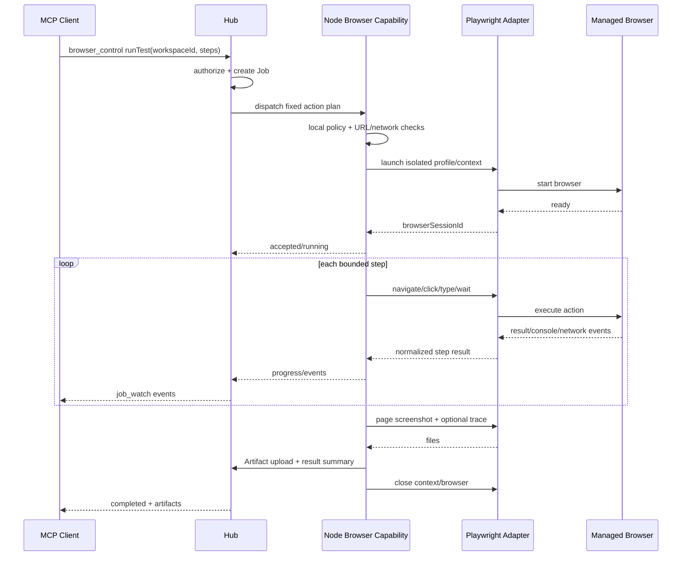

# 12 浏览器与截图

## 1. 范围

Fast Spider 的浏览器能力用于开发页面验证、自动化测试、结构化页面读取和一次性截图，不用于通用远程桌面。

支持：

- Node 启动/关闭受管浏览器。
- 隔离 Browser Profile/Context。
- 页面导航、列表、点击、输入、按键、等待。
- 可访问性树或结构化页面摘要。
- 受限页面脚本。
- 页面截图、下载、控制台日志、网络错误。
- 浏览器测试 Job。
- 桌面、显示器、窗口的一次性截图。

不支持：

- 持续桌面视频、音频。
- 通用鼠标键盘远控。
- 默认接管用户现有浏览器登录态。
- 向 Client 暴露任意原始 CDP 命令。

## 2. Phase 5 当前实现状态

当前已落地的 Browser MVP 边界：

- Go `BrowserManager` + 私有 Playwright `1.62.0` Chromium Sidecar。
- Sidecar 只通过 Node 子进程 stdio 通信，不监听 TCP/CDP 端口。
- 每个 Node 当前最多一个受管 Browser Session、最多 8 个页面；Session 空闲 10 分钟自动关闭。
- Browser 不再额外叠加 Workspace `browser` 权限；Workspace 本身启用即可使用。
- 公网 HTTP/HTTPS/WS/WSS 默认可访问；localhost、RFC1918、ULA、CGNAT 等本地/私网目标需要在 Node 本机加入一次持久 Origin 白名单。
- 当前固定动作：`launch/close/page.open/page.navigate/page.close/pages.list/click/type/press/wait/snapshot/screenshot/events`。
- 不公开任意 JavaScript、`evaluate`、CDP、Playwright 原始 API、下载、Trace/HAR/视频。
- 页面截图写入 Node 私有临时目录后立即上传 Hub Artifact；远程结果不返回绝对路径。
- Browser Origin 白名单只在本机维护；普通 Workspace 权限变化不会无意义地中断正在运行的 Browser Session。
- Sidecar/Playwright/受管 Chromium 任一缺失时，该 Node 不宣告 `browser.automation`，其余 Node 能力不受影响。

一次性桌面、显示器和窗口截图已通过同一个 `screenshot_take` 开放并直接返回 Artifact；窗口目标通过 `listWindows` 返回的短期 opaque `windowId` 选择，不暴露 OS 句柄。

## 3. 浏览器控制模式

### A. Node 管理隔离 Browser Profile

- Node 创建专用数据目录。
- 默认无用户 Cookie、扩展和历史。
- 可为每个 Workspace/Job 建立 Browser Context。
- 生命周期、下载、网络和 Artifact 更容易控制。

### B. 扩展或调试连接控制现有浏览器

- 可以访问用户真实登录态和现有页面。
- 需要扩展、远程调试端口或浏览器原生连接。
- 隐私、权限、版本兼容和误操作风险更高。

## 4. 决策

MVP 选择模式 A：**Node 管理的隔离 Profile**。模式 B 是后续独立高风险能力，必须：

- 用户本机显式启用。
- 指定浏览器实例/Profile/域名范围。
- 使用短期授权和明显可见状态。
- 不读取或返回原始 Cookie、密码和 Token。
- 可随时断开并使 Session 失效。

详见 [adr/0005-browser-control.md](adr/0005-browser-control.md)。

## 5. 技术实现选项

### Playwright Adapter

优势：跨 Chromium、Firefox、WebKit；高层等待、Context、截图、下载、Trace 和测试语义成熟。代价：浏览器二进制和 driver 体积较大；Go Node 需要独立 Adapter/driver 生命周期。

推荐实现：

- Browser 能力定义在 Go Capability Engine。
- 独立、受管的 Playwright driver/sidecar 只监听 Node 私有 IPC 或 stdio。
- Node 管理版本、下载、进程、权限、Job 和结果。
- sidecar 不接受公网/Local Client 直接连接。
- 所有动作使用 Fast Spider 固定 Schema，不透传任意 Playwright API。

### chromedp Adapter

优势：纯 Go、Chromium/CDP 直接控制、部署较轻。限制：只覆盖 Chromium；高层测试语义和跨浏览器一致性较弱；CDP tip-of-tree 兼容需要管理。

用途：作为 Chromium-only 精简替代或紧急退出路径，不与 Playwright 同时在 MVP 维护两套完整行为。

### 原始 CDP

只作为底层协议参考或实现少量诊断能力。不能直接公开给 MCP Client，否则会绕过 URL、下载、脚本和数据边界。

## 6. Browser Manager

Node 内部组件：

| 组件 | 责任 |
|---|---|
| Browser Runtime Registry | 可用引擎、版本、driver 和安装状态 |
| Profile Manager | 隔离 Profile、Context、配额与清理 |
| Browser Session Manager | browserSessionId、owner、页面和生命周期 |
| Action Executor | 固定动作与参数校验 |
| Network Policy | URL、DNS、IP、重定向、下载策略 |
| Event Collector | console、network error、page crash、download |
| Artifact Bridge | screenshot、trace、HAR、报告上传 |
| Cleanup/Reaper | 崩溃进程、过期 Profile、临时下载清理 |

浏览器进程必须加入 Node Job/进程管理，取消或 Node 退出时可清理。

## 7. 标识

对外只使用 opaque 标识：

```text
browserSessionId
browserContextId
pageId
downloadId
windowId
displayId
artifactId
```

不得把调试端口、OS 句柄、Profile 绝对路径或 CDP WebSocket URL返回给远程 Client。

## 8. 浏览器 Session 生命周期

```text
created
launching
ready
running_action
closing
closed
failed
lost
```

- 一个 browserSession 绑定 machineId、workspaceId、创建 Client 和隔离 Profile。
- 页面动作可以是短同步 Job；多步骤测试使用长 Job。
- Session 空闲超时后自动关闭。
- Node 断线时是否继续由 Job 策略决定；默认浏览器测试可以本机继续并缓冲结果。
- Node 重启后 MVP 不尝试恢复旧浏览器进程，Session 标记 lost/closed 并清理。

## 9. 固定动作

### 生命周期

- `launch(engine, headless, viewport, locale, timezone, networkPolicyId)`
- `close(browserSessionId)`
- `context.create(options)`
- `context.close(contextId)`
- `pages.list(browserSessionId/contextId)`

### 页面

- `page.open(url)`
- `page.navigate(pageId,url,waitUntil)`
- `page.close(pageId)`
- `page.snapshot(pageId,mode)`
- `page.screenshot(pageId,fullPage,format,quality)`

### 交互

- `click(locator,options)`
- `type(locator,text,options)`
- `press(locator,key)`
- `select(locator,values)`
- `check/uncheck(locator)`
- `wait(locator/state/timeout)`

### 诊断

- `console.list(cursor)`
- `network.errors(cursor)`
- `downloads.list/get`
- `trace.start/stop`（后续）
- `har.start/stop`（后续）

Locator 使用结构化形式：role、label、text、testId、CSS（受限）、XPath（默认不推荐）。Client 不传可执行回调。

## 10. 受限页面脚本

MVP 优先不公开任意 `evaluate`。必要场景使用：

- 预定义读取表达式，如 title、URL、DOM 文本、属性、local storage key（需权限）。
- 限制返回大小和执行时间。
- 禁止访问 Node 文件系统或 sidecar运行时模块。
- 隔离浏览器仍视页面脚本为不可信。

后续 `evaluateRestricted` 必须使用独立 Action 权限，并记录脚本摘要/hash。

## 11. 可访问性树与页面摘要

默认给 AI 返回结构化、有限的页面快照，而不是整个 DOM：

```text
page URL/title
visible landmarks
interactive elements: role/name/state
selected text/value（敏感输入除外）
important errors/alerts
optional bounded text excerpts
```

规则：

- 密码字段、信用卡、安全码等值永不返回。
- 最大节点数、深度和文本长度受限。
- iframe 跨源边界明确标记。
- 完整 HTML 只有独立授权并作为 Artifact 返回。

## 12. 网络安全策略

### 12.1 默认阻止

- `file:`、`javascript:`、`data:`（导航场景）、自定义危险 scheme。
- 云元数据地址和已知 link-local 管理地址。
- 未授权的 loopback、RFC1918、ULA、CGNAT 和本机服务。
- Link-local 和已知云元数据地址；即使用户尝试授权也拒绝已知危险元数据地址。
- 重定向、页面子资源和 WebSocket 切换到未授权 Origin。

### 12.2 本地开发页面与 Origin 授权

Fast Spider 的核心场景需要测试本地开发服务，因此允许通过明确策略授权：

```text
workspaceId
origin: http://127.0.0.1:3000
pinnedIPs: [127.0.0.1]
```

规则：

- 授权的是精确 canonical Origin（scheme + host + port），不是 host 通配符。
- 只允许 `http/https` Origin；`ws/wss` 使用对应 `http/https` Origin 策略。
- 白名单持久保存，直到用户本机删除；不再要求反复续期。
- 同一 Workspace 最多保存 32 个本地/私网 Origin。
- loopback/RFC1918/ULA 可用于本地开发，但必须显式本机授权；link-local 与已知元数据地址继续拒绝。

授权仅应用于该 Node 的受管浏览器，不等于任意端口转发，也不让远程 Client 直接连接本地端口。浏览器在 Node 本机访问，结果通过结构化事件/截图返回。

### 12.3 DNS Rebinding

当前实现采用双层绑定：

- Node 授权 Origin 时解析并保存完整 pinned IP 集合。
- `page.open/page.navigate` 前 Go 再解析并要求 IP 集合完全一致。
- Sidecar 对本地/私网 HTTP/HTTPS 子请求和 WS/WSS 请求再次解析并要求集合完全一致；公网请求只要不落入危险地址即可直接访问。
- Chromium 启动时为授权 hostname 注入精确 host-resolver rule，将真实浏览器连接绑定到 pinned IP，减少检查到建连之间的 DNS TOCTOU 窗口。
- 同一 hostname 的多个授权 Origin 若持有不一致 pinned 地址，Sidecar 拒绝启动，要求重新授权。
- 删除或修改本地 Origin 后，新导航立即按 Node 当前白名单检查；需要刷新 Sidecar 子资源策略时关闭并重新 launch 即可，不为此维护额外短期授权状态机。

## 13. 下载

- 下载默认进入该 Browser Session 的隔离临时目录。
- 文件名只作逻辑名称，真实路径由 Node 生成。
- 限制总大小、类型、数量和时间。
- 不自动执行、打开或移动到 Workspace。
- 移入 Workspace 是独立 `file.write/importArtifact` 操作并重新授权。
- 可执行文件、脚本和压缩包标记高风险。
- 清理失败和磁盘占用进入运维告警。

## 14. 浏览器测试 Job



取消时 Node 先中断动作，再关闭 Context/Browser 和 sidecar子进程；清理不完整不得虚报 canceled。

## 15. 测试步骤 Schema

多步骤测试不接受任意代码文件直接执行，首版可使用固定步骤：

```json
{
  "steps": [
    {"action": "navigate", "url": "http://localhost:3000"},
    {"action": "click", "locator": {"role": "button", "name": "Sign in"}},
    {"action": "type", "locator": {"label": "Email"}, "textRef": "secret-input-ref"},
    {"action": "wait", "locator": {"text": "Dashboard"}},
    {"action": "screenshot", "name": "dashboard"}
  ]
}
```

敏感输入可通过短期 secret reference 传入；Event、日志和截图策略必须防止明文泄露。

## 16. 桌面截图

### 支持目标

- 当前桌面一次性截图。
- 指定显示器。
- 指定窗口。
- 浏览器页面。

### 不支持

- 连续帧推流。
- 后台无提示持续录屏。
- 远程鼠标/键盘控制。

### 安全

- `screenshot.capture` 与浏览器页面截图分权。
- 首次或每次按本地策略显示可见提示。
- 只返回选择的目标，窗口截图不能悄悄升级为整个桌面。
- Artifact 使用短保留和访问复核。
- 多显示器、DPI、HDR 和敏感窗口需要平台专项测试。

## 17. 平台实现

### Windows

优先评估 Windows Graphics Capture/Desktop Duplication 等系统 API；窗口枚举和捕获需处理：

- 用户会话、锁屏、UAC 安全桌面。
- 最小化/遮挡窗口行为。
- 多显示器、缩放和 HDR。
- 受保护内容返回黑屏/拒绝。

Go 库不足时使用窄接口 helper process/DLL，不把策略放入 native 层。

### Linux

- X11 可通过成熟 API 捕获，但权限边界较弱。
- Wayland 应优先 XDG Desktop Portal/PipeWire 等用户可见授权机制。
- 无图形会话、SSH-only 和锁屏返回明确不可用状态。
- 不通过要求 root 绕过 Wayland 安全模型。

### macOS（后续）

使用系统 Screen Recording 权限和 API，明确首次授权与签名/notarization要求。

## 18. 图片格式与限制

| 格式 | 场景 |
|---|---|
| PNG | 默认，无损，适合 UI/Diff |
| JPEG | 照片/大桌面，质量可控 |
| WebP | 可选，需确认客户端兼容 |

限制：

- 最大像素数、宽高和编码后大小。
- 超过阈值自动缩放需在结果中明确，不能静默改变测试基线。
- 截图编码在受限 worker 中完成，防止大图内存峰值。
- 图片写入临时文件后 hash 校验并上传 Artifact。

## 19. Trace、HAR 与视频

- Trace/HAR 是 Phase 5 后续可选 Artifact，默认关闭。
- HAR 可能包含 URL、Header、Cookie 和请求体，必须脱敏并单独授权。
- 浏览器测试视频不是桌面远控视频，但仍有隐私风险；不进入 MVP。
- 任何录制功能都必须有明显状态、时限和清理策略。

## 20. 资源与清理

- 每 Node 默认最多一个 Browser Job。
- Browser Session 空闲默认 10 分钟关闭。
- Profile、下载、Trace 和截图分别设置配额。
- Node 启动时扫描并清理无 owner 的过期 Profile/进程。
- 浏览器崩溃不使 Node 主进程退出；返回 `BROWSER_CRASHED` 并收集受限诊断。
- 浏览器/driver 更新与 Node 版本建立兼容矩阵，避免自动升级破坏测试。

## 21. 验收

- 隔离 Profile 中无法读取用户日常浏览器 Cookie。
- 可打开明确授权的本地开发 URL，执行点击/输入/等待并返回页面截图。
- 内网/云元数据/危险 scheme 默认被阻止。
- 下载不自动进入 Workspace或执行。
- 取消后浏览器、Context、driver 和子进程被清理。
- 锁屏/无桌面权限返回明确错误，不尝试提权绕过。
- 截图 Artifact 有权限、大小、hash 和过期策略。
