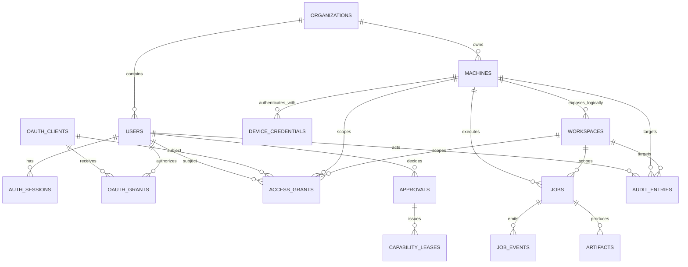

# 13 数据模型

## 1. 原则

- Hub 与 Node 分别保存自己权威的事实，不共享数据库。
- Hub 不保存 Node 绝对 Workspace 路径；Node 不保存 Hub 用户密码或远程 OAuth Token。
- Provider Token 仅存 Node/Provider 本机安全存储。
- 标识为 opaque、不可猜测、不可从 ID 推导路径。
- Job 终态、Workspace revision、设备吊销和 idempotency 是强约束。
- 表围绕真实聚合设计，不建立万能实体/键值表或通用 Repository。
- SQLite 事务只做短数据库操作，不包裹网络、文件或进程执行。
- 所有时间以 UTC 保存；运行时 deadline 同时使用单调时钟。

## 2. 标识规范

对外标识采用类型前缀 + 至少 128 bit 加密安全随机值，例如：

```text
usr_...
cli_...
mach_...
cred_...
ws_...
job_...
evt_...
appr_...
lease_...
art_...
```

规则：

- ID 不复用。
- 不接受客户端自选 ID，除协议明确的 idempotencyKey/correlationId。
- 数据库可存 TEXT；后续性能需要时可迁移 BLOB，不影响公共格式。
- 显示名不唯一，也不参与授权。

## 3. Hub 数据模型总览



## 4. Hub 核心表

### 4.1 `organizations`

| 字段 | 说明 |
|---|---|
| id | organizationId |
| name | 显示名 |
| mode | `owner`，未来可扩展 team |
| status | active/locked/deleted |
| created_at/updated_at | 时间 |
| revision | CAS 版本 |

MVP 可只有一个默认 organization，但所有资源明确归属，避免以后补租户边界时改全库。

### 4.2 `users`

- id、organization_id。
- login identifier/email（如使用）。
- password_hash/identity_provider_ref（二选一或组合）。
- role_hint（Owner 模式仅作 UI；实际权限由 grant）。
- status、last_login_at、created_at、updated_at、revision。

敏感恢复材料单独表并保存摘要。

### 4.3 `oauth_clients`

- id、organization_id、name、client_type。
- redirect_uris（规范化子表或 JSON，MVP 推荐子表）。
- public key/client secret 摘要（按 Client 类型）。
- allowed_scopes、status、created_by、created_at、last_used_at。

### 4.4 `auth_sessions` 与 `refresh_tokens`

`auth_sessions`：userId、session family、认证强度、created/expires/last_seen、revoked_at、客户端摘要。

`refresh_tokens`：只保存 token hash、family/session、rotation counter、expires/revoked/replaced_by。检测旧 Token 重用时吊销整个 family。

Access Token 通常不入库；需要即时吊销时通过 session/client revision 或短 TTL 实现。

## 5. 机器与设备身份

### 5.1 `enrollment_tokens`

- id、organization_id、token_hash。
- created_by、created_at、expires_at。
- max_attempts、attempt_count、consumed_at。
- expected_name/os 可选。
- idempotency_key、result_machine_id 可选。

唯一约束：token_hash。消费与 machine/credential 创建在一个事务。

### 5.2 `machines`

| 字段 | 说明 |
|---|---|
| id | machineId |
| organization_id | 所有者边界 |
| display_name | 人类名称 |
| status | active/revoked/disabled |
| os/arch | 最近上报平台 |
| node_version | 最近版本 |
| capability_digest | 能力摘要，不替代 descriptor |
| last_seen_at | 最近有效消息 |
| last_connection_generation | 防旧连接回写 |
| revoked_at/revoked_by | 吊销事实 |
| revision | CAS |

在线/繁忙是连接注册表的运行时事实，数据库只保存最后快照；不能仅靠 DB status 判断当前在线。

### 5.3 `device_credentials`

- id、machine_id。
- public_key/certificate fingerprint。
- issued_at、not_before、expires_at。
- status active/overlap/revoked/expired。
- revoked_at/reason、last_used_at。
- key algorithm/version。

私钥不在 Hub。

### 5.4 `machine_presence_snapshots`

可选轻量表，只保存连接/断开时间、connectionId hash、generation、原因和容量摘要。高频 heartbeat 不逐条入库，避免写放大。

## 6. Workspace 逻辑目录

### `workspaces`

- id、organization_id、machine_id。
- display_name。
- local_revision（Node 上报的授权 revision）。
- status active/disabled/revoked/unavailable。
- git_present、git_display_summary。
- capability_summary、read_only。
- created_at、updated_at、last_seen_at、revoked_at。

禁止字段：绝对路径、UNC、用户主目录、真实 `.git` 路径。若运维确需诊断，只能在 Node 本地受保护日志中查看。

唯一约束：`(machine_id, id)`；ID 全局随机仍建立组织/机器外键以防 IDOR。

## 7. 权限与审批

### 7.1 `access_grants`

- id、organization_id。
- subject_type (`user|oauth_client|local_proxy_identity`) 与 subject_id。
- machine_id、workspace_id 可空表示受限层级范围；MVP 谨慎使用 wildcard。
- capability、action。
- effect allow/deny。
- max_risk、origin_constraints、parameter_constraints JSON。
- starts_at、expires_at、created_by、revoked_at。
- revision。

索引：subject + active window；machine/workspace + capability/action。显式 deny 决策优先。

### 7.2 `approvals`

- id、organization_id、job_id 可选。
- requested_by user/client、decision_by user。
- machine/workspace/capability/action。
- risk_level、risk_digest、human_summary。
- state pending/approved/denied/expired/canceled。
- requested_at、expires_at、decided_at。
- decision_scope once/short_lease。

Approved 后参数摘要变化不能复用。

### 7.3 `capability_leases`

- id、approval_id。
- subject、machine、workspace、workspace_revision。
- capability/action、risk_digest。
- nonce_hash、allowed_count、used_count。
- issued_at、expires_at、revoked_at。

使用次数增加与 Job 创建必须原子；`used_count <= allowed_count` CHECK。

## 8. Job

### 8.1 `jobs`

| 字段 | 说明 |
|---|---|
| id | jobId |
| organization_id | 边界 |
| created_by_user/client | 发起者 |
| origin | mcp/api/web/local_proxy |
| machine_id/workspace_id | 固定目标 |
| workspace_revision | 创建/执行所需 revision |
| capability/action/version | 固定能力 |
| params_digest | 规范化参数摘要 |
| idempotency_scope_hash | 主体+目标+能力+key 摘要 |
| state | canonical 状态 |
| phase/owner | 可选运行阶段/所有权 |
| connection_generation | 接受任务的 Node 连接代次 |
| deadline_at | 最终期限 |
| accepted_at/started_at/finished_at | 时间 |
| last_event_sequence/terminal_sequence | 游标 |
| result_json | 有界结构化摘要 |
| error_code | 稳定错误码 |
| side_effects_known/occurred | 取消/lost 判断 |
| revision | CAS |

唯一约束：`idempotency_scope_hash` 在保留窗口内唯一。若长期清理，可将幂等记录拆到独立表以覆盖需要的最长窗口。

CHECK：终态必须有 finished_at；completed 必须有 result；终态不可由普通 UPDATE 逆转，应用层 + 测试保证，必要时触发器防护。

### 8.2 `job_events`

- job_id、sequence（联合主键）。
- type、timestamp、source。
- payload_json 或 artifact_id。
- payload_hash、stream、stream_offset。
- retained_until、security_relevant。

不保存无限 payload；inline payload 设硬上限。安全关键事件可复制摘要到 audit_entries。

### 8.3 `job_idempotency`

如果 Job 元数据保留期短于幂等窗口，独立保存：scope_hash、params_digest、job_id、state、created_at、expires_at。Node 也有自己的本地记录，Hub 记录不能替代 Node 防重。

## 9. Artifact

### 9.1 `artifacts`

- id、organization_id、job_id、machine_id、workspace_id。
- logical_name（仅展示）。
- media_type、size_bytes、sha256。
- storage_key（Hub 生成内容寻址 key）。
- state uploading/available/quarantined/deleted。
- sensitivity normal/sensitive。
- scan_status unknown/passed/blocked。
- created_at、expires_at、deleted_at。
- created_by/source。

`storage_key` 不由 logical_name 生成。`sha256 + size` 可去重物理对象，但权限元数据仍独立。

### 9.2 `artifact_uploads`

- upload_id、artifact_id、expected_size/hash。
- received_bytes、last_confirmed_offset。
- temp_storage_key、created/expires_at、state。
- connection_generation、idempotency_key。

完成校验和原子移动后 Artifact 才 available。

### 9.3 `artifact_blobs`（可选）

若物理去重：hash、size、path、ref_count、created_at。删除 Artifact 元数据后只有 ref_count=0 且过宽限期才删物理文件。

## 10. Audit

### `audit_entries`

- id、organization_id、occurred_at。
- actor_user_id、actor_client_id、origin。
- machine_id、workspace_id、workspace_revision。
- capability、action、risk_level。
- request_id、job_id、trace_id、correlation_id。
- hub_decision、node_decision、approval_id、lease_id。
- outcome、error_code、side_effect_summary。
- details_json（严格白名单/脱敏）。
- previous_hash/entry_hash（后续可启用链式防篡改）。

审计和普通调试日志分表/分保留策略。删除用户内容不应删除证明安全决策所需的最小审计事实，但需符合隐私与保留政策。

## 11. 运维表

### `operation_runs`

记录清理、备份、数据库 checkpoint、密钥轮换检查等：task_name、run_id、started/finished、status、processed_count、bytes_reclaimed、cursor、error_summary。相同 task_name 同时只允许一个运行实例。

### `schema_migrations`

version、name、checksum、applied_at、duration_ms、app_version。Migration 文件一旦发布不可修改；checksum 不匹配时启动拒绝写入。

### `system_settings`

仅保存明确、版本化的非秘密设置。秘密引用独立 secret store，不建立无约束 JSON 配置垃圾桶。

## 12. Node 本地数据模型

Node 可使用 SQLite 或平台安全存储 + 小型状态库。

### 12.1 `node_identity`

machineId、Hub endpoint、Hub trust fingerprint、credential reference、status、last rotation。私钥只保存安全存储引用。

### 12.2 `local_workspaces`

- workspace_id、display_name。
- encrypted/OS-protected root_path。
- canonical identity（volume/device/file ID 能力）。
- git_root metadata。
- status、read_only、revision。
- capability policy、subdir rules、exclude rules。
- created/updated/revoked。

路径不上传 Hub。

### 12.3 Local Bridge 状态

当前个人 MVP 不建立 `local_grants` 或 `local_clients` 表。Local Bridge 只依赖当前 OS 用户/data-dir ACL，并复用 Workspace Registry 与现有危险本机权限；连接级 `connectionId` 仅作临时日志字段，不持久化为权限主体。

### 12.4 `local_jobs`

jobId、request/idempotency、params digest、workspace revision、state、phase、process metadata、deadline、sequence、result digest、Hub ack sequence、created/finished。

进程句柄不能跨重启永久恢复；保存 PID、start time、process group/Job Object metadata用于重启后识别和清理，不能只按 PID 杀进程。

### 12.5 `local_events`

有界事件缓冲和 Hub ack。stdout/stderr 可引用受限本地日志文件，关键状态和终态持久化。

### 12.6 `recovery_items`

recoveryId、workspaceId、original relative path、internal storage path、hash、size、deletedAt、expiresAt。内部路径不对远程返回。

### 12.7 Agent Session 状态

当前 Phase 6 直接读取 Codex 官方 Session/Turn 事实并在 Node 内维护有界运行时事件，不额外创建 Fast Spider `agent_sessions` 持久表。若未来确有跨 Provider/离线索引需求，再评估最小持久化模型；Provider Token 不进入 Hub/Node 通用数据库。

### 12.8 `update_state`

current/previous/pending version、manifest hash、signature key id、download path、install state、health deadline、rollback reason。

## 13. 事务边界

### 配对

一个事务：验证/消费 enrollment token → 创建 machine → 创建 credential → 写审计。WSS 连接在事务后进行。

### Job 创建

一个事务：完成当前身份/资源授权 → 幂等查找/插入 → 创建 Job → 写初始审计。Node dispatch 在提交后进行。

### Job Event

事件批量插入 + 更新 last_event_sequence；终态 Event、Job 终态和结果摘要在同一事务中提交。

### Artifact 完成

文件 hash/size 校验在事务外；原子移动完成后，以短事务更新 Blob/Artifact/Job Event。崩溃恢复器处理“文件已移动但 DB 未完成”等中间状态。

### Workspace 收紧

更新 Workspace revision/status + 吊销相关 Lease + 标记 queued/waiting Job 需重新评估 + 审计，在一个 Hub 事务；Node 本地先更新本地权威状态，再同步 Hub。

## 14. 索引

关键索引：

- machines `(organization_id, status, last_seen_at)`。
- workspaces `(organization_id, machine_id, status)`。
- grants `(subject_type, subject_id, machine_id, workspace_id, capability, action, revoked_at, expires_at)`。
- jobs `(organization_id, state, created_at)`、`(machine_id, state)`、`(workspace_id, created_at)`、idempotency unique。
- events `(job_id, sequence)` primary；`(retained_until)` 清理。
- artifacts `(job_id)`、`(expires_at,state)`、`(sha256,size)`。
- audit `(organization_id, occurred_at)`、actor、machine、workspace、job、trace。
- operation_runs `(task_name, started_at)`。

避免为所有 JSON 字段建索引；常用查询字段应提升为列。

## 15. 保留与删除

- 软删除只用于需要恢复/审计的实体，不把所有表都加 `deleted_at`。
- 机器/Workspace 吊销记录保留最小历史，opaque ID 不复用。
- Job Event 与 Artifact 按保留策略分批清理。
- 审计使用独立更长保留期。
- 数据删除需要先处理外键、物理 Blob ref_count、备份保留和安全要求。
- 清理任务使用 cursor、批次、时间预算和磁盘水位，不做全表长事务。

## 16. 数据库选择与迁移

MVP SQLite WAL：

- 单 Hub 进程写入。
- `foreign_keys=ON`、合理 `busy_timeout`、受控 WAL checkpoint。
- 文件系统必须支持可靠锁；不把 DB 放不可靠网络共享。
- 在线备份使用 SQLite backup API/一致性机制，不直接复制正在变化的单一文件而忽略 WAL。

迁移 PostgreSQL 的触发条件和方法见 ADR 0004。公共 ID、状态和契约不依赖 SQLite 特性，迁移时可停机导出校验，不维护长期双写。

## 17. 数据模型不变量测试

- Workspace ID 在 Hub 永远无法反查绝对路径。
- 终态 Job 不可回到非终态。
- 同幂等 scope + 不同参数摘要必冲突。
- Event sequence 唯一且不可覆盖。
- Workspace revision 变化使旧 Lease 失效。
- revoked credential/machine 不能建立新连接。
- Artifact available 必须有匹配 size/hash 的物理 Blob。
- approval/lease 不能跨主体、机器、Workspace 或 Action 使用。
- cleanup 不删除仍被引用的 Blob或安全审计事实。
