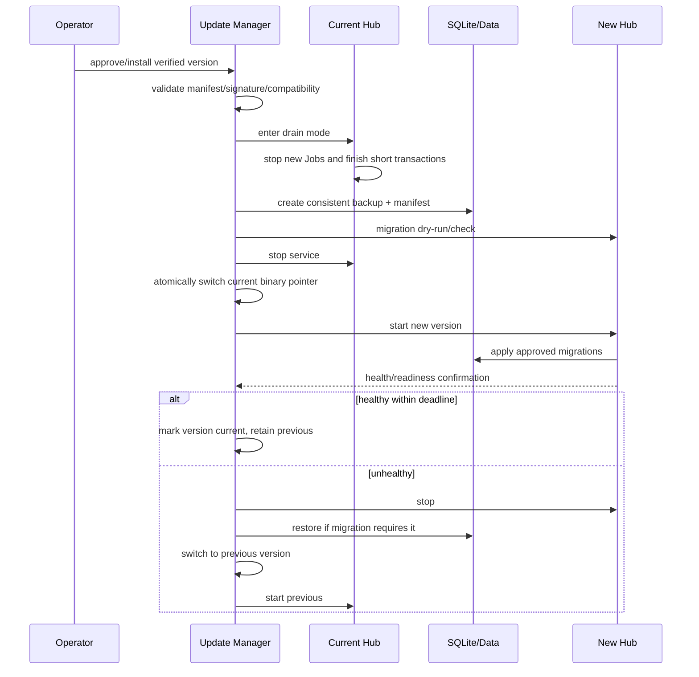

# 16 更新与恢复

## 1. 目标

Fast Spider 的更新链路拥有在用户机器上替换高权限执行组件的能力，必须视为核心安全边界。更新机制需要：

- 验证发布者、平台、版本、大小和内容 hash。
- 防止镜像/代理/更新服务器单点被攻破后下发恶意包。
- 支持断点下载、原子安装、健康门禁和自动回滚。
- 支持 Hub/Node 协议兼容窗口。
- 不因更新失败留下两个并行服务、失效路径或无限重试。
- 数据库 migration 与二进制版本可恢复。

## 2. 发布物

每个版本至少包含：

```text
fast-spider-hub-<version>-linux-<arch>
fast-spider-node-<version>-windows-<arch>.msi/.exe
fast-spider-node-<version>-linux-<arch>.tar.gz/.deb
checksums.txt
release-manifest.json
release-manifest.sig
SBOM
release-notes.md
```

后续 macOS 包需签名和 notarization。

发布物不包含用户配置、设备私钥、Hub 主密钥或测试 Token。

## 3. 签名信任模型

### 3.1 密钥分层

- **Root key**：离线保存，用于签发/轮换在线发布 key，极少使用。
- **Release key**：在线或受保护发布环境使用，为 manifest 签名。
- **Emergency revoke metadata**：由 root key 签名，声明失效 release key 和最低安全版本。

客户端内置/安装 root public key，不只信任 HTTPS 证书。更新服务器被攻破但无发布私钥时不能生成有效更新。

### 3.2 Manifest

概念字段：

```json
{
  "schemaVersion": 1,
  "product": "fast-spider",
  "version": "0.1.0",
  "channel": "stable",
  "publishedAt": "2026-08-08T00:00:00Z",
  "expiresAt": "2026-09-08T00:00:00Z",
  "minimumSafeVersion": "0.1.0",
  "protocolCompatibility": {
    "fswp": ["1.0"],
    "databaseSchemaMin": 1,
    "databaseSchemaMax": 1
  },
  "artifacts": [
    {
      "component": "node",
      "os": "windows",
      "arch": "amd64",
      "urlPath": "...",
      "size": 123,
      "sha256": "..."
    }
  ],
  "signingKeyId": "release-2026-a"
}
```

签名覆盖规范化完整 manifest。URL host 由配置/信任策略限制；manifest 中不允许任意切换到不可信域名。

## 4. 更新检查

- 默认每日一次，带随机抖动，不能所有 Node 同时请求。
- 用户可手动检查。
- Update channel：stable 默认；preview/dev 必须显式选择并显示风险。
- 请求只发送组件、当前版本、OS/arch 和必要兼容信息，不上传 Workspace/文件/Provider 信息。
- 检查失败指数退避，摘要日志限频。
- Hub 可展示 Node 版本状态，但不能强制绕过 Node 本地更新安全策略。

## 5. 下载

1. 获取并验证 manifest 签名、有效期、key 状态和最低安全版本。
2. 选择精确匹配 component/os/arch 的 Artifact。
3. 检查声明大小和本地磁盘空间。
4. 下载到版本化临时目录，支持 offset/ETag 断点续传。
5. 完成后校验实际 size 和 SHA-256。
6. 验证平台代码签名（Windows Authenticode 等，发布阶段要求）。
7. 标记 `downloaded_verified`，不能直接覆盖当前版本。

任何一步失败都删除或隔离不可信临时文件。

## 6. Hub 更新流程



### 6.1 Drain

- 拒绝新 Job/配对/权限变更。
- 允许 watch、result、cancel、管理健康。
- 通知 Node 即将重启，缩短重连风暴。
- 等待短时间完成关键事务，不无限等待长 Job；Node 可继续允许离线执行的 Job。

### 6.2 二进制切换

推荐版本目录 + 原子 `current` 指针/受控安装器：

```text
/opt/fast-spider/versions/0.1.0/fast-spider-hub
/opt/fast-spider/current -> versions/0.1.0
```

systemd 永远指向稳定 `current`。不创建多个 unit，不让旧进程和新进程同时监听。

## 7. Node 更新流程

### Windows

- 托盘/UI 显示可用更新、签名和影响。
- 默认在无高风险 Job 时安装；强制安全更新也要给出可见倒计时和取消策略。
- Helper/安装器使用窄权限，只负责验证后的文件替换与重启。
- 每用户安装不请求管理员权限；切换到系统服务模式才可能需要 UAC，并由用户明确确认。
- 当前/上一版本并存于受控版本目录。
- 新 Node 启动后验证状态库、Hub 连接、Workspace Registry 和本地 IPC；健康失败自动回滚。

### Linux

- user systemd 模式使用用户权限更新版本目录或由包管理器负责。
- system package 更新需要管理员明确操作，不由普通 Node 自动提权。
- 不能通过 shell 拼接从远程执行安装脚本。

### 运行中 Job

默认策略：

- 有 running write/exec/browser/agent Job 时延后普通更新。
- 安全紧急更新可请求用户取消/等待；不能静默杀进程并报告成功。
- 更新前写入本地 Job/事件状态；重启后对残留进程和 Job 对账。

## 8. 数据库 Migration

### 分类

- **可逆**：新增表/索引/可空列，旧版本仍可读取。
- **向前兼容但不可逆**：数据转换后旧版本不能安全运行。
- **破坏性**：删除/改语义，需要明确停机和备份恢复方案。

### 规则

- Migration 文件不可发布后修改，带 checksum。
- 启动前检查应用支持的 schema 范围。
- Migration 前一致性备份和磁盘空间检查。
- 大数据转换分批、可恢复，不持有超长事务；MVP 数据量小也需设超时/进度。
- 不在 Migration 事务中调用网络、Node 或文件外部服务。
- 失败后应用保持 not-ready，不用半迁移 Schema 提供写服务。

### 回滚

- 可逆 migration 可以执行明确 down，但必须测试。
- 不可逆 migration 回滚通过恢复升级前数据库备份，不假装旧二进制兼容新 Schema。
- Artifact 文件若升级中改变格式，也要有 manifest 和恢复策略。

## 9. 协议兼容

发布 manifest 声明：

- Hub 支持的 FSWP major/minor。
- Node 支持的 Capability versions。
- 最低安全 Hub/Node 版本。
- MCP Adapter 支持的规范版本。

升级期间：

- Hub 与旧 Node 协商共同 FSWP/Capability 版本。
- 新 Action 只有 Node 声明支持时出现。
- 无共同安全版本时 Node 保持连接拒绝/受限模式，UI 显示 `version_incompatible`。
- 安全缺陷要求禁用旧协议时，通过最低安全版本和明确升级窗口执行。
- 不永久保留旧协议的双业务实现。

## 10. 防回滚

- Node/Hub 保存已接受的最高 release metadata generation 和最低安全版本。
- 低于 minimumSafeVersion 的包即使签名正确也拒绝自动安装。
- 用户为灾难恢复手工降级必须进入离线受控流程，显示安全风险，并确保数据库兼容。
- 时钟异常不能让已过期 manifest 永久有效；可用最近可信时间/metadata generation 辅助判断。

## 11. 发布渠道

| 渠道 | 用途 | 默认 |
|---|---|---|
| stable | 已通过完整门禁 | 是 |
| preview | 提前验证，允许已知限制 | 否 |
| dev | 开发环境、可能无稳定兼容 | 否，禁止生产自动选择 |

渠道切换需要本机/管理员确认并审计。preview/dev 数据目录建议与 stable 隔离。

## 12. 自动更新策略

- Hub MVP 推荐管理员批准安装；可以自动检查，不默认无人值守执行破坏性 migration。
- Node 可默认自动安装低风险 patch，但必须签名、健康门禁、可回滚且用户可配置维护窗口。
- major/minor 或权限/安装模式变化需要确认。
- 紧急安全更新可提高提示等级，但不绕过签名、本机权限或自动提权规则。

## 13. 健康门禁

### Hub

- 进程稳定运行至少配置窗口。
- `/livez`、`/readyz` 成功。
- DB schema/version/integrity 快检通过。
- Artifact 目录可读写。
- 能接受本地自检请求，Node WSS 路由初始化。
- 无持续 panic/crash loop。

### Node

- 状态库可打开。
- 设备凭据可读取。
- Workspace Registry 可读取但不主动扫描全部文件。
- Hub 连接或离线模式初始化成功。
- Job Manager/Path Guard/Local Bridge 配置自检。
- 无旧版本进程/重复托盘/端口冲突。

健康超时触发一次自动回滚；重复失败停止自动尝试并提示人工处理。

## 14. 更新状态机

```text
idle
checking
download_available
downloading
downloaded_verified
waiting_for_window
installing
health_checking
completed
rollback_pending
rolling_back
rolled_back
failed
```

每次状态转换持久化，崩溃后能判断是继续验证、清理临时文件还是回滚。`installing` 不能无限停留；启动恢复器根据版本指针、进程和状态决定。

## 15. 中断恢复

| 中断点 | 恢复行为 |
|---|---|
| 下载中断 | 从已验证 offset 继续或重下 |
| 下载完成未安装 | 重新校验 manifest/hash 后等待窗口 |
| 切换前崩溃 | current 未变，清理/继续 |
| 切换后新进程未启动 | 自动切回 previous |
| migration 中断 | 根据 migration journal/事务恢复；not-ready |
| 新版健康失败 | 恢复 DB（如需）并回滚 binary |
| 回滚也失败 | 停止循环，进入 recovery mode |

## 16. Recovery Mode

Hub Recovery Mode 只提供本机/受限管理员功能：

- 查看版本、Schema、备份和错误摘要。
- 验证/恢复数据库。
- 切换 previous 版本。
- 导出脱敏诊断。

不接受远程执行 Job、Node 配对或权限修改。Node Recovery Mode 只允许本机 UI/CLI 查看状态、断开 Hub、恢复 previous、导出诊断和卸载。

## 17. 发布流程与供应链

1. 从干净、受保护 tag 构建。
2. 固定 Go/Node/工具链版本，依赖校验。
3. 单元、集成、协议、兼容、安全和安装测试。
4. 生成 SBOM、checksums 和 provenance。
5. 对平台包进行代码签名。
6. 生成并签名 release manifest。
7. 上传到不可静默覆盖的版本路径。
8. 从发布地址重新下载并独立验证。
9. 先 preview/canary，再 stable。
10. 保留发布审计和撤销能力。

更新元数据和二进制不能由同一个被攻破的普通 CI Token无审核地替换。

## 18. 密钥轮换与泄露

### Release key 轮换

Root 签发新 key metadata，客户端在有效链路中接受；旧 key 保留短 overlap 后撤销。

### Release key 泄露

- 用 root 发布 revoke + minimum safe metadata。
- 停止受影响渠道。
- 审计所有已签名版本和发布时间。
- 发布使用新 key 的修复版本。
- Hub/Node 显示高优先级告警并拒绝泄露 key 后的可疑 metadata generation。

### Root key 泄露

属于最高级事件，需要新信任根的人工重装/明确迁移流程，不能用被泄露 root 自证安全。

## 19. 卸载

- Hub 卸载与数据删除分开；默认保留数据库/Artifact 备份，明确选择才删除。
- Node 卸载停止进程、移除自启动/服务/Local Bridge，询问是否保留配置和 Workspace 授权。
- 设备凭据应在 Hub 吊销；离线卸载时在再次连接前由 Owner 手工吊销。
- 不遗留后台进程、计划任务、监听端口或更新 Helper。

## 20. 验收测试

- 篡改 manifest、包、size、hash、platform、版本均拒绝。
- 更新服务器仅被替换但无签名 key 时不能下发更新。
- 下载中断可恢复且不会接受混合文件。
- Hub 新版失败自动回滚，数据库可恢复。
- Node 新版失败只回滚一次，不崩溃循环。
- 旧版本低于 minimumSafeVersion 时拒绝自动降级。
- 更新期间 Node 重连不重复执行 Job。
- 安装后只存在一个正式 Hub/Node 实例和一条启动路径。
- 卸载后无隐蔽进程、服务、端口或自启动残留。
